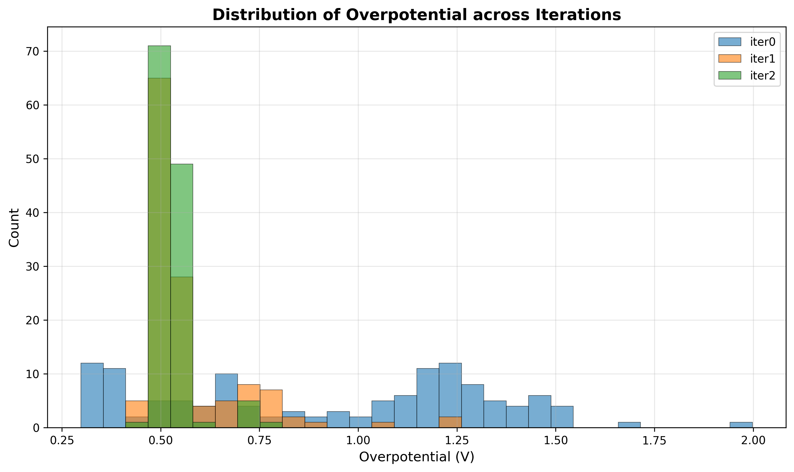
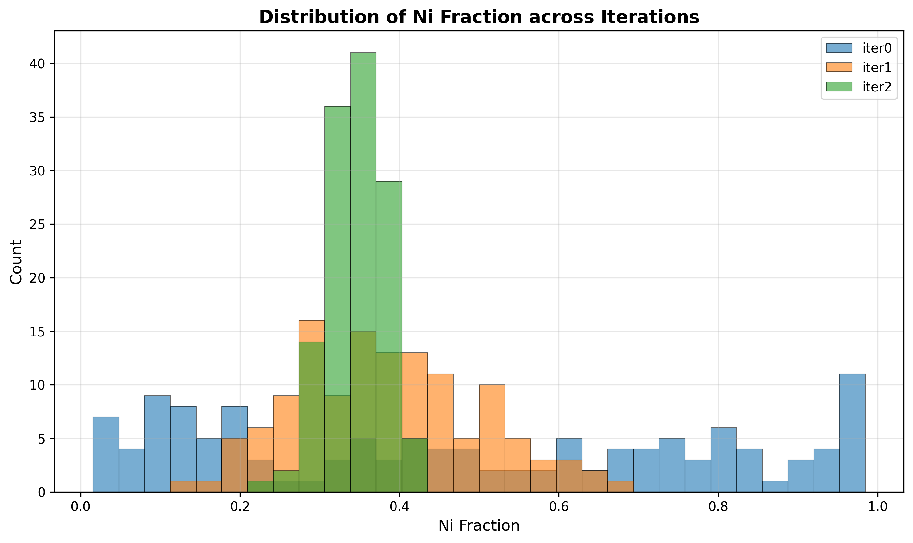
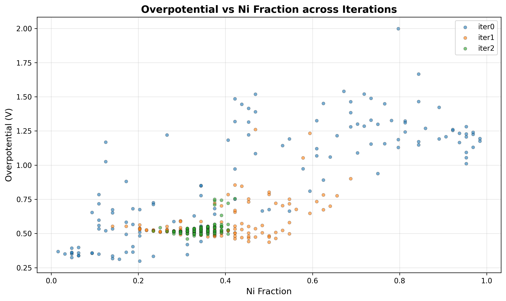
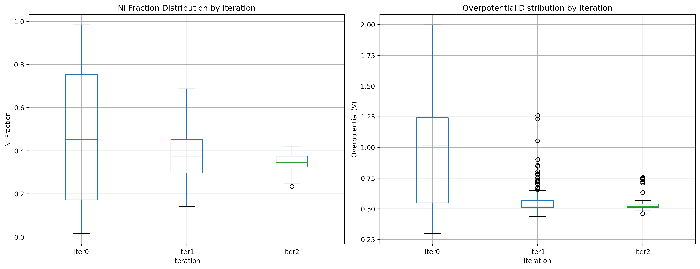

# ORR Catalyst Generator with Conditional GAN

条件付きGANを用いたORR（酸素還元反応）触媒の反復的設計システム

## 概要

このシステムは、Pt-Ni合金触媒のORR過電圧を最小化する構造を、条件付きGANを用いて反復的に探索。

### 主な特徴

- **iter0**: ランダム構造生成 → ORR過電圧計算 → 条件付きGAN学習
- **iter1以降**: GAN生成構造 → ORR過電圧計算 → GAN再学習（累積データ使用）
- **目標**: ORR過電圧が低いPt-Ni系触媒の構造生成

## ファイル構成

```
ccgan/
├── 01_generate_random_structures.py  # ランダム構造生成（iter0のみ）
├── 02_calculate_overpotentials.py    # ORR過電圧計算
├── 03_conditional_gan.py             # 条件付きGAN学習
├── 04_generate_new_structures.py     # GAN による新構造生成
├── tool.py                           # ユーティリティ関数
└── README.md                         # このファイル
```

## データ表現

### 構造データ
- **入力**: Pt4×4×4構造（64原子）
- **テンソル変換**: 4チャンネル×8×8（各層を1チャンネルとして表現）
- **元素マッピング**: 0（空サイト）, 1（Ni）, 2（Pt）

### 条件ラベル
- **ORR過電圧ラベル**: データセット中央値未満なら1、以上なら0

## GANアーキテクチャ

### 生成器 (Generator)
- **入力**: 128次元ノイズ + 2次元条件ラベル
- **出力**: 4チャンネル×8×8テンソル（確率分布）
- **構造**: 線形層 → 転置畳み込み層

### 識別器 (Discriminator)
- **入力**: 4チャンネル×8×8テンソル
- **出力**: 3ノード（真偽判定, ORR過電圧予測, Pt含有量予測）
- **構造**: 畳み込み層 → 線形層

### 損失関数
- **生成器**: 真データ + 目標条件（ORR過電圧=1, Pt含有量=1）を目指す
- **識別器**: 真偽判定 + 条件ラベル予測

## 結果

### 図表

- **iterごとの過電圧の変化**  
    

- **iterごとのNi含有量の変化**  
    

- **過電圧vs Ni含有量の散布図**  
    

- **過電圧とNi含有量の箱ヒゲ図**  
    

### 統計情報

| Iteration | Ni含有量 (平均±標準偏差) | 過電圧 (平均±標準偏差) | Pt含有量 (平均±標準偏差) | 限界電位 (平均±標準偏差) |
|-----------|------------------------|-------------------|------------------------|---------------------|
| iter0     | 0.477±0.311            | 0.920±0.405       | 0.523±0.311            | 0.310±0.405         |
| iter1     | 0.383±0.115            | 0.573±0.135       | 0.617±0.115            | 0.657±0.135         |
| iter2     | 0.343±0.035            | 0.533±0.050       | 0.658±0.035            | 0.697±0.050         |


### 考察
- 条件ラベルの設定を中央値の上下で設定してしまったため、iter1から2にかけての過電圧改善が限定的だった。上位1/3か1/4で条件ラベルを設定すればもう少し改善が見込めた可能性がある。
- iterが進むごとに、過電圧やNi含有量が同じような構造が生成される様になった。触媒生成機としては、高活性であれば、ある程度似た様な構造と性能のものが生成されても良いのかも知れない。
- 一方で、GANとしては、似た様な構造のみが生成されてしまうのは、出力の多様性が失われており、モード崩壊が起きている可能性がある。