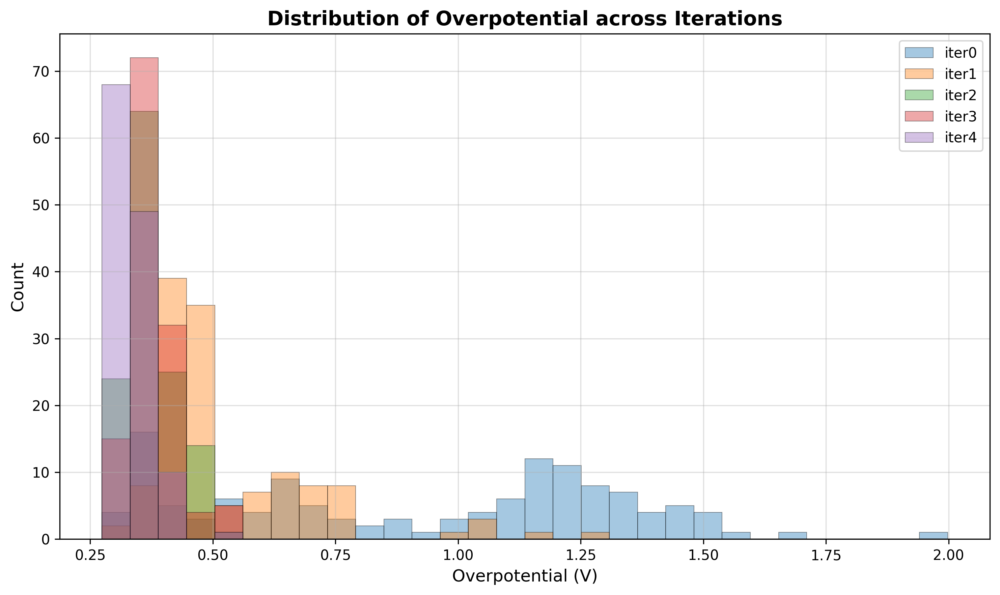
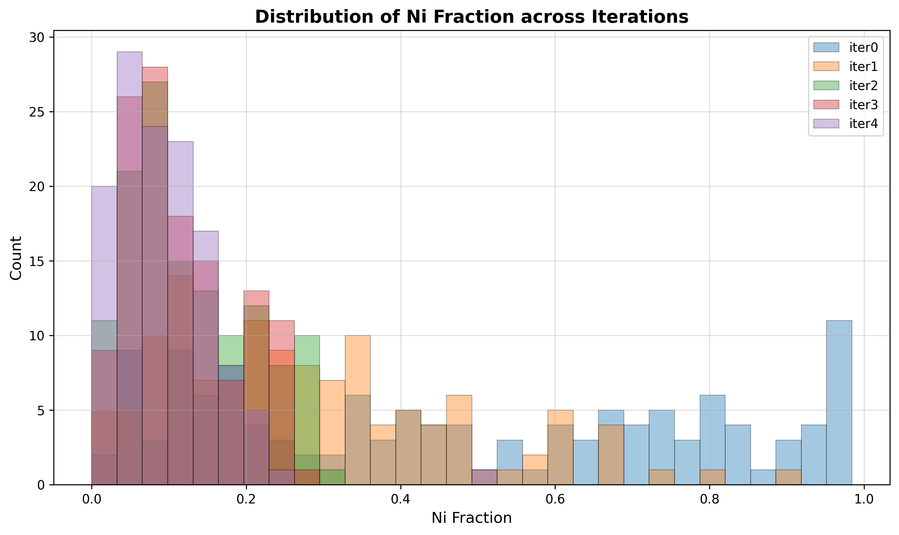
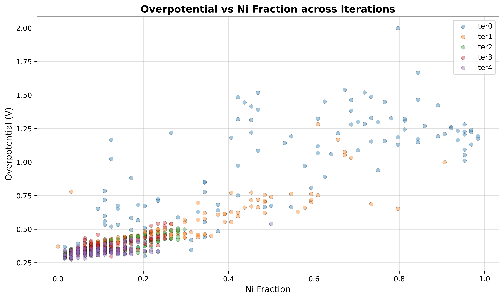
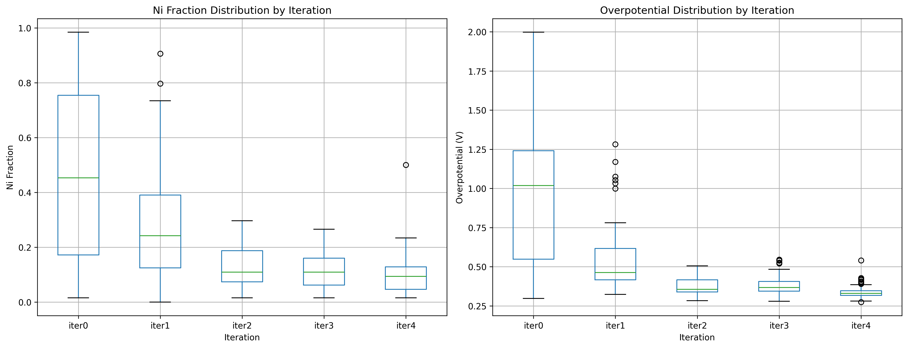

# ORR Catalyst Generator with Conditional VAE

条件付きVAEを用いたORR（酸素還元反応）触媒の反復的設計システム

## 概要

このシステムは、Pt-Ni合金触媒のORR過電圧を最小化する構造を、条件付きVAEを用いて反復的に探索。

### 主な特徴

- **iter0**: ランダム構造生成 → ORR過電圧計算 → 条件付きVAE学習
- **iter1以降**: VAE生成構造 → ORR過電圧計算 → VAE再学習（累積データ使用）
- **目標**: ORR過電圧が低いPt-Ni系触媒の構造生成

## ファイル構成

```
ccvae/
├── 01_generate_random_structures.py  # ランダム構造生成（iter0のみ）
├── 02_calculate_overpotentials.py    # ORR過電圧計算
├── 03_conditional_vae.py             # 条件付きVAE学習
├── 04_generate_new_structures.py     # VAE による新構造生成
├── tool.py                           # ユーティリティ関数
└── README.md                         # このファイル
```

## データ表現

### 構造データ
- **入力**: Pt4×4×4構造（64原子）
- **テンソル変換**: 4チャンネル×8×8（各層を1チャンネルとして表現）
- **元素マッピング**: 0（空サイト）, 1（Ni）, 2（Pt）

### 条件ラベル
- **ORR過電圧ラベル**: データセット後、過電圧が低いもの64個を1、残りを0とする

## 条件付きVAEアーキテクチャ

### エンコーダ (Encoder)
- **入力**: 4チャンネル×8×8テンソル + 1次元条件ラベル
- **条件埋め込み**: 線形層（1→16→16→8次元）で条件を変換
- **結合**: 条件を空間的に拡張して入力テンソルと結合（12チャンネル）
- **出力**: 潜在変数の平均μと分散logvar（各128次元）
- **構造**: 畳み込み層（256→512→1024） → 全結合層

### デコーダ (Decoder)  
- **入力**: 128次元潜在変数 + 1次元条件ラベル
- **条件埋め込み**: 線形層（1→16→16→8次元）で条件を変換
- **結合**: 潜在変数と条件埋め込みを結合（136次元）
- **出力**: 12チャンネル×8×8テンソル（各層3クラス分類用logits）
- **構造**: 全結合層 → 転置畳み込み層（64→128→64→32→12）

### 損失関数
- **再構成損失**: 各層でクラス重み付きクロスエントロピー
- **KL発散**: 潜在変数の正規化項
- **総損失**: 再構成損失 + β × KL発散

## 結果

### 図表

- **iterごとの過電圧の変化**  
    

- **iterごとのNi含有量の変化**  
    

- **過電圧vs Ni含有量の散布図**  
    

- **過電圧とNi含有量の箱ヒゲ図**  
    

### 統計情報

| Iteration | Ni含有量 (平均±標準偏差) | 過電圧 (平均±標準偏差) | Pt含有量 (平均±標準偏差) | 限界電位 (平均±標準偏差) |
|-----------|------------------------|-------------------|------------------------|---------------------|
| iter0     | 0.477±0.311            | 0.920±0.405       | 0.523±0.311            | 0.310±0.405         |
| iter1     | 0.280±0.186            | 0.530±0.174       | 0.720±0.186            | 0.700±0.174         |
| iter2     | 0.131±0.077            | 0.374±0.051       | 0.870±0.077            | 0.856±0.051         |
| iter3     | 0.120±0.066            | 0.379±0.050       | 0.880±0.066            | 0.851±0.050         |
| iter4     | 0.098±0.064            | 0.336±0.035       | 0.902±0.064            | 0.894±0.035         |


### 考察
- 過電圧ラベルの付け方を変えたら、iterを4まで実施しても過電圧の改善が見られる様になった。
- 一方で、やはり過電圧改善に伴ってNi含有量が減少する傾向が見られる。