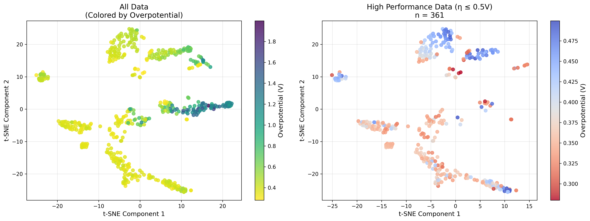

# ORR Catalyst Generator with Conditional VAE

## Overview (概要)

条件付きVAEを用いたORR（酸素還元反応）触媒の反復的設計システム

このシステムは、Pt-Ni合金触媒のORR過電圧を最小化する構造を、条件付きVAEを用いて反復的に探索します。

### Key Features (主な特徴)

- **iter0**: ランダム構造生成 → ORR過電圧計算 → 条件付きVAE学習
- **iter1以降**: VAE生成構造 → ORR過電圧計算 → VAE再学習（累積データ使用）
- **目標**: ORR過電圧が低いPt-Ni系触媒の構造生成

## File Structure (ファイル構成)

```
ccvae/
├── 01_generate_random_structures.py  # ランダム構造生成（iter0のみ）
├── 02_calculate_overpotentials.py    # ORR過電圧計算
├── 03_conditional_vae.py             # 条件付きVAE学習
├── 04_generate_new_structures.py     # VAE による新構造生成
├── tool.py                           # ユーティリティ関数
└── README.md                         # このファイル
```

## Data Representation (データ表現)

### Structure Data (構造データ)
- **入力**: Pt4×4×4構造（64原子）
- **テンソル変換**: 4チャンネル×8×8（各層を1チャンネルとして表現）
- **元素マッピング**: 0（空サイト）, 1（Ni）, 2（Pt）

### Condition Labels (条件ラベル)
- **ORR過電圧ラベル**: データセットの内、過電圧が低いもの64個を1、残りを0とする

## Conditional VAE Architecture (条件付きVAEアーキテクチャ)

### Encoder (エンコーダ)
- **入力**: 4チャンネル×8×8テンソル + 1次元条件ラベル
- **条件埋め込み**: 線形層（1→16→16→8次元）で条件を変換
- **結合**: 条件を空間的に拡張して入力テンソルと結合（12チャンネル）
- **出力**: 潜在変数の平均μと分散logvar（各128次元）
- **構造**: 畳み込み層（256→512→1024） → 全結合層

### Decoder (デコーダ)
- **入力**: 128次元潜在変数 + 1次元条件ラベル
- **条件埋め込み**: 線形層（1→16→16→8次元）で条件を変換
- **結合**: 潜在変数と条件埋め込みを結合（136次元）
- **出力**: 12チャンネル×8×8テンソル（各層3クラス分類用logits）
- **構造**: 全結合層 → 転置畳み込み層（64→128→64→32→12）

### Loss Function (損失関数)
- **再構成損失**: 各層でクラス重み付きクロスエントロピー
- **KL発散**: 潜在変数の正規化項
- **総損失**: 再構成損失 + β × KL発散

## Results (結果)

### Figures (図表)

#### Overpotential Changes by Iteration (iterごとの過電圧の変化)


#### Ni Content Changes by Iteration (iterごとのNi含有量の変化)


#### Overpotential vs Ni Content Scatter Plot (過電圧vs Ni含有量の散布図)


#### Box Plots Comparison (過電圧とNi含有量の箱ヒゲ図)


### Statistics (統計情報)

| Iteration | Ni含有量 (平均±標準偏差) | 過電圧 (平均±標準偏差) | Pt含有量 (平均±標準偏差) | 限界電位 (平均±標準偏差) |
|-----------|------------------------|-------------------|------------------------|---------------------|
| iter0     | 0.477±0.311            | 0.920±0.405       | 0.523±0.311            | 0.310±0.405         |
| iter1     | 0.280±0.186            | 0.530±0.174       | 0.720±0.186            | 0.700±0.174         |
| iter2     | 0.131±0.077            | 0.374±0.051       | 0.870±0.077            | 0.856±0.051         |
| iter3     | 0.120±0.066            | 0.379±0.050       | 0.880±0.066            | 0.851±0.050         |
| iter4     | 0.098±0.064            | 0.336±0.035       | 0.902±0.064            | 0.894±0.035         |

### Latent Space Visualization (学習済みVAEの潜在変数空間の可視化)

#### t-SNE Plot


### Discussion (考察)

- 過電圧ラベルの付け方を変えたら、iterを4まで実施しても過電圧の改善が見られる様になった
- 一方で、やはり過電圧改善に伴ってNi含有量が減少する傾向が見られる
- Ptの使用量を減らす方針も考慮する場合、Ni含有量ラベルを設定する必要あり
- VAEモデルとしては、過電圧の大小に対応して、潜在変数空間が分離されていることが確認できた

### おまけ：ChatGPT(o3)による評価

#### t-SNE可視化から読み取れるVAEの状態

| 観点 | 観察結果 | 評価 | コメント・改善案 |
|------|----------|------|------------------|
| **クラスタリング構造** | t-SNE上で7〜8個ほどの"島"に分割されている | ★★★☆☆ (まずまず) | 構造的に似た触媒が同じ島に集まっている証拠。一方、島同士の間に大きな空白があり、連続潜在空間というよりモードごとの離散表現になっている可能性。潜在次元(128)が大き過ぎて自己組織化し切れていない典型例。β-VAEやKL weight warm-upで圧縮強化を検討。 |
| **物性（過電圧）との相関** | 左図：島内部で色が比較的そろい、島間で色が切り替わる<br>右図：η ≤ 0.5 Vが複数島に分布 | ★★★★☆ (良好) | 局所的に"似たηのデータが近い"＝トポロジ保存は機能。ただし島によってηのレンジが狭い／広い差があり、不均質。島内勾配がある場合は属性方向が潜在軸にきれいに埋め込まれていない証拠。条件変数を別に持つC-VAEなら、ηの勾配がもっと滑らかに出るはず。 |
| **高性能触媒の分布** | η ≤ 0.5 V (361点)が5つほどの島に散在 | ★★★★☆ (探索性○) | 多数の"潜在ファミリー"から高性能サンプルが得られることを示唆。新規サンプリング時に多様性を確保できる。ただし各島の局所密度が低い＝モデルがその周辺を十分に埋めていない可能性。高性能サンプルだけを再学習させるfine-tuneやimportance samplingを検討。 |
| **潜在空間の利用効率** | t-SNEで見る限り有効次元は2〜3に縮退 | ★★☆☆☆ (過剰表現) | 平均ベクトルμを128→t-SNE(2)で投影した際に大局構造が明瞭＝実際にはほんの数次元しか使っていない。latent_sizeを思い切って16〜32に削減し、KL-βを>1に上げてみると情報密度が上がりやすい。 |
| **連続性（補間可能性）** | 島間が切れているため長距離補間で不連続ジャンプの恐れ | ★★☆☆☆ | 島内部は連続だが、島をまたぐと突然構造が変わる可能性が高い。生成した構造が壊れやすくなるため、密な潜在正則化or追加サンプリングで空白領域を埋めるのが望ましい。 |
| **ドリフト／崩壊の兆候** | 特定島にη ≈ 1.5 V以上が集中（紫領域） | ★★★☆☆ | 条件つきVAEでもposterior collapseしていればηと独立なノイズになるが、今回はある程度分離できている。とはいえ高ηサンプルが"1か所溜まり"になるのは学習バランスが悪いサイン。損失にproperty-prediction term (predictor head + MSE)を加えると分散が落ち着きやすい。 |

#### まとめと次の一手

1. **表現の圧縮**
    - latent_size 128 → 32などに削減し、β-VAE（KL係数 > 1）かannealingでKLを強める
    - 目的は「島をつなぎ」「空白を埋め」「有効次元を増やす」

2. **物性誘導の強化**
    - 既にconditional (binary)だが、ηを連続条件として与えるか、潜在からηを再予測する補助損失を入れて勾配を流す
    - island内の色勾配を平滑化し、物性方向を潜在軸に沿わせる

3. **高性能領域の重点サンプリング**
    - 右図で青い島を中心に再サンプリング → fine-tune (Curriculum VAE)
    - 生成時は「島ごとにμ±σ」を走査して多様性を担保

この可視化だけでも「物性はある程度写っているが、連続潜在というよりクラスタリング寄り」という現状が読み取れます。上記のように圧縮と正則化を強めると、より滑らかで制御可能な生成モデルに近づけるはずです。

〜〜〜〜〜

↑要するに、潜在変数の次元が大きすぎて、潜在変数空間がスパースになってしまっているので、もっとzの次元を落として情報を圧縮して、潜在変数空間を密にするとVAEの出力が滑らかになって、いろんな構造がサンプリングしやすくなる可能性があるということか。