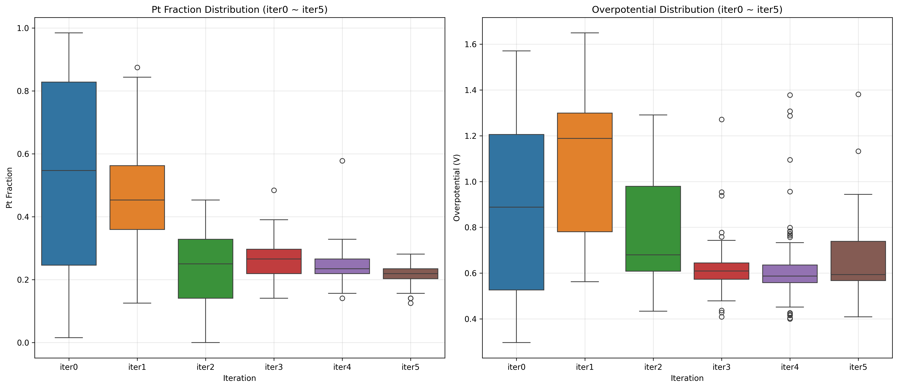
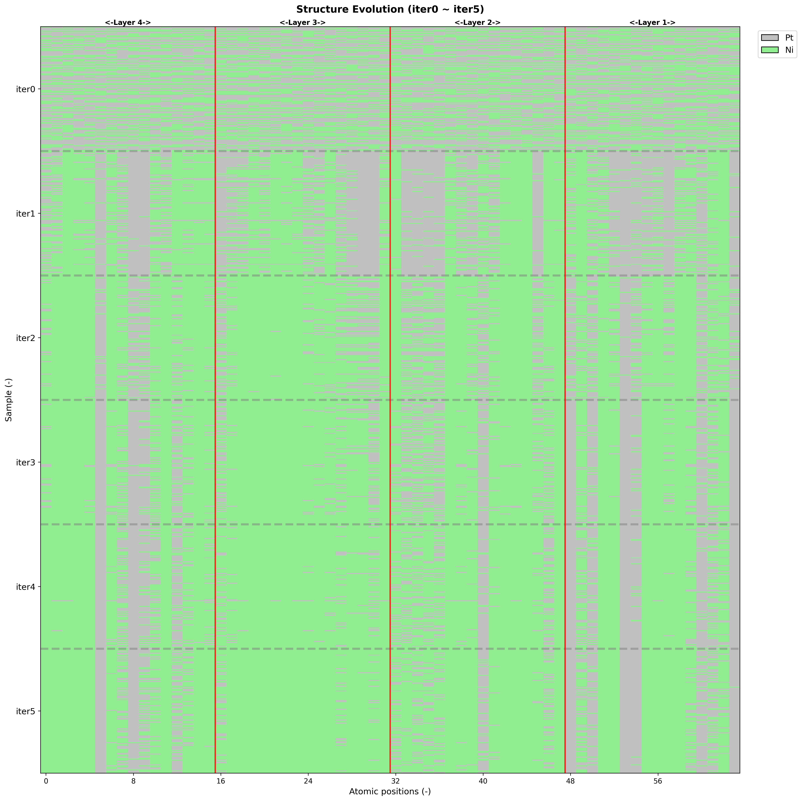
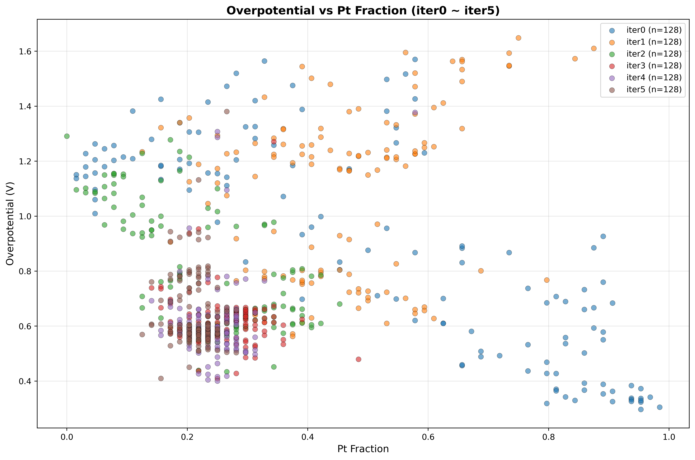

## 1. Introduction

- 固体高分子型燃料電池（PEMFC）は、エネルギー問題に対処するための効果的な手段である。
- しかし、カソードにおける酸素還元反応（ORR）が遅いことが問題となっている。
- そのため、カソード電極材料にはPt触媒が使用されているが、その高いコストがPEMFCの普及を妨げている。
- したがって、電極活性と材料コストのバランスを考慮した触媒の開発が不可欠である。
---
- 最近の研究では、Pt系二元合金（Pt-M）触媒の開発が進められている。
- 例えば、Pt-NiおよびPt-Co合金はPt単体よりも高いORR活性を示し、触媒性能を向上させながらPt使用量を削減できる可能性を示唆している。
---
- 一方で、合金触媒の設計には元素組成と原子配置の最適化が必要であり、これらを実験的または理論的アプローチで網羅的に検証することは困難である。
- そのため、触媒組成と配置を効率的に探索するために機械学習によるアプローチが提案されている。
- 特に、生成型人工知能を用いることで限られた初期データセットでも合金触媒の組成と配置の外挿的な生成と最適化が可能であることが報告されている
- さらに、機械学習のための触媒特性のデータセット生成には、ニューラルネットワークポテンシャル(NNP)を用いた計算検討されており、計算コストを大幅に削減しながら第一原理計算に近い精度を提供することが可能である。
---
- 本研究では、データセット生成のためのNNPと生成AIアプローチとしてVariational Auto-Encoder（VAE）を用いて、効率的に合金触媒を設計する手法を提案する。
- Pt-Ni合金を対象システムとして、条件付きVAEを用いて、ランダムに生成された初期データセットから、ORR活性とPt使用量の両方を考慮した触媒の探索と生成を行う。

## 2. Methods

## 2.1 Oxygen Reduction Reaction

- ORR触媒活性の評価には、Nørskovらによって提案された計算水素電極（CHE）モデルを用いて計算された理論過電圧を利用する。
- 理論過電圧は、以下の4電子反応経路を仮定して計算した。
- (1) O2 + H+ + e− + * → OOH*
- (2) OOH* + H+ + e− → O* + H2O
- (3) O* + H+ + e− → OH*
- (4) OH* + H+ + e− → H2O + *
- そして、各ステップのギブスエネルギー変化ΔG1, ΔG2, ΔG3, ΔG4を計算し、以下の式でORR理論過電圧ηを求める。
- η = 1.23 + max(ΔG1, ΔG2, ΔG3, ΔG4) [V]

## 2.2 NNP and DFT calculation

- VAEのトレーニングのためのデータセット生成には、PBEレベルで計算されたmatpesデータセットを用いてfine-turningされたMACE（omat-0）モデルを使用した。
- 計算に用いたスラブモデルは、PtまたはNiの4×4のfcc(111)面によって構成される４層のスラブであり、真空層は15 Åとした。
- また、全てのスラブモデルは、真空層を追加する前に、セルサイズと原子位置の構造最適化が行われた。
- OOH*、O*、OH*におけるエネルギー計算は、スラブのontop, bridge, fcc-hollow, hcp-hollowの4つの吸着サイトにおいて実施し、最安定なサイトを選択した。この際、スラブの下2層は固定されている。
---
- さらに、VAEによって出力された構造の一部は、Vienna Ab Initio Simulation Package（VASP）を用いたスピン分極DFT計算を実行し、ORR活性を検証した。
- DFT計算には、交換相関汎函数としてGGA-PBEを使用した。電子は、PAW法を用いて表現され、平面波のカットオフは000 eVとした。
- スラブに対する計算では、分極補正が適応された。

## 2.3 Variational Auto-Encoder

### 2.3.1 Structure Representation
- テンソル形式に変換された結晶構造情報を入力として、スラブモデルのORR過電圧とPt含有量を条件ラベルとする条件付き畳み込みVAEを実装した。
- テンソルへの変換は、図xのようにz軸方向のレイヤーをチャンネルとして、行列の要素間に交互に0を配置することで、fccの結晶構造に対応するように行った。また、原子位置に対応する要素には、Ni=28、Pt=78の値を設定した。
- 最終的に[4, 8, 8]のテンソルが生成され、各層（チャンネル）が4層の触媒構造を表現している。

### 2.3.2 VAE Architecture
- エンコーダー：畳み込み層（4+16→256→512→1024チャンネル）を使用し、条件ラベルを空間的に拡張して入力データと結合した。
- デコーダー：潜在変数（32次元）と条件ラベルを結合し、全結合層および逆畳み込み層を通して[12, 8, 8]の出力を生成した。
- 条件ラベルには、ORR過電圧とPt含有量を使用し、それぞれデータセット中の中央値以上と未満に対応する0と1の値を設定した。
- またVAEの学習時は、テンソルの要素を28を1、78を2として、原子番号に対応する離散的な値に変換している。

### 2.3.3 Training Process
- 各イテレーションにおいて、ランダムに生成された初期構造とNNPで計算された過電圧データを用いてVAEをトレーニングした。
- 学習率00、バッチサイズ00、最大エポック数00で学習を行った。
- 損失関数は、再構成損失とKLダイバージェンスの和であり、以下のように定義される。
- ここで、再構成誤差は、テンソルの要素ごとのクロスエントロピー損失を用いて計算される。
- KLダイバージェンスは、潜在変数の平均と分散を用いて計算される。

$$\begin{align}
\mathcal{L}_{\rm recon}
&=
\sum_{z=1}^{4}
\sum_{b=1}^{B}
\sum_{h=1}^{H}
\sum_{w=1}^{W}
\mathrm{CE}\bigl(x_{b,z,h,w},\,\hat x_{b,z,:,h,w}\bigr),
\\
\mathcal{L}_{\rm KL}
&=
-\frac12
\sum_{b=1}^{B}
\sum_{j=1}^{D}
\Bigl(1 + \log\sigma_{b,j}^2 - \mu_{b,j}^2 - \sigma_{b,j}^2\Bigr),
\\
\mathcal{L}_{\text{VAE}}
&=
\mathcal{L}_{\rm recon}
\;+\;
\mathcal{L}_{\rm KL}
\end{align}$$

### 2.3.4 Structure Generation
- 学習済みVAEのデコーダーを使用して、低過電圧・低Pt含有量の条件ラベルを設定し、新しい触媒構造を生成した。
- VAEから生成されたテンソルは、ソフトマックス関数を適用後、最大値を持つクラスを選択してNi（原子番号28）またはPt（原子番号78）の離散的な原子配置に変換した。
- 得られたテンソルは、再度fcc構造に対応するように変換され、最終的な触媒構造として出力する。
- 各イテレーションでは、重複を除き128個の新しい構造を生成した。

## 3. Results and Discussion

## 3.1 Accuracy of NNP
- NNPを用いてデータセット生成をする前に、NNPとDFTのそれぞれで計算されたORR過電圧の比較を行った。

## 3.2 Iterative VAE Training and Structure Generation

- 初期データセット（iter0）として、ランダムに生成された128個のPt-Ni合金構造に対してNNPを用いてORR過電圧を計算した。
- 各イテレーションにおいて、前イテレーションまでの全データを用いて条件付きVAEを訓練し、低過電圧・低Pt含有量の条件で128個の新構造を生成した。
- iter0からiter5まで6回のイテレーションを実行し、総計000個の構造を生成した。

- iter0では平均過電圧が0.00±0.00 V、平均Pt含有量が0.00±0.00であった。
- iter4では平均過電圧が0.00±0.00 V、平均Pt含有量が0.00±0.00に改善された。
- 過電圧の標準偏差は0.00 Vから0.00 Vに減少し、より均一な高性能触媒が生成された。
- Ni含有量の増加によりPt使用量の削減が達成された（Pt含有量：0.00から0.00に減少）。

- VAEによる構造生成は、イテレーションが進むにつれてPtの含有量が少ない構造が出力される傾向が見れれた。
- 一方で、最表面のPt原子数は一定数に保たれていた。これはVAEがレイヤー毎の構造の特徴を学習し、触媒の表面活性を維持しつつPt使用量を削減したを示唆している。

- 過電圧 vs Pt含有量の散布図により、低過電圧・低Pt含有量の領域へ効率的に探索されていることが確認された。

## 3.3 Comparison with DFT

- VAEから得られた構造の一部を選択し、NNPとDFTでの自由エネルギーダイアグラムの比較を行った。
- NNPとDFTの計算結果は良好な一致を示し、VAEによる構造生成の妥当性が確認された。(?)

- また、得られた構造と単体Pt、単体NiのPDOSを比較すると、dバンド中心が...。(?)
  
## 4. Conclusions

- 本論文では、NNPと条件付きVAEを用いて、触媒活性と材料使用量に注目した効率的な触媒設計手法を開発した。
- NNPは、第一原理計算に近い精度で触媒のORR過電圧が計算できることを確認し、VAEのためのデータセット生成に利用した。
- 条件付きVAEは、触媒のORR過電圧とPt使用量を条件ラベルとして、テンソル形式に変換された触媒構造を入力データとし学習された。
- イテレーションを重ねるごとに、低過電圧・低Pt含有量の触媒構造が生成された。
- VAEから生成された構造は、再度DFTによって検証された。
- この手法を用いることで、初期データセットには含まれていない高活性かつ低Pt使用量のORR触媒構造を探索・生成することが可能であることを示した。

## References

- pandoc paper.md -o paper.pdf --bibliography=orr-vae.bib --csl=american-chemical-society.csl --citeproc --standalone

## Supplementary Information
- NNPとDFTで計算したPtとNiの自由エネルギーダイアグラムの図
- 条件ラベルを過電圧だけで設定した場合のiter0からiter4までの過電圧とPt含有量の変化