## Abstract

多元素合金触媒では高活性な原子組成と配列を効率的に探索することが重要である。本研究では汎用機械学習ポテンシャル（NNP）と条件付き変分オートエンコーダ（cVAE）を統合した反復的生成・評価ワークフローを構築し、Pt–Ni合金表面の酸素還元反応（ORR）を対象に活性と安定性を同時に最適化する合金表面構造の提案を実現した。cVAEは、計算水素電極（CHE）に基づく過電圧 η、と合金形成エネルギー E_form を条件ラベルとして学習し、新規構造を外挿的に生成する。各候補の評価は、NNPにより高速化され、iter0〜5の6反復で各128構造（計768件）を生成・評価した。iter毎に反復の進行に伴い、データセットη分布は低電位側へ系統的にシフトし平均値は1.126から0.520 Vへ低下し、同時にE_formの平均値は−0.027から−0.047 eV/atomへとより負の側に移動して熱力学的安定性が向上した。生成構造の特徴として、Ptが表面原子として存在する構造が多く見られ、活性と安定性の両立に資する設計指針が示唆された。さらにdG_OHと制限電位U_Lの関係はORRのボルケーノプロットと整合し得られた活性傾向の物理的一貫性を支持した。本手法は限られた初期データからでも、活性（低η）と安定性（低E_form）を満たす合金触媒構造を外挿的に提案できる汎用的枠組みであり、多元系触媒の計算スクリーニングを大幅に効率化しうることを示す。

## 1. Introduction

固体高分子形燃料電池（PEMFC）は、再生可能エネルギー由来の水素を活用できるクリーンな発電技術として注目されている。一方で、カソードにおける酸素還元反応（oxygen reduction reaction, ORR）の速度が実用化のボトルネックであり、高活性かつ安価な電極触媒の開発が喫緊の課題である。商用触媒としては白金（Pt）が中心であるが、希少性とコストの問題から、Ptに安価元素を合金化して性能と資源制約のバランスを取る戦略が広く検討されている。なかでもPt–Niは代表的な合金触媒であるものの、合金の組成・配列と活性・安定性の関係は、報告により最適比が異なるなど未だ統一的理解に達していない。

こうした合金触媒の設計では、元素組成比と原子配列の組合せは天文学的に膨大であり、第一原理計算（DFT）を用いた網羅的探索は計算資源の観点から現実的でない。記述子に基づくスクリーニングやDFTベースのマイクロキネティクスは、機構理解と活性予測に有効である一方、候補構造の評価コストがボトルネックとなる。近年、機械学習を活用した触媒設計が進展し、特に生成モデルは既存データに含まれない外挿的な構造候補の提案に有望であることが示されている。しかし、生成候補を都度DFTで評価するワークフローは、元素数・探索空間の拡大とともに急速に非効率化する。この課題に対し、第一原理データで事前学習したユニバーサルなニューラルネットワークポテンシャル（NNP）を用いると、DFTに近い精度を維持しながら計算を高速化でき、反復的な生成・評価ループの実用性が大きく向上する。

本研究は、Pt–Ni 合金表面の ORR を対象に、ユニバーサル NNP による高速評価と生成モデルによる外挿的探索を統合した反復的設計ワークフローを提案する。具体的には、計算水素電極（CHE）に基づく過電圧（η）と合金形成エネルギー（E_form）を同時に条件付けた条件付き変分オートエンコーダ（cVAE）で新規構造を生成し、NNPで迅速に評価・選別する工程を反復することで、活性（低η）と安定性（低E_form）を両立する表面配列と組成域を効率的に探索する。

## 2. Methods

## 2.1 Oxygen Reduction Reaction

本研究では，J. K. Nørskov らの計算水素電極（Computational Hydrogen Electrode, CHE）に基づき，理論限界電位 U_L と過電圧 η により ORR 活性を評価した。酸性条件下の4電子反応機構を仮定し，素過程は次の 4 反応で表す。

1. O2 + H+ + e− + * → OOH*
2. OOH* + H+ + e− → O* + H2O
3. O* + H+ + e− → OH*
4. OH* + H+ + e− → H2O + *

各 1 電子段階の自由エネルギーは

$$\Delta G_i(U)=\Delta G_i(0)-eU$$

とし，U=1.23 V（RHE 基準, pH=0, T=298.15 K）での平衡を基準に

$$U_L=\min_i\left[\frac{\Delta G_i(0)}{e}\right],\quad \eta=1.23-U_L\;\mathrm{[V]}$$

として過電圧を求めた。ここで ΔG_i(0) は DFT 全エネルギーに，文献値に基づくゼロ点振動（ZPE）と有限温度の振動エントロピー（TS, T=298.15 K）を加えて構成した。気相 O2 エネルギーの既知の誤差を避けるため，O2 を明示的に参照せず，H2 と H2O のエネルギー、および水生成の実験自由エネルギーを用いて計算した(2H2O → O2 + 2H2 to be 4.92 eV)。文献に基づき、溶媒効果は定数補正として導入し，O*, OOH*, OH* に対してそれぞれ 0.00, 0.28, 0.57 eV を加えた。

## 2.2 NNP and DFT calculation

データセット生成には，ニューラルネットワークポテンシャル UMA（uma‑s‑1p1）を用いて構造最適化およびエネルギー計算を行った。スラブ幾何は fcc(111) の 4 層（64 原子），下 2 層固定とし，吸着系では OOH, O, OH* を ontop／bridge／fcc‑hollow／hcp‑hollow に初期配置して最安定サイトを採用した（幾何・真空などの設定は下記 DFT と同一）。また，セルサイズは真空付与前に最適化した。

第一原理計算（DFT）は Vienna Ab initio Simulation Package（VASP）を用いたスピン分極計算で実施し，projector augmented-wave 法（PAW）法と GGA‑RPBE 交換相関汎関数を採用した。波動関数は 450 eV の平面波カットオフで展開し，金属占有には Methfessel–Paxton スミアリング（幅 0.20 eV）を用いた。自己無撞着計算の収束判定は 1×10^{-5} eV とし，Brillouin ゾーンのサンプリングはバルク 2×2×2，(111) スラブ 2×2×1，気相分子（H2, H2O）は Γ 点とした。
スラブモデルは fcc(111) 面からなる 4 層構造とし，下 2 層を固定，上 2 層と吸着種は全自由度で緩和した。z 方向には 15 Å の真空を設け，表面法線方向の双極子補正を適用した。構造最適化は最大残差力 0.05 eV/Å を閾値として収束させ，気相参照の H2，H2O は 15 Å 立方セル中で最適化して用いた。
自由エネルギーの評価は 2.1 節の CHE の枠組みに従い実施し，ZPE/エントロピーおよび溶媒の寄与は文献に基づく定数補正として O*，OOH*，OH* に適用した。
なお，本研究の反復ループにおける η と E_form の評価は一貫して UMA（uma‑s‑1p1）で実施し，DFT は NNP の検証および代表構造の自由エネルギー解析に用いた。

合金形成エネルギーは、以下のように定義した。

$$
E_{\mathrm{form}} = E_{\mathrm{bulk}}^{\mathrm{alloy}} - \sum_i N_i \; \frac{E_{\mathrm{bulk}}(i)}{N_{\mathrm{bulk}}(i)}.
$$

そして E_form（eV）を原子あたり（eV/atom）に正規化して算出し，純元素（Pt, Ni）のバルク参照エネルギーを個別に計算して用いた。

## 2.3 Variational Auto-Encoder

### 2.3.1 Structure Representation
表面構造は，fcc(111) の上位 4 層を空間グリッドへ写像した テンソルで表現した。各層は二次元の行列で，要素ごとに空白・Ni・Pt の占有を離散的に符号化する。これにより，層間スタッキングと平面内の合金配置を同時に取り扱えるようにした。

### 2.3.2 VAE Architecture
条件付き畳み込み VAE を用い，入力の構造テンソルに加えて，過電圧と合金形成エネルギーの二値ラベルを条件として与えた。エンコーダ／デコーダはいずれも畳み込みブロックを主体とする対称構造で，潜在空間の次元は 32 とした。条件は学習された埋め込みを介して両ブランチへ注入し，潜在表現と復元に寄与させる。出力は各層における元素占有のクラス確率である。

### 2.3.3 Training Process
学習には iter0〜iter5 を統合したデータを用い，訓練:評価=9:1 に分割した。最適化は AdamW（学習率 2×10^{-4}，weight decay 1×10^{-4}），バッチサイズ 16，最大 200 エポックで行った。損失関数は，4 層それぞれの画素に対する 3 クラス（空白・Ni・Pt）の重み付き多クラス交差エントロピーと，潜在分布の KL ダイバージェンスを組み合わせた β‑VAE である（β=2.0）。モデルの出力は各層ごとに 3 チャネルのロジット（確率ではなく前処理値）を並べた 12 チャネルであり，ターゲットは各層の画素ごとに {0: 空白, 1: Ni, 2: Pt} のクラス ID を持つ。

$$\begin{align}
\mathcal{L}_{\rm recon}
&= \sum_{b=1}^{B}\sum_{z=1}^{4}\sum_{h=1}^{H}\sum_{w=1}^{W}
\Bigl[-\sum_{c\in\{0,1,2\}} w_c\,\mathbb{1}[x_{bzhw}=c] \;\log\,\mathrm{softmax}(\hat x_{bzchw})\Bigr],\\
\mathcal{L}_{\rm KL}
&= -\tfrac12\sum_{b=1}^{B}\sum_{j=1}^{D}\Bigl(1+\log\sigma_{bj}^2-\mu_{bj}^2-\sigma_{bj}^2\Bigr),\\
\mathcal{L}_{\text{total}}
&= \mathcal{L}_{\rm recon} + \beta\,\mathcal{L}_{\rm KL} \qquad (\beta=2.0).
\end{align}$$

- 変数: B はバッチサイズ，z は層（4），H=W=8 は各層の画素サイズ，D は潜在次元（32）。$\hat x_{bzchw}$ は出力ロジット，$x_{bzhw}$ はクラス ID。$w=(w_0,w_1,w_2)=(0.1,1.0,1.0)$ はクラス重み（空白(0)の学習を抑制させるため低重み）。

### 2.3.4 Structure Generation
学習後は条件 [1,1]（低過電圧・低形成エネルギー）を指定し、学習済みVAEのデコーダーからテンソルを出力した。テンソルは前述の変換の逆変換によって、新規の構造とした。この時、既存構造と一致する重複は除外した。

## 2.4 Dataset Construction, Iterative Loop, and Analysis
iter0〜iter5 の 6 イテレーションを実施し，1 iter あたり 128 構造（合計 768 構造）を生成・評価した。iter0 ではランダムに合金配置を生成し，NNPにより ORR 過電圧 η と合金形成エネルギー E_form を評価した。得られた（構造，η，E_form）を用いて条件付き VAE を学習し，次段では「低過電圧・低形成エネルギー（下位 30%）」に対応する条件を指定して新規構造を生成した。生成構造に対して再び NNPにより（η，E_form）を評価し，データ集合に追加したうえで学習を更新する，という「生成→評価→追加→再学習」のループを iter1 以降も繰り返した。これらの構造生成、管理はASEでpythonライブラリパッケージASEを用いて行われた。

## 3. Results and Discussion

## 3.1 Accuracy of NNP
本研究で用いる NNP（fairchem; UMA）の妥当性を、DFT計算と直接比較して検証した。図1は、iter0 と同様の手順で作成した ランダムな64 構造の Pt–Ni 合金について、OH/O/OOH の吸着エネルギー（eV）と過電圧 η（V）を DFT（横軸）と NNP（縦軸）で比較した図である。OH と O の吸着エネルギーは点が対角線上に良好に並び、相関（R）が高く、絶対値も概ね一致した。一方で OOH の吸着エネルギーには、数点の DFT 基準に対して系統的なずれが見られ、外れ値に相当するサンプルも存在した。

しかし、過電圧については NNP と DFT の値が近く、線形関係も維持されており、VAE のデータセット生成に NNP を用いる判断は妥当と結論づけた。

Figure 1. Parity plots of adsorption energies (OH, O, OOH; eV) and overpotential (V) between DFT (x) and NNP (y).

ここで、OH, O, OOH の吸着エネルギーは以下で定義する（O2 を明示参照せず、H2 と H2O を用いる標準スキーム）。

$$
E_{\mathrm{ads}}(\mathrm{OH}^*) = E(\mathrm{slab}+\mathrm{OH}^*) - \Bigl[ E(\mathrm{slab}) + E(\mathrm{H_2O}) - \tfrac{1}{2}E(\mathrm{H_2}) \Bigr],
$$

$$
E_{\mathrm{ads}}(\mathrm{O}^*) = E(\mathrm{slab}+\mathrm{O}^*) - \Bigl[ E(\mathrm{slab}) + E(\mathrm{H_2O}) - E(\mathrm{H_2}) \Bigr],
$$

$$
E_{\mathrm{ads}}(\mathrm{OOH}^*) = E(\mathrm{slab}+\mathrm{OOH}^*) - \Bigl[ E(\mathrm{slab}) + E(\mathrm{H_2O}) + \tfrac{1}{2}E(\mathrm{H_2}) \Bigr].
$$

## 3.2 Iterative Improvement and Latent-Space View

本研究の反復的な生成・評価過程により、過電圧および合金形成エネルギーの分布は高性能側へ系統的に推移した。Fig. 2のバイオリンプロットから、iterの進行とともに過電圧分布が低電位側に、形成エネルギー分布がより負（熱力学的に安定）な側へ移動する傾向が確認できる。定量的には、iter0→iter5で過電圧の平均は1.126 Vから0.520 Vへ、合金形成エネルギーの平均は−0.027 eV/atomから−0.047 eV/atomへとそれぞれ低下した（詳細統計はSI参照）。

さらに、iter5時点の学習済みVAEのエンコーダから得た潜在平均（μ）をt‑SNEで2次元に射影すると（Fig. 3）、データ群はiterの進行に伴い潜在空間上で新たな領域へ広がり、初期データ（iter0）には含まれていなかった特性をもつ構造群が外挿的に獲得されていることが分かる。これは、条件付き生成により、活性（低過電圧）と安定性（より負の形成エネルギー）を同時に満たす構造クラスが初期の設計空間外に向けて順次拓かれていくことを示唆する。

Figure 2. Combined distributions of alloy formation energy and overpotential (iter0–5).
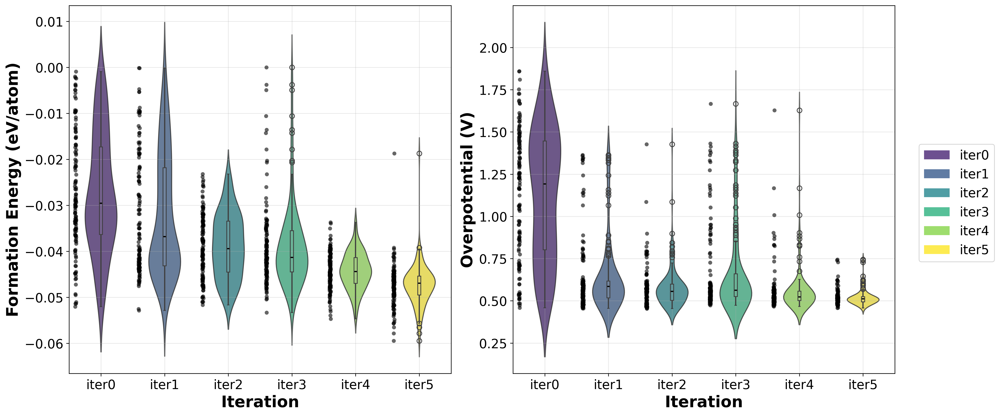

Figure 3. Data space visualization by iteration (VAE latent mean μ, t-SNE; iter0–5).
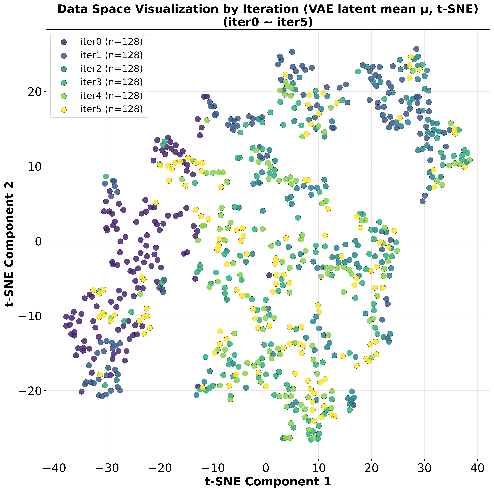

## 3.3 Evolution of Generated Data and Composition Ratios

本研究の反復生成では、条件付きVAEにより所望の特性（低過電圧・低形成エネルギー）を満たす構造が選択的に出力されるため、iterの進行に伴い分布が高性能側へシフトするだけでなく、分散も縮小し、より均一な特性のデータが得られる（Fig. 4）。

同時に、組成比の分布にも系統的変化が見られ、Pt–Ni 合金における Ni 含有量は iter の進行とともに等量近傍（x_Ni ≈ 0.5）を中心とする領域に濃縮する傾向を示した（Fig. 4）。

なお、構造の配置進化を俯瞰すると、iter0はランダムな構造配置が確認できるが、iterの進行に伴い最表面にPtが配され、その直下にNiが配置される構成（いわゆるPt‑skin/サブサーフェスNi）が徐々に顕在化する傾向が見られる。これは、活性（低過電圧）と安定性（より負の形成エネルギー）を同時に満たす設計指針として、表面・サブサーフェスの元素分配が重要であることを示唆する。

Figure 4. Overpotential vs. alloy formation energy（iter色） and the same colored by Ni fraction.

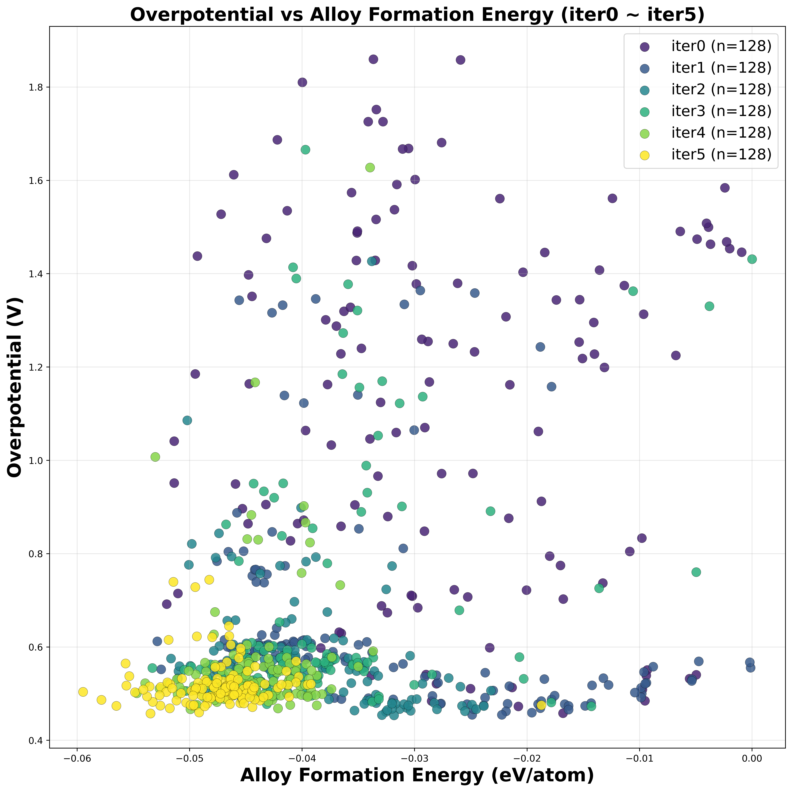

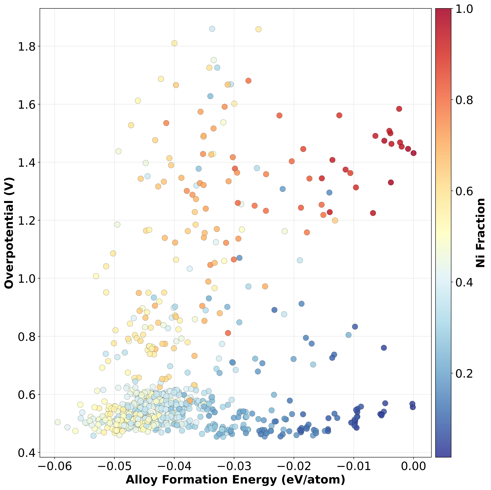

Figure 5. Structure evolution across iterations (iter0–5).
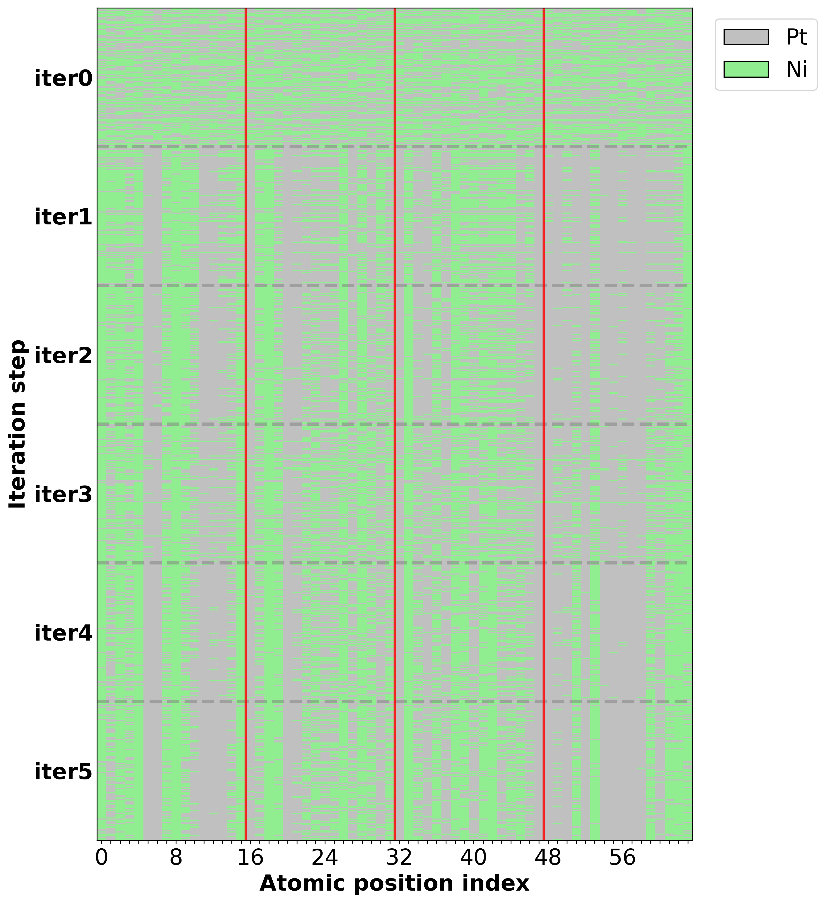

## 3.4 Evolution of Catalytic Properties

各イテレーションで得られた触媒構造の特性が（i）活性の先行研究トレンドと矛盾せず、（ii）反復生成・評価により系統的に改善されていくことを、記述子プロットで横断的に確認することである。図6は ORR の理論枠組み（CHE）と線形スケーリング則に基づくボルケーノ相関に、各iterの構造を重ね合わせたものであり、図7は組成と安定性を対応付けた相図である。これらは、3.2節のバイオリンプロットで観察した性能向上が、記述子空間でも一貫して現れていることを検証する狙いをもつ。

まず図6では、x軸に ΔG_OH、y軸に理論限界電位 U_L を取り、CHEおよびスケーリング関係から得られる2本の境界直線（強結合側: U_L = ΔG_OH、弱結合側: U_L = 1.72 − ΔG_OH）と理想水平線（U_L = 1.23 V）を示した。2直線の交点は ΔG_OH ≈ 0.86 eV であり、ここがボルケーノの頂点（U_L 最大）に対応する。iterの進行とともに、データ点は強結合側・弱結合側の腕から頂点近傍へと集約する傾向を示し、活性が理論最適領域へ近づく様子が確認できる。すなわち、3.2節のη分布の低下に対応して、記述子空間上でも U_L が高い領域（頂点近傍）への移動が観測される。

Figure 6. Volcano plot: ΔG_OH vs limiting potential (iter0–5).
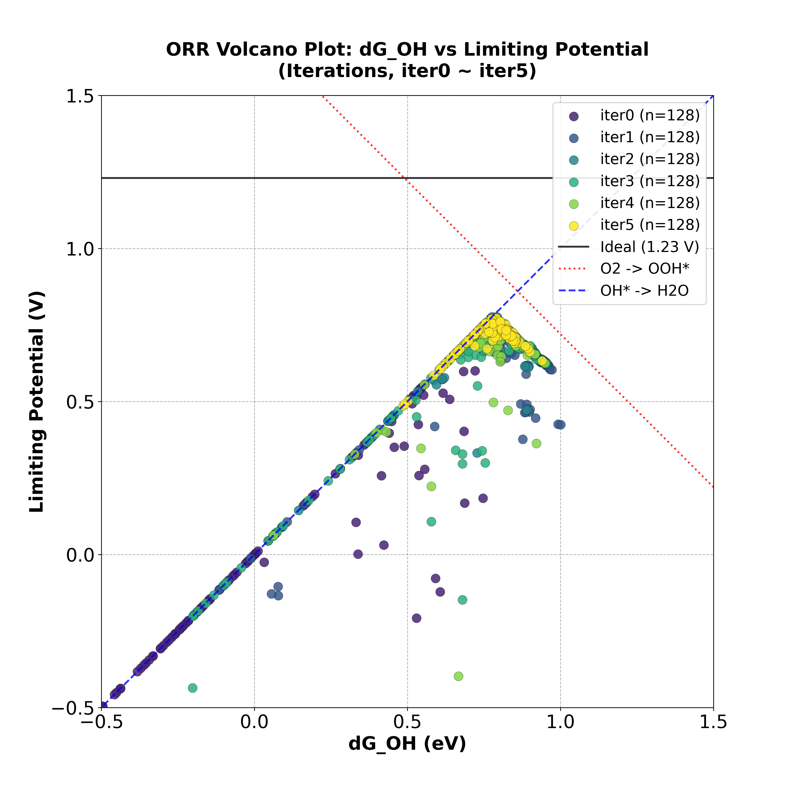

次に図7は、Ni 含有率（x_Ni）と合金形成エネルギー E_form（eV/atom、負ほど安定）の相図を iter 色で示す。iter の進行に伴い、分布はより負の E_form 側へ推移しつつ、x_Ni ≈ 0.4–0.6 の等量近傍にサンプルが濃縮する傾向が見られる。これは、活性が高い領域（図6の頂点近傍）と、熱力学的に安定な領域（より負の E_form）が、探索の反復によって同時に強化されていることを示唆する。先行研究で指摘される表面Pt・サブサーフェスNi（Pt‑skin/サブサーフェスNi）の層別組成モチーフとも整合的であり、本ワークフローが「活性×安定性」両面の設計指針を自動的に抽出していることを支持する。

Figure 7. Phase diagram: Ni fraction vs formation energy colored by iter.
  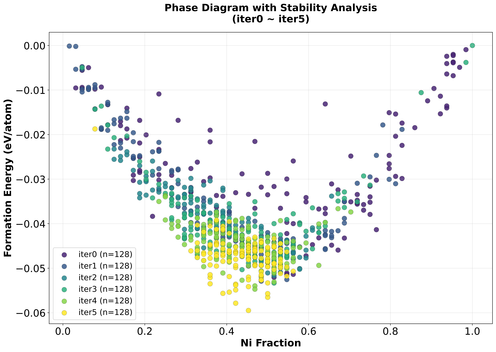

 
## 3.5 DFT Validation

iter5で得られた生成構造の一例であるPt33Ni31（Ni31Pt33）についてNNPとDFTによるORR自由エネルギーダイアグラムを比較したところ、限界電位はNNP/DFTでそれぞれ0.713 Vおよび0.728 V、過電圧は0.517 Vおよび0.502 Vであり、両者は同じ律速段階（OH*→H2O）を示し数値差は≲0.02 Vと良好に一致している。吸着サイトについてはOHが両者ともontop、OOHが両者ともbridgeで一致し、OについてはNNPがhcp、DFTがontopとわずかな差異が見られた。

Figure 8. ORR free energy diagram of Pt33Ni31 (NNP; fairchem).
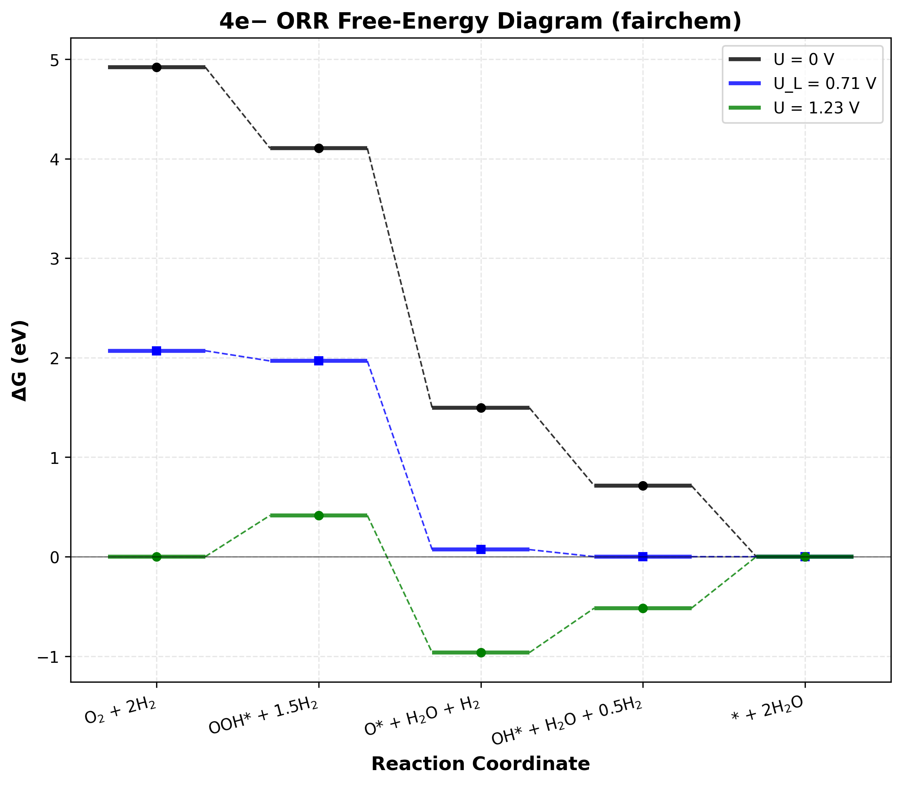

Figure 9. ORR free energy diagram of Pt33Ni31 (DFT; VASP).
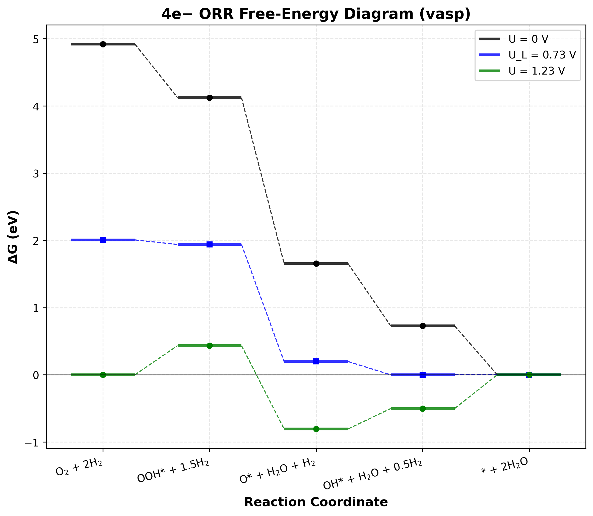

 
## 4. Conclusions

本研究では、汎用機械学習ポテンシャル（NNP）と条件付き変分オートエンコーダ（cVAE）を統合し、Pt–Ni 合金表面の酸素還元反応（ORR）を対象に「生成→評価→再学習」を反復する設計ワークフローを構築した。cVAE は計算水素電極（CHE）に基づく過電圧 η と合金形成エネルギー E_form を条件として学習し、NNP により各候補のエネルギー評価を高速化することで、iter0〜5（各128構造、計768件）の反復を通じて、η と E_form の分布がそれぞれ低電位側およびより負の側へ系統的に移動することを示した。さらに、ボルケーノプロットと相図の確認から、データ点がボルケーノ頂点近傍および安定域へ集約する傾向が確認され、既報の線形スケーリングに基づく活性トレンドと矛盾しない物理化学的一貫性が担保された。加えて、iter5 で得られた Pt33Ni31 に対する自由エネルギーダイアグラムの個別検証では、NNP と DFT の U_L・η・律速段階がよく一致し、提案手法の定量的信頼性を支持した。以上より、本ワークフローは、限られた初期データからでも、活性（低 η）と安定性（低 E_form）を同時に満たす合金表面構造を外挿的に提案しうる実用的・汎用的な計算スクリーニング基盤であることを示した。

## Data and Code Availability

- github

## References 

### イントロで使う文献

#### 燃料電池導入／ORRのボトルネック・Pt依存

- Debe, M. K. Electrocatalyst approaches and challenges for automotive fuel cells. Nature (2012) 486(7401), 43–51. DOI: 10.1038/nature11115
  ［用途メモ：PEMFCの現状/課題、ORRが律速、Pt依存の背景に］

- Centi, G. Smart catalytic materials for energy transition. SmartMat (2020) 1(1), 1005. DOI: 10.1002/smm2.1005
  ［用途メモ：エネルギー転換と触媒材料の俯瞰（導入の補助）］

- R. Rosli; A. Sulong; W. Daud; M. Zulkifley; T. Husaini; M. Rosli; E. Majlan; M. Haque. A Review of High-Temperature Proton Exchange Membrane Fuel Cell (HT-PEMFC) System. International Journal of Hydrogen Energy (2017) 42, 9293–9314. DOI: 未記載
  ［用途メモ：PEMFC技術の俯瞰（高温系のレビュー）］

- Gittleman, C. S.; Kongkanand, A.; Masten, D.; Gu, W. Materials research and development focus areas for low cost automotive proton-exchange membrane fuel cells. Current Opinion in Electrochemistry (2019) 18, 81–89. DOI: 10.1016/j.coelec.2019.10.009
  ［用途メモ：コスト低減の研究課題（政策的・産業的背景）］

- Moving forward with fuel cells. Nature Energy (2021) 6, 451. DOI: 10.1038/s41560-021-00846-1
  ［用途メモ：燃料電池の最新動向（短評・社説系）］

#### Pt系一般（利点・課題）

- Zhang, X.; Li, H.; Yang, J.; Lei, Y.; Wang, C.; Wang, J.; Tang, Y.; Mao, Z. Recent advances in Pt-based electrocatalysts for PEMFCs. RSC Advances (2021)（Review）. DOI: 10.1039/D0RA05468B
  ［用途メモ：Pt系触媒の総説］

- Wang, Y.; Wang, D.; Li, Y. A fundamental comprehension and recent progress in advanced Pt-based ORR nanocatalysts. SmartMat (2021) 2(1), 56–75. DOI: 10.1002/smm2.1023
  ［用途メモ：Pt系のデメリット・課題整理（活性/耐久/コスト）］

- Gasteiger, H. A.; Kocha, S. S.; Sompalli, B.; Wagner, F. T. Activity benchmarks and requirements for Pt, Pt-alloy, and non-Pt oxygen reduction catalysts for PEMFCs. Applied Catalysis B: Environmental (2005) 56(1–2), 9–35. DOI: 10.1016/j.apcatb.2004.06.021
  ［用途メモ：ORR活性の基準・要求水準（ベンチマーク）］

#### Pt合金一般／Pt–Ni

- Greeley, J.; Stephens, I.; Bondarenko, A.; et al. Alloys of platinum and early transition metals as oxygen reduction electrocatalysts. Nature Chemistry (2009) 1, 552–556. DOI: 10.1038/nchem.367
  ［用途メモ：Pt合金一般の有望性（理論＋実験の早期総括）］

- Tian, X.; Zhao, X.; Su, Y.-Q.; et al. Engineering bunched Pt–Ni alloy nanocages for efficient oxygen reduction in practical fuel cells. Science (2019) 366(6467), 850–856. DOI: 10.1126/science.aaw7493
  ［用途メモ：Pt–Niナノ構造での高活性実証（応用側の強い例）］

- Zhuang, Y.; Iguchi, Y.; Li, T.; Kato, M.; Hutapea, Y. A.; Hayashi, A.; Watanabe, T.; Yagi, I. Platinum–Nickel Alloy Nanowire Electrocatalysts Transform into Pt-Skin Beads-on-Nanowires Keeping Oxygen Reduction Reaction Activity During Potential Cycling. ACS Catalysis (2024) 14(3), 1750–1758. DOI: 10.1021/acscatal.3c04709
  ［用途メモ：Pt-skin 形成と活性維持（耐久・構造進化）］

##### Pt–Ni の組成・合成・活性例

- Carpenter, M. K.; Moylan, T. E.; Kukreja, R. S.; Atwan, M. H.; Tessema, M. M. Solvothermal Synthesis of Platinum Alloy Nanoparticles for Oxygen Reduction Electrocatalysis. Journal of the American Chemical Society (2012) 134(20), 8535–8542. DOI: 未記載
  ［用途メモ：Pt合金NPの合成とORR活性］

- Yang, H.; Coutanceau, C.; Léger, J.-M.; Alonso-Vante, N.; Lamy, C. Methanol tolerant oxygen reduction on carbon-supported Pt–Ni alloy nanoparticles. Journal of Electroanalytical Chemistry (2005) 576(2), 305–313. DOI: 10.1016/j.jelechem.2004.10.026
  ［用途メモ：Pt–Niの耐メタノール性・組成依存例］

##### 合金触媒の組成比最適化／高エントロピー

- Batchelor, T. A. A.; Pedersen, J. K.; Winther, S. H.; Castelli, I. E.; Jacobsen, K. W.; Rossmeisl, J. High-Entropy Alloys as a Discovery Platform for Electrocatalysis. Joule (2019) 3(3), 834–845. DOI: 10.1016/j.joule.2018.12.015
  ［用途メモ：多元合金（HEA）プラットフォームの概念］

- Shamekhi, M.; Toghraei, A.; Guay, D.; Peslherbe, G. H. High-throughput screening and DFT characterization of bimetallic alloy catalysts for the nitrogen reduction reaction. Physical Chemistry Chemical Physics (2025) DOI: 10.1039/D5CP01094B
  ［用途メモ：ハイスループットDFTと二元合金スクリーニング（NRR例；スクリーニング手法の参照に）］

### 生成AI／NNP（イントロ後半で使う想定）

#### 生成AIの利用（触媒探索）

- Ishikawa, A. Heterogeneous catalyst design by generative adversarial network and first-principles based microkinetics. Scientific Reports (2022) 12, 11657. DOI: 10.1038/s41598-022-15586-9
  ［用途メモ：GANで外挿生成→DFT/マイクロキネ連携の枠組み］

- Hisama, K.; Ishikawa, A.; Aspera, S. M.; Koyama, M. Theoretical Catalyst Screening of Multielement Alloy Catalysts for Ammonia Synthesis Using Machine Learning Potential and Generative Artificial Intelligence. The Journal of Physical Chemistry C (2024) 128(44), 18750–18758. DOI: 10.1021/acs.jpcc.4c04018
  ［用途メモ：GAN＋NNPで反復的スクリーニング（NNP活用の具体例）］

#### NNPのレビュー・評価

- Friederich, P.; Häse, F.; Proppe, J.; et al. Machine-learned potentials for next-generation matter simulations. Nature Materials (2021) 20, 750–761. DOI: 10.1038/s41563-020-0777-6
  ［用途メモ：MLポテンシャルの俯瞰レビュー］

- Unke, O. T.; Chmiela, S.; Sauceda, H. E.; et al. Machine Learning Force Fields. Chemical Reviews (2021) 121(16), 10142–10186. DOI: 10.1021/acs.chemrev.0c01111
  ［用途メモ：MLFFの大規模レビュー］

- Focassio, B.; Freitas, L. P. M.; Schleder, G. R. Performance Assessment of Universal Machine Learning Interatomic Potentials: Challenges and Directions for Materials’ Surfaces. ACS Applied Materials & Interfaces (2024/2025) 17(9), 13111–13121. DOI: 10.1021/acsami.4c03815
  ［用途メモ：ユニバーサルNNPの表面系評価（課題と指針）］

- UMA: A Family of Universal Models for Atoms. arXiv (2025). DOI: 10.48550/arXiv.2506.23971
  ［用途メモ：ユニバーサルNNP（UMA）概要。本文では軽い紹介に］

- Chanussot, L.; Das, A.; Goyal, S.; et al. Open Catalyst 2020 (OC20) Dataset and Community Challenges. ACS Catalysis (2021). DOI: 10.1021/acscatal.0c04525
  ［用途メモ：触媒NNPの大規模データ基盤］

- Barroso-Luque, L.; Shuaibi, M.; Fu, X.; et al. Open Materials 2024 (OMat24) Inorganic Materials Dataset and Models. arXiv (2024). DOI: 未記載
  ［用途メモ：材料一般の大規模データ（参考）］

- Schmidt, J.; Hoffmann, N.; Wang, H.-C.; et al. Machine-Learning-Assisted Determination of the Global Zero-Temperature Phase Diagram of Materials. Advanced Materials (2023) 35(22), 2210788. DOI: 未記載
  ［用途メモ：相図推定にMLを用いる流れ（背景）］

### メソッドで使う文献

#### ORR／CHE／溶媒補正

- Nørskov, J. K.; Rossmeisl, J.; Logadottir, A.; et al. Origin of the Overpotential for Oxygen Reduction at a Fuel-Cell Cathode. The Journal of Physical Chemistry B (2004) 108(46), 17886–17892. DOI: 10.1021/jp047349j
  ［用途メモ：CHEの基礎（ηやULの定義、自由エネルギー評価）］

- He, Z.-D.; Hanselman, S.; Chen, Y.-X.; Koper, M. T. M.; Calle-Vallejo, F. Importance of Solvation for the Accurate Prediction of Oxygen Reduction Activities of Pt-Based Electrocatalysts. The Journal of Physical Chemistry Letters (2017) 8(10), 2243–2246. DOI: 10.1021/acs.jpclett.7b01018
  ［用途メモ：定数溶媒補正の根拠（OOH/OHの補正など）］

- Zhang, Q.; Asthagiri, A. Solvation effects on DFT predictions of ORR activity on metal surfaces. Catalysis Today (2019) 323, 35–43. DOI: 10.1016/j.cattod.2018.07.036
  ［用途メモ：溶媒が活性予測に与える影響（概要）］

#### DFT実装・PAW・VASP

- Kresse, G.; Furthmüller, J. Efficient iterative schemes for ab initio total-energy calculations using a plane-wave basis set. Physical Review B (1996) 54(16), 11169–11186. DOI: 未記載
  ［用途メモ：VASP（実装基礎）］

- Kresse, G.; Joubert, D. From ultrasoft pseudopotentials to the projector augmented-wave method. Physical Review B (1999) 59(3), 1758–1775. DOI: 未記載
  ［用途メモ：PAW法の原典］

### VAE／実装基盤

- Kingma, D. P.; Welling, M. Auto-Encoding Variational Bayes. arXiv (2013/ICLR 2014). DOI: 10.48550/arXiv.1312.6114
  ［用途メモ：VAEの基本枠組み］

- Rezende, D. J.; Mohamed, S.; Wierstra, D. Stochastic Backpropagation and Approximate Inference in Deep Generative Models. arXiv (2014/ICML 2014). DOI: 10.48550/arXiv.1401.4082
  ［用途メモ：畳み込みVAE］

- Larsen, A. H.; Mortensen, J. J.; Blomqvist, J.; et al. The atomic simulation environment—a Python library for working with atoms. Journal of Physics: Condensed Matter (2017) 29(27), 273002. DOI: 10.1088/1361-648X/aa680e
  ［用途メモ：ASE（計算実装の基盤）］

### 結果の考察で使う文献

#### 構造生成（Pt-skinモチーフの設計・再現）

- Shin, D. Y.; Shin, Y.-J.; Kim, M.-S.; Kwon, J. A.; Lim, D.-H. Density functional theory–based design of a Pt-skinned PtNi catalyst for the oxygen reduction reaction in fuel cells. Applied Surface Science (2021) 565, 150518. DOI: 10.1016/j.apsusc.2021.150518
  ［用途メモ：Pt-skin設計のDFT指針（本研究の生成構造モチーフの妥当性確認に）］

#### ボルケーノ／スケーリング関係

- Kulkarni, A.; Siahrostami, S.; Patel, A.; Nørskov, J. K. Understanding Catalytic Activity Trends in the Oxygen Reduction Reaction. Chemical Reviews (2018) 118(5), 2302–2312. DOI: 10.1021/acs.chemrev.7b00488
  ［用途メモ：ΔG_*OH 指標・スケーリング・ボルケーノの総説（図示の根拠に）］

#### 相図（Ni–Pt 系）

Popov, A. A.; Varygin, A. D.; Plyusnin, P. E.; Sharafutdinov, M. R.; Korenev, S. V.; Serkova, A. N.; Shubin, Y. V. X-ray diffraction reinvestigation of the Ni–Pt phase diagram. Journal of Alloys and Compounds (2022) 891, 161974. DOI: 10.1016/j.jallcom.2021.161974
［用途メモ：Ni–Pt バルク相図の最新XRD再検討。合金安定相・秩序相領域の根拠に。］

Sanati, M.; Wang, L. G.; Zunger, A. Adaptive Crystal Structures: CuAu and NiPt. Physical Review Letters (2003) 90, 045502. DOI: 10.1103/PhysRevLett.90.045502
［用途メモ：NiPt（CuAu型を含む）における適応的結晶構造／秩序化の理論的知見。相安定性・秩序相の議論に。］

Shang, S. L.; Wang, Y.; Kim, D. E.; Zacherl, C. L.; Du, Y.; Liu, Z. K. Structural, vibrational, and thermodynamic properties of ordered and disordered Ni1−xPt x alloys from first-principles calculations. Physical Review B (2011) 83, 144204. DOI: 10.1103/PhysRevB.83.144204
［用途メモ：Ni1−xPt x 合金の秩序／無秩序相に対する構造・振動・熱力学（第一原理）。混合自由エネルギーや相安定性の補強に。］

- 

## Supplementary Information
- Distributions（補足）: iter別の単独分布を参照（本文は複合図）。
  - Overpotential histogram (iter0–5)
  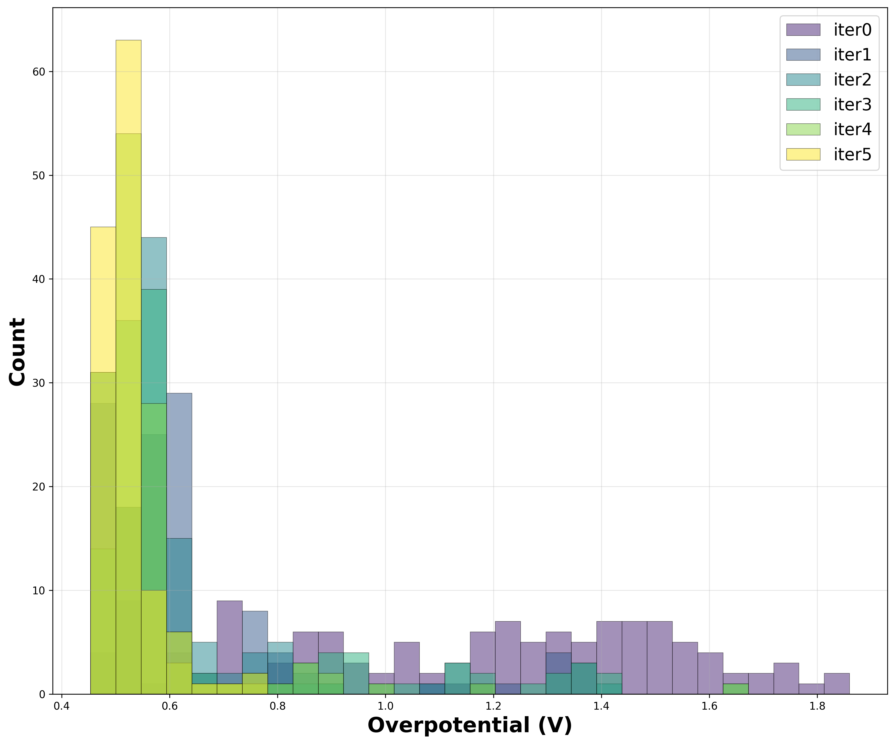
  - Alloy-formation histogram (iter0–5)
  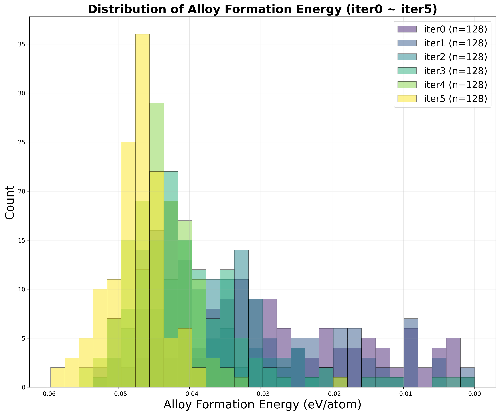

- Volcano variants（補助）: iter以外の色付け表現。
  - Volcano（Ni heatmap）
  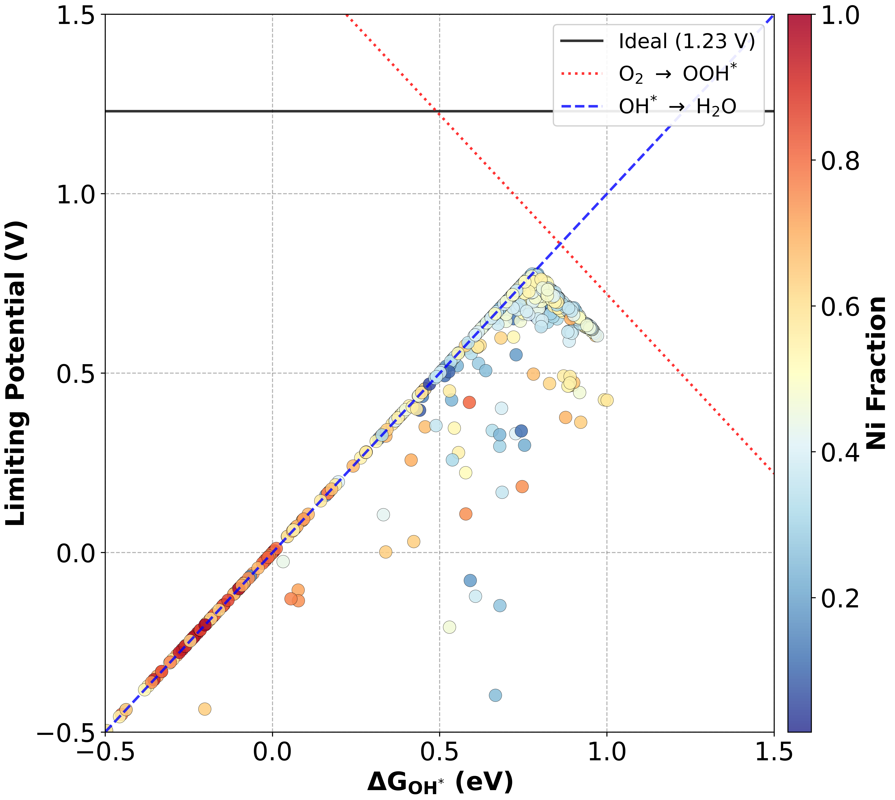
  - Volcano（Pt heatmap）
  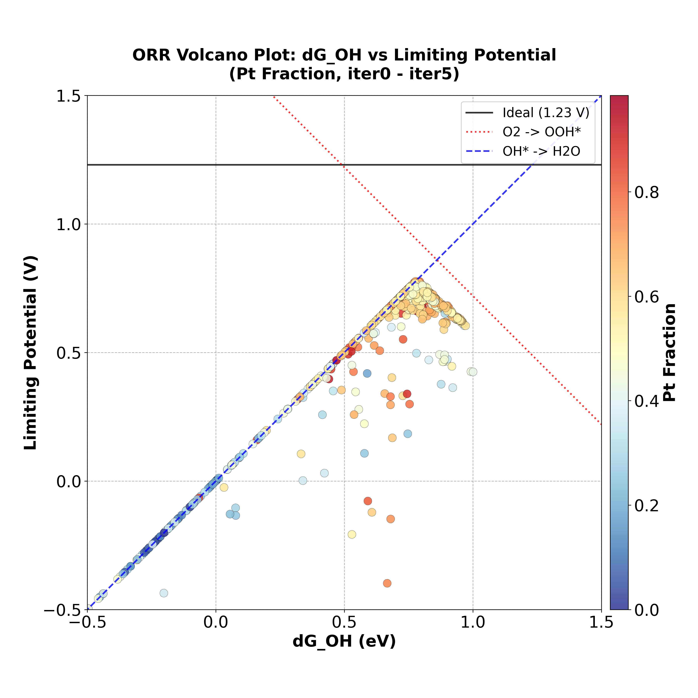
