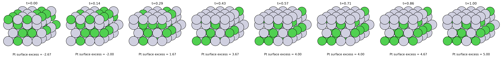
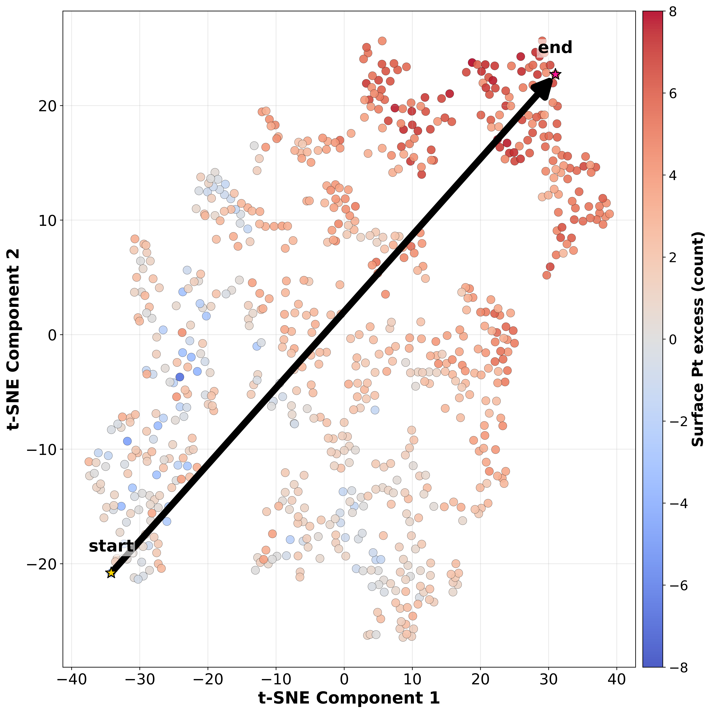
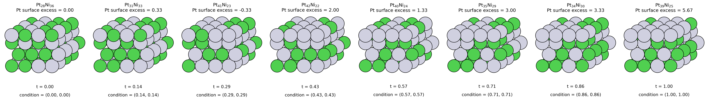
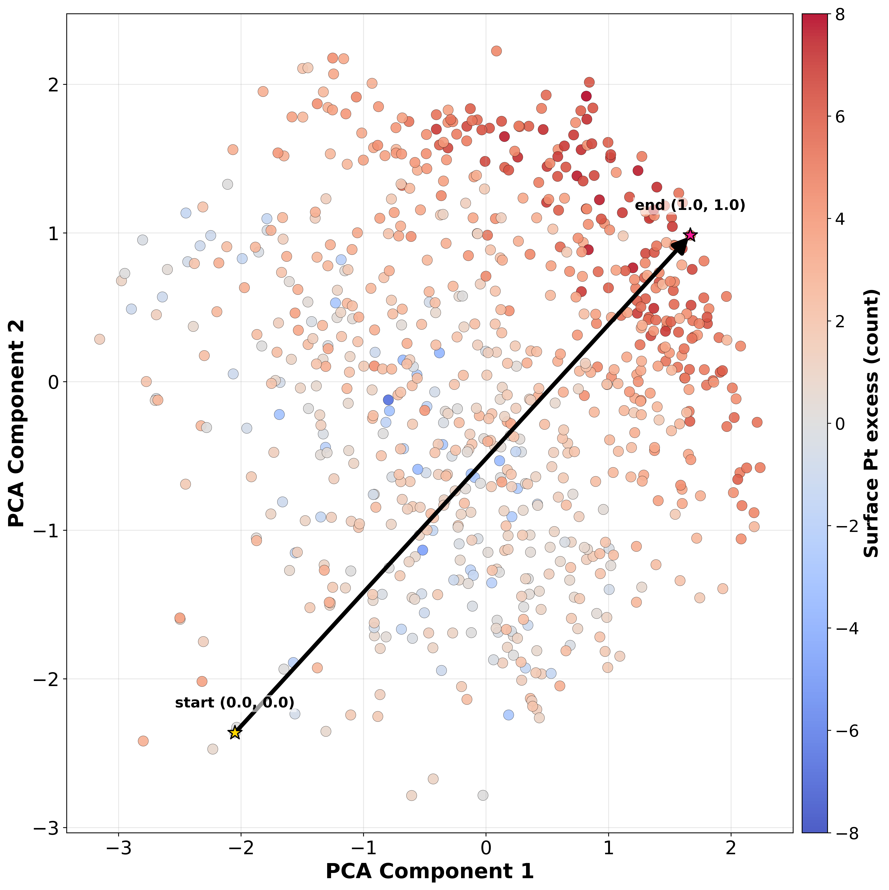

## Abstract

We developed a method that simultaneously optimizes the activity and stability of alloy catalysts for the oxygen reduction reaction (ORR) by combining a conditional variational autoencoder (cVAE) with a universal neural network potential (NNP) for rapid evaluation within the computational hydrogen electrode (CHE) framework.

We applied this method to Pt–Ni surface alloys.

The cVAE was trained with overpotential (η) and alloy formation energy (E_form) as conditional labels, and used to generate new structures that were then evaluated by the NNP.

Across six iterations (n = 768 structures), the distributions shifted toward lower overpotentials and more negative formation energies.  

For example, the dataset mean improved from η = 1.126 to 0.520 V and from E_form = −0.027 to −0.047 eV/atom.

Latent-space analysis showed that the generator explored regions of the data space absent from the initial data and created Pt-rich surface (Pt-skin-like) structures consistent with ORR design principles.

NNP predictions agreed closely with DFT for both η and E_form, supporting the reliability of the high-throughput screening. 

This method accelerates inverse design of alloy catalysts and provides a general approach for discovering surface structures that jointly satisfy high activity and thermodynamic stability.

---

## 1. Introduction
Proton exchange membrane fuel cells (PEMFCs) are a clean power technology that can use hydrogen from renewable sources.
[@debeElectrocatalystApproachesChallenges2012]

However, slow oxygen reduction reaction (ORR) at the cathode limits practical deployment, and the development of highly active and durable catalysts remains a challenge.
[@gittlemanMaterialsResearchDevelopment2019][@cullenNewRoadsChallenges2021]

Platinum (Pt) is the main commercial catalyst, but its cost and rarity motivate alloying Pt with inexpensive elements as an effective way to balance performance and resource constraints.
[@huangAdvancedPlatinumBasedOxygen2021][@greeleyAlloysPlatinumEarly2009][@zhangRecentAdvancesPtbased2021]

Among these, Pt–Ni is a widely studied ORR alloy catalyst system.
[@wangFundamentalComprehensionRecent2021][@tianEngineeringBunchedPtNi2019]

This is partly because Pt-skin structures, with Pt-rich surfaces over Ni-rich subsurfaces, can enhance ORR activity by tuning the d-band center.
[@stamenkovicImprovedOxygenReduction2007][@shinDensityFunctionalTheory2021][@kumedaInterfacialStructurePtNi2017][@limRoleTransitionMetals2023]

However, several reports disagree on the optimal composition and atomic arrangement for jointly improving activity and stability, and design rules remain incomplete.
[@yangMethanolTolerantOxygen2005][@carpenterSolvothermalSynthesisPlatinum2012][@xiaUnveilingCompositionDependentCatalytic2024]

For such alloy catalyst design, computational screening, especially with density functional theory (DFT), has been effective.
[@shambhawiDesignOptimizationHeterogeneous2024]

However, the combinations of elemental composition ratios and atomic arrangements are vast, and comprehensive exploration of candidate patterns is not realistic with DFT given computational resource constraints.
[@shambhawiDesignOptimizationHeterogeneous2024]

Descriptor-based machine-learning screening also helps identify important features and predict properties.
[@hartMachineLearningAlloys2021][@sharmaMachineLearningGuidedDiscovery2025][@yinMachinelearningacceleratedDesignHighperformance2024][@lucchettiRevolutionizingORRCatalyst2024]
[@shamekhiHighthroughputScreeningDFT2025]

However, model training requires a sufficient amount of data for each task, and exploring new structures needs many evaluations using the trained model.

Therefore, the use of generative models has been proposed for inverse design from material properties to structures, and is expected to be an effective approach for generating structures from unknown chemical data spaces.
[@hellmanBriefOverviewDeep2025][@parkHasGenerativeArtificial2024]

In particular, the iterative process of structure generation by generative models and evaluation by DFT calculations has been shown to enable the extrapolative proposal of alloy catalyst structure candidates not included in initial data sets for alloy catalyst design.
[@ishikawaHeterogeneousCatalystDesign2022]

However, the workflow of evaluating proposed structures from generative models with DFT calculations each time becomes rapidly inefficient as the amount of data increases.

To solve this problem, a universal neural network potential (NNP) trained on first-principles calculation data can accelerate the iteration of generation and evaluation while maintaining accuracy close to DFT.
[@hisamaTheoreticalCatalystScreening2024]

These studies have used generative adversarial networks (GANs) as generative models, although variational autoencoders (VAEs), which are also general generative models, have been used for the design of several materials.  
[@hellmanBriefOverviewDeep2025][@parkHasGenerativeArtificial2024][@bajpaiScalableCrystalRepresentation2023][@turkAssessingDeepGenerative2022][@songInverseDesignPromising2025][@renRapidEstimationSolvus2024]

GANs can sometimes be unstable during training when the amount of training data is small.
[@liComprehensiveSurveyDataEfficient2022][@zhaoDifferentiableAugmentationDataEfficient2020][@karrasTrainingGenerativeAdversarial2020]

This suggests that GAN use may be limited when a sufficient amount of data cannot be prepared computationally or experimentally.

By contrast, VAEs are relatively easy to train and stabilize compared to GANs, and they can generate candidates from unobserved data spaces because they have a regularized continuous latent space.
[@bajpaiScalableCrystalRepresentation2023]

Additionally, it has been reported that conditional learning allows high-precision generation of specified label (class) data.
[@turkAssessingDeepGenerative2022]

In addition, by optimizing the latent space of a pre-trained crystal diffusion variational autoencoder (CDVAE) using the bird swarm algorithm, new CO2RR catalysts were designed by exploring alloys with desired adsorption energies based on existing scaling relations.
[@songInverseDesignPromising2025]

However, in catalyst design, multiple metrics such as not only activity but also material stability and durability are important, and it is required to optimize them simultaneously.
[@sharmaMachineLearningGuidedDiscovery2025][@lucchettiRevolutionizingORRCatalyst2024]

Moreover, for more general catalyst design methods, it is necessary to evaluate catalytic activity not by a single adsorption energy but by kinetic or thermodynamic analysis of reaction steps, assuming the existence of systems where scaling relations are not reported or do not hold.

Thus, this study proposes a workflow that integrates fast evaluation using a universal NNP and structure generation using VAE for the optimization of Pt–Ni alloy catalysts for ORR.

Specifically, new structures are generated using a conditional variational autoencoder (cVAE) conditioned on ORR overpotential and alloy formation energy.

The cVAE has been used for multi-objective optimization and generation of chemical compounds with multiple properties as conditional labels, and there is no need for additional optimization of the latent space.
[@leeMGCVAEMultiObjectiveInverse2022][@limMolecularGenerativeModel2018][@jooGenerativeModelProposing2020]

The generated structures are evaluated by thermodynamic analysis based on the computational hydrogen electrode (CHE) using the NNP.

By repeating this process, we efficiently explore Pt–Ni catalysts that have high activity and stability.

---

## 2. Methods

### 2.1 Machine-Learning Potential and DFT Settings

We used the uma-s-1p1 model as a universal neural network potential (NNP) for structure optimization and energy calculations.
[@woodUMAFamilyUniversal2025]

uma-s-1p1 was pretrained on about 500 million DFT-calculated data points and incorporates a Mixture of Linear Experts (MoLE) within the equivariant Smooth Energy Network (eSEN) architecture.

It reports accuracies of MAE 24.9 meV/atom for the formation energies of high-entropy alloys (HEAs) and MAE 68.8 meV for adsorption energies on the OC20 dataset.

All spin-polarized DFT calculations were performed with VASP 6.5.1 using the GGA-RPBE exchange–correlation functional and the projector augmented-wave (PAW) method.
[@kresseEfficientIterativeSchemes1996][@kresseUltrasoftPseudopotentialsProjector1999]

A plane-wave cutoff of 450 eV was used with Methfessel–Paxton smearing of width 0.20 eV.

The electronic self-consistency tolerance was set to 1×10⁻⁵ eV, and Brillouin-zone sampling used Monkhorst–Pack k-point grids of 2×2×2 for bulk, 2×2×1 for slabs, and the Γ-point for gas-phase molecules.

Each slab comprised a 4×4 surface unit cell with four atomic layers of fcc(111); the bottom two layers were fixed, and the top two layers and adsorbates were fully relaxed.

A 15 Å vacuum was applied along the z direction, and a dipole correction was included.

Gas-phase H₂ and H₂O references were optimized in a 15 Å cubic box.

Geometry optimizations with both NNP and DFT were converged to a force threshold of 0.05 eV Å⁻¹.

For adsorption calculations, OOH*, O*, and OH* were initially placed at on-top, bridge, fcc-hollow, and hcp-hollow sites, and the most stable site was identified by relaxation.

The cell size was optimized before applying the vacuum layer to the slab.

We consistently used the NNP (uma-s-1p1) to evaluate η and E_form in the iterative loop, whereas DFT was used to validate the NNP and to analyze representative structures.

---

### 2.2 Oxygen Reduction Reaction

We assessed oxygen reduction reaction (ORR) activity within the computational hydrogen electrode (CHE) framework of Nørskov and co-workers.
[@norskovOriginOverpotentialOxygen2004]

Under acidic conditions (pH = 0), the four-electron pathway proceeds through the sequence:

1. O₂ + H⁺ + e⁻ + * → OOH*
2. OOH* + H⁺ + e⁻ → O* + H₂O
3. O* + H⁺ + e⁻ → OH*
4. OH* + H⁺ + e⁻ → H₂O + *

For each proton–electron transfer step i, we first calculated the zero-potential free-energy change,

$$
\Delta G_i(0) \;=\; \Delta E_i \;+\; \Delta E_i^{\mathrm{ZPE}} \;-\; T\,\Delta S_i,
$$

where $\Delta E_i$ is the DFT reaction energy, and $\Delta E_i^{\mathrm{ZPE}}$ and $\Delta S_i$ are zero-point-energy and vibrational-entropy corrections taken from the literature at $T = 298.15\,\mathrm{K}$.
[@norskovOriginOverpotentialOxygen2004]

Potential-dependent free energies follow

$$
\Delta G_i(U) \;=\; \Delta G_i(0) \;-\; n_i\,e\,U,
$$

where $U$ denotes the applied electrode potential referenced to the standard hydrogen electrode, $e$ is the elementary positive charge, and $n_i$ is the number of coupled proton–electron pairs transferred in step $i$ (here $n_i = 1$ for all four reactions).

The limiting potential is the smallest $U$ that gives every step exergonic, and the corresponding theoretical overpotential is computed relative to the reversible potential of 1.23 V as

$$
U_L \;=\; \min_i \!\left[ \frac{\Delta G_i(0)}{n_i\,e} \right], \qquad \eta \;=\; 1.23 \;-\; U_L \;\;[\mathrm{V}].
$$

To alleviate the well-known error of gas-phase O₂ within GGA functionals, we referenced the O₂ free energy to H₂ and H₂O using the experimental water-formation free energy (2.46 eV).

Constant solvation corrections of 0.00, 0.28, and 0.57 eV were added to O*, OOH*, and OH*, respectively.
[@zhangSolvationEffectsDFT2019][@heImportanceSolvationAccurate2017]

---

### 2.3 Alloy Formation Energy

The alloy formation energy $E_{\mathrm{form}}$ was evaluated as

$$
E_{\mathrm{form}} \;=\; E_{\mathrm{bulk}}^{\mathrm{alloy}} \;-\; \sum_i N_i \, \frac{E_{\mathrm{bulk}}(i)}{N_{\mathrm{bulk}}(i)}.
$$

We normalized $E_{\mathrm{form}}$ by the total number of atoms in each slab, yielding values in eV/atom. The elemental reference energies for Pt and Ni were obtained by optimizing 4×4×4 fcc cells using the same computational workflow described in Section 2.1.

### 2.4 Variational Auto-Encoder

#### 2.4.1 Structure Representation

Catalyst slabs were represented as a tensor of shape (4, 8, 8), mapping each of the four fcc(111) layers to a 2D grid.

For each layer, a two-dimensional matrix encoded the site occupancy as blank, Ni, or Pt for every grid element.

This representation captures layer stacking and in-plane alloy arrangements.

Figure 1. Structure representation of the catalyst slab as a (4, 8, 8) tensor mapping each fcc(111) layer to a 2D grid.

#### 2.4.2 VAE Architecture
We used a conditional VAE to learn and generate catalyst structures.  
[@kingmaAutoEncodingVariationalBayes2022][@kingmaSemiSupervisedLearningDeep2014][@sohnLearningStructuredOutput2015]

We augmented the (4, 8, 8) structure tensor with binary labels summarizing performance in overpotential and alloy formation energy.

At iteration k, we aggregated all structures available up to that point (iter0–k), ranked them by overpotential (ascending; lower is better) and by formation energy (ascending; more negative is more stable), and reassigned the labels. The top 30% in each ranking received a label value of 1, and the remaining 70% received 0. This percentile-based assignment was recomputed at every iteration so that the conditional labels reflected the current performance distribution.

Consequently, each structure carried one of four condition vectors—(1,1), (1,0), (0,1), or (0,0)—depending on whether it met the targets for low overpotential and/or high stability.

The VAE encoder and decoder were based on convolutional blocks and had a 32-dimensional latent space.

Conditional labels were embedded with fully connected layers and concatenated to the encoder and decoder.

The decoder output had shape (12, 8, 8) corresponding to 4 layers × 3 classes.

During structure generation, the output was converted to (4, 8, 8) class labels via a softmax function.

Figure 2. Conditional convolutional VAE architecture: label embeddings are combined into encoder and decoder; the decoder outputs logits of shape (12, 8, 8) corresponding to 4 layers × 3 classes.

#### 2.4.3 Training Process
VAE training was conducted on the cumulative dataset up to the current iteration, split into training and validation sets at a 9:1 ratio.

The optimizer was AdamW with a learning rate of 2×10⁻⁴ and weight decay 1×10⁻⁴.

The batch size was 16, and training was performed for 200 epochs.

The loss combined weighted multi-class cross-entropy over the three classes (blank, Ni, Pt) for each pixel in the four layers with the KL divergence of the latent distribution.

$$
p_{bzhw,c} \,=\, \mathrm{softmax}(\hat x_{bzchw})_c
$$

$$
\begin{aligned}
\mathcal{L}_{\rm recon}
&= -\sum_{b=1}^{B}\sum_{z=1}^{4}\sum_{h=1}^{H}\sum_{w=1}^{W}
\, w_{x_{bzhw}} \, \log p_{bz h w,\, x_{bzhw}},\\
\mathcal{L}_{\rm KL}
&= -\tfrac12\sum_{b=1}^{B}\sum_{j=1}^{D}\Bigl(1+\log\sigma_{bj}^2-\mu_{bj}^2-\sigma_{bj}^2\Bigr),\\
\mathcal{L}_{\text{total}}
&= \mathcal{L}_{\rm recon} + \beta\,\mathcal{L}_{\rm KL}\qquad(\beta=2.0).
\end{aligned}
$$

We also used the β-VAE technique, multiplying the KL term by β = 2.0 for regularization.  
[@higginsVVAELEARNINGBASIC2017]

#### 2.4.4 Structure Generation
After training, we selected the condition (1,1) (low overpotential and low formation energy) and sampled tensors from the trained decoder.

New catalyst structures were obtained by applying the inverse structure representation.

During each iteration, we generated structures from the decoder until we collected 128 unique slabs, discarding any candidate whose atomic arrangement exactly matched a structure present in the current iteration or in the accumulated dataset.

### 2.5 Iterative Loop
We conducted six iterations (iter0–5): iter0 generated 128 random Pt–Ni slabs as the seed dataset, and each of the subsequent five iterations (iter1–5) generated and evaluated 128 structures with cVAE-guided sampling, yielding 768 structures in total.

The iter0 structures were generated with random atomic arrangements, and the ORR overpotential η and alloy formation energy E_form were evaluated using the NNP.

The resulting dataset (structure, η, E_form) was used to train the conditional VAE.

After training, the decoder was conditioned on “low overpotential and low formation energy” to generate new structures.

For the generated structures, we again evaluated (η, E_form) using the NNP, added them to the dataset, redefined the conditional labels, and repeated the “generation → evaluation → addition → training” loop from iter1 to iter5.

For VAE training we used PyTorch, and for structure generation and management we used ASE.  
[@hjorthlarsenAtomicSimulationEnvironment2017]

Figure 3. Iterative workflow integrating structure generation with cVAE and property evaluation with NNP.

## 3. Results and Discussion

## 3.1 Accuracy of NNP

We validated the universal NNP (uma‑s‑1p1) for the Pt–Ni alloy system by comparison with DFT calculations.

For this validation, we generated 50 Pt–Ni slabs using the same random sampling scheme as iter0, ensuring broad coverage of surface configurations. Each structure was then evaluated with both the NNP and spin‑polarized DFT under the settings described in Section 2.1.

Figure 4 shows parity plots of (i) ORR overpotential η (V) and (ii) alloy formation energy E_form (eV/atom), with DFT on the x‑axis and NNP on the y‑axis.

Both metrics show high Spearman rank correlation (ρ ≈ 0.985 for η; ρ ≈ 0.982 for E_form), confirming preservation of rank ordering between NNP and DFT.

The mean absolute errors were MAE ≈ 0.060 V for η and MAE ≈ 0.007 eV/atom for E_form.

η agrees closely across a wide range (≈ 0.5–1.8 V).

E_form tends to be slightly underestimated on the unstable side in the region of under −0.03 eV/atom, yet the typical error (~ 0.01 eV/atom) is acceptable for screening purposes.

Therefore, we judge that property evaluation by the NNP is reliable within this workflow.

---

$$
E_{\mathrm{form}} = E_{\mathrm{bulk}}^{\mathrm{alloy}} - \sum_i N_i \; \frac{E_{\mathrm{bulk}}(i)}{N_{\mathrm{bulk}}(i)}.
$$

Figure 4. Parity plots of overpotential (V) and alloy formation energy (eV/atom) between DFT (x) and NNP (y).

## 3.2 Iterative Improvement and Data Distributions

We confirmed that the distributions of overpotential and alloy formation energy shifted toward higher performance across six iterations of generation and evaluation, where iter0 is the random initialization and iter1–5 are cVAE‑guided updates.

The violin plots in Figure 5 show that the overpotential distribution moves toward higher activity, while the formation‑energy distribution shifts to more stable values as iterations progress.

The mean overpotential decreased from 1.126 V to 0.520 V, and the mean formation energy decreased from −0.027 to −0.047 eV/atom.

Figure 6 shows the joint distribution: as η decreases, E_form shifts to more negative values.

These trends indicate that the VAE generator tends to produce structures that are both active and stable.

--- 

Figure 5. Distributions of overpotential and alloy formation energy (iter0–5).

Figure 6. Overpotential vs alloy formation energy (iter0–5).

## 3.3 Evolution of Catalytic Properties

Figure 7 shows volcano plots based on the CHE and linear scaling relations for the ORR, with points from each iteration.
[@kulkarniUnderstandingCatalyticActivity2018]

Figure 8 shows a phase diagram of composition (Ni fraction) versus alloy formation energy.

In Figure 7, the x‑axis is ΔG_OH and the y‑axis is the limiting potential U_L, with two boundary lines obtained from CHE and scaling relations, and an ideal line (U_L = 1.23 V).

The intersection occurs at ΔG_OH ≈ 0.86 eV, corresponding to the volcano top (maximum U_L).

Data points shift toward the top as iterations progress, and the activity approaches the theoretically optimal region.

In Figure 8, the distribution shifts toward more negative E_form, with samples concentrating around x_{Ni} ≈ 0.5.

These results indicate that the high‑activity region (near the top in Figure 7) and the thermodynamically stable region (more negative E_form) are increasingly accessed by the iterative exploration.

---

Figure 7. Volcano plot: ΔG_OH vs limiting potential U_L (iter0–5). [@kulkarniUnderstandingCatalyticActivity2018]

Figure 8. Phase diagram: Ni fraction vs formation energy, colored by iteration.

  

 
## 3.4 DFT Validation

We validated the 24 structures obtained in iteration 5 that satisfy η < 0.60 V and E_form < −0.05 eV/atom by DFT evaluation.

The trend of overpotential agreed well between NNP and DFT, with MAE ≈ 0.016 V.

The alloy formation energy was slightly underestimated by the NNP relative to DFT by about 0.01 eV/atom.

We also examined Pt35Ni29, one of the high-activity and high-stability structures from iteration 5, and visualized and compared the most stable site and adsorption reaction energies for OH*, O*, and OOH* using both NNP and DFT.

The three adsorbates shared the same most stable site.

Furthermore, comparing the ORR free-energy diagrams from NNP and DFT in Figure 11, the limiting potentials U_L are 0.731 V and 0.756 V, respectively (error 0.025 V), and the rate-determining steps are consistent.

---

Figure 9. Parity and property plots for DFT vs NNP: (a) overpotential, (b) alloy formation energy, and (c) overpotential vs formation energy.

  

Figure 10. Adsorption structures and adsorption reaction energies.

Figure 11. ORR free‑energy diagrams.

 

$$
E_{\mathrm{ads}}(\mathrm{OH}^{\ast}) = E(\mathrm{OH}^{\ast}) - \left[ E(\ast) + E(\mathrm{H_2O}) - \tfrac{1}{2}E(\mathrm{H_2}) \right]
$$

$$
E_{\mathrm{ads}}(\mathrm{O}^{\ast}) = E(\mathrm{O}^{\ast}) - \left[ E(\ast) + E(\mathrm{H_2O}) - E(\mathrm{H_2}) \right]
$$

$$
E_{\mathrm{ads}}(\mathrm{OOH}^{\ast}) = E(\mathrm{OOH}^{\ast}) - \left[ E(\ast) + E(\mathrm{H_2O}) + \tfrac{1}{2}E(\mathrm{H_2}) \right]
$$

## 3.5 Latent-Space Visualization and Property-Colored Distributions

We visualized all data points in 2D using t-SNE to analyze the distribution, after reducing the dimensionality to the 32-dimensional posterior mean (μ) of the latent variable z learned by the cVAE at iteration 5.

Figure 12 shows the results colored by iteration.

The initial data (iter0) are mainly distributed on the left side of the map, whereas iter1 and later spread toward the center and right.

This indicates that exploration and generation expanded into regions of the data space absent in iter0.

In addition, we colored each point by a parameter that measures the excess number of Pt atoms in the top layer relative to the lower layers to probe the influence of surface structure on activity.

In iter0, most points are near 0, indicating that the number of Pt atoms in the top layer is similar to that in lower layers.

By contrast, in iter1 and later, points with positive values (red) increase markedly, meaning the top layer contains more Pt than the average of layers 2–4.

This suggests that Pt-skin-like structures are selectively generated.
[@stamenkovicImprovedOxygenReduction2007][@shinDensityFunctionalTheory2021][@kumedaInterfacialStructurePtNi2017][@limRoleTransitionMetals2023]

This is consistent with the improvement in the overpotential distribution shown in Section 3.2 (shift to lower η).

Therefore, iterative generation and evaluation extend the data space beyond that of the initial dataset, and a meaningful catalytic feature (surface Pt enrichment) emerges in the mapping.

---

$$
\mathrm{Surface\ Pt\ excess}
\;=\;
\frac{1}{3}\sum_{k=2}^{4}\bigl[\,N_{\mathrm{Pt}}^{(\mathrm{top})}-N_{\mathrm{Pt}}^{(k)}\,\bigr],
$$

Figure 12. Latent-space visualization by t‑SNE (top: colored by iteration; bottom: colored by surface Pt excess).

## 4. Conclusions

For ORR on the Pt–Ni alloy surface, the cVAE was trained with conditional labels based on CHE overpotential and alloy formation energy, and the NNP accelerated evaluation of the generated structures.

The overpotential and formation energy values obtained by the NNP were confirmed by DFT to exhibit low MAE and preserve rank order with high accuracy.

The distributions of η and E_form shifted toward lower overpotentials and more negative formation energies by generating and evaluating 768 structures over six iterations.

Data obtained in each iteration approached the area of the reported volcano peak and the thermodynamically stable regions of the Ni–Pt phase diagram, confirming the physical and chemical plausibility of the generated structures.

Using the encoder of the trained cVAE, each structure was mapped to two dimensions, and the data expanded into regions of latent space absent in the initial dataset as iterations progressed.

A surface Pt-rich (Pt-skin-like) feature emerged as a meaningful catalytic descriptor.

This workflow demonstrates a general computational screening method that can extrapolate alloy surface structures satisfying both activity and stability from limited initial data.

---

## Data and Code Availability

- github

## References

- orr-vae.bib

## Supplementary Information

  
  - Overpotential histogram (iter0–5)
  
  

  - Alloy-formation histogram (iter0–5)
  
  

  
  
  

  
  

  
  - Structure lineup (t-SNE interpolation)
  
  
  
  - Start/end highlight on t-SNE map
  
  

  - PCA latent interpolation lineup
  
  
  
  - Start/end highlight on PCA map
  
  
