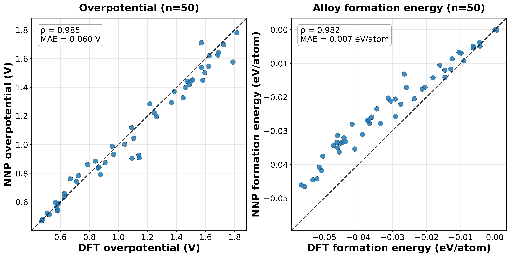
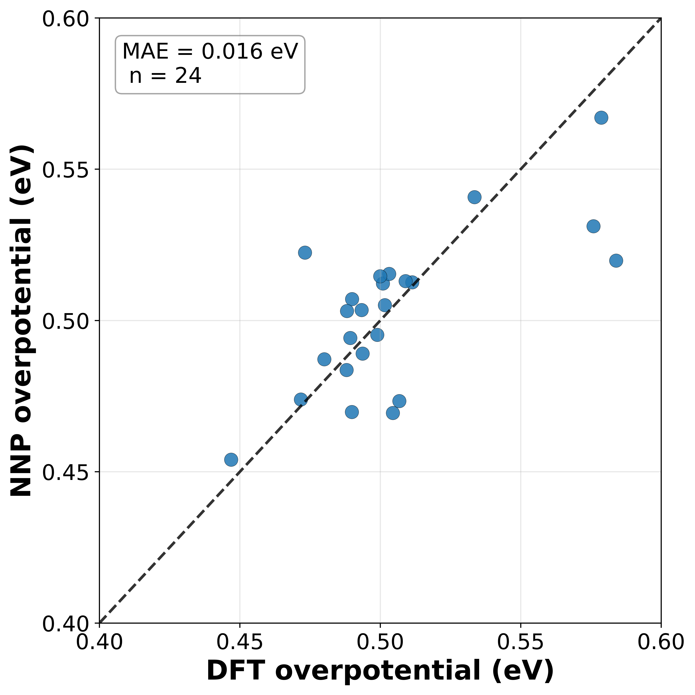
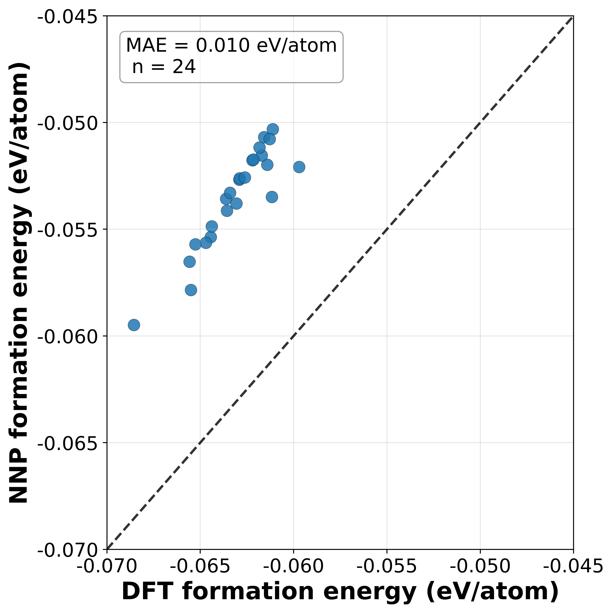
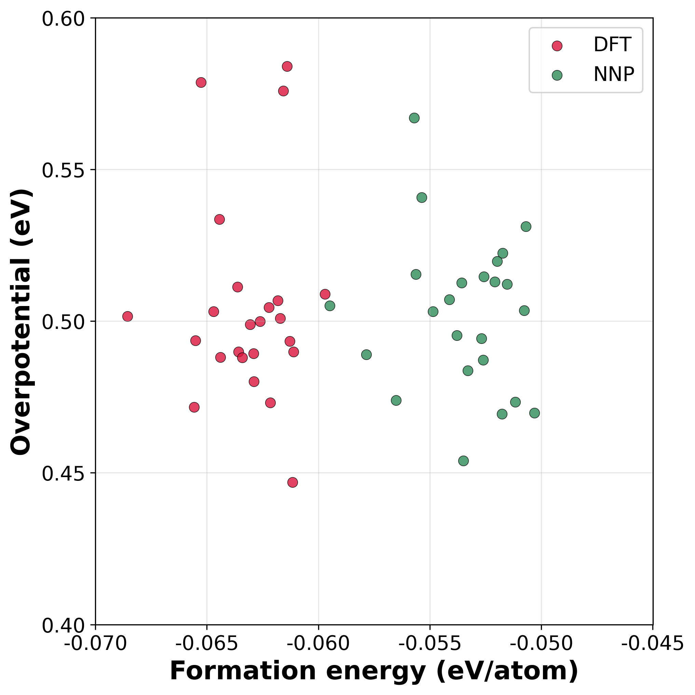
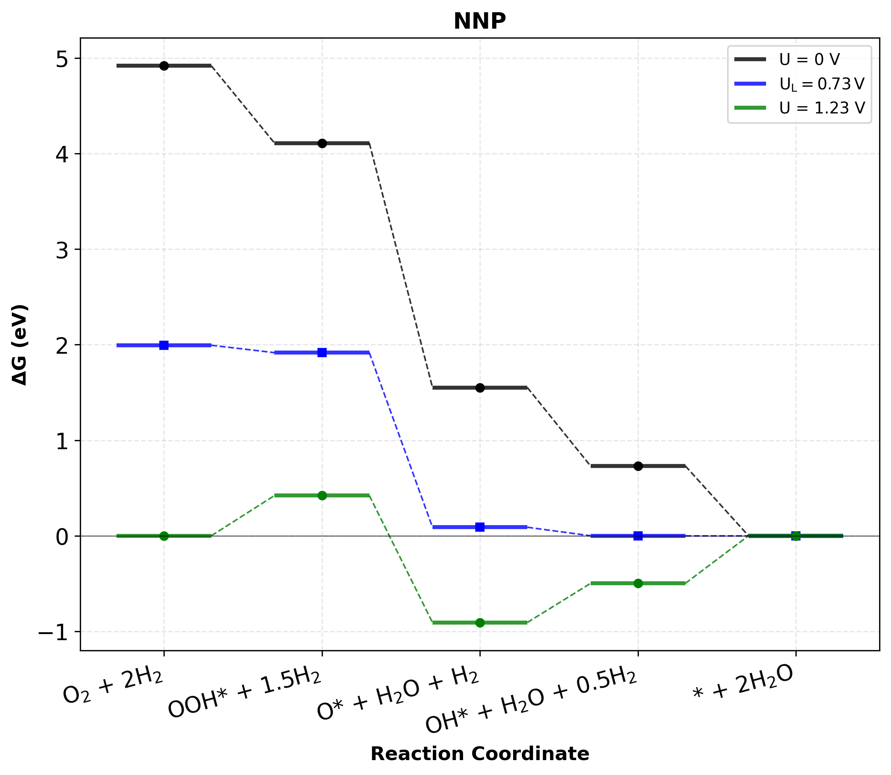
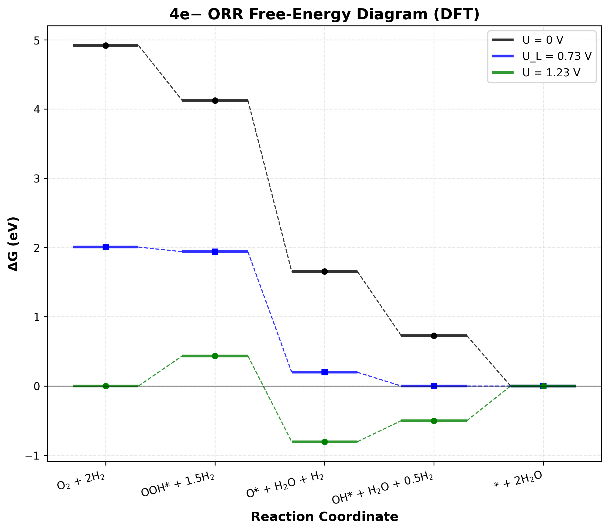
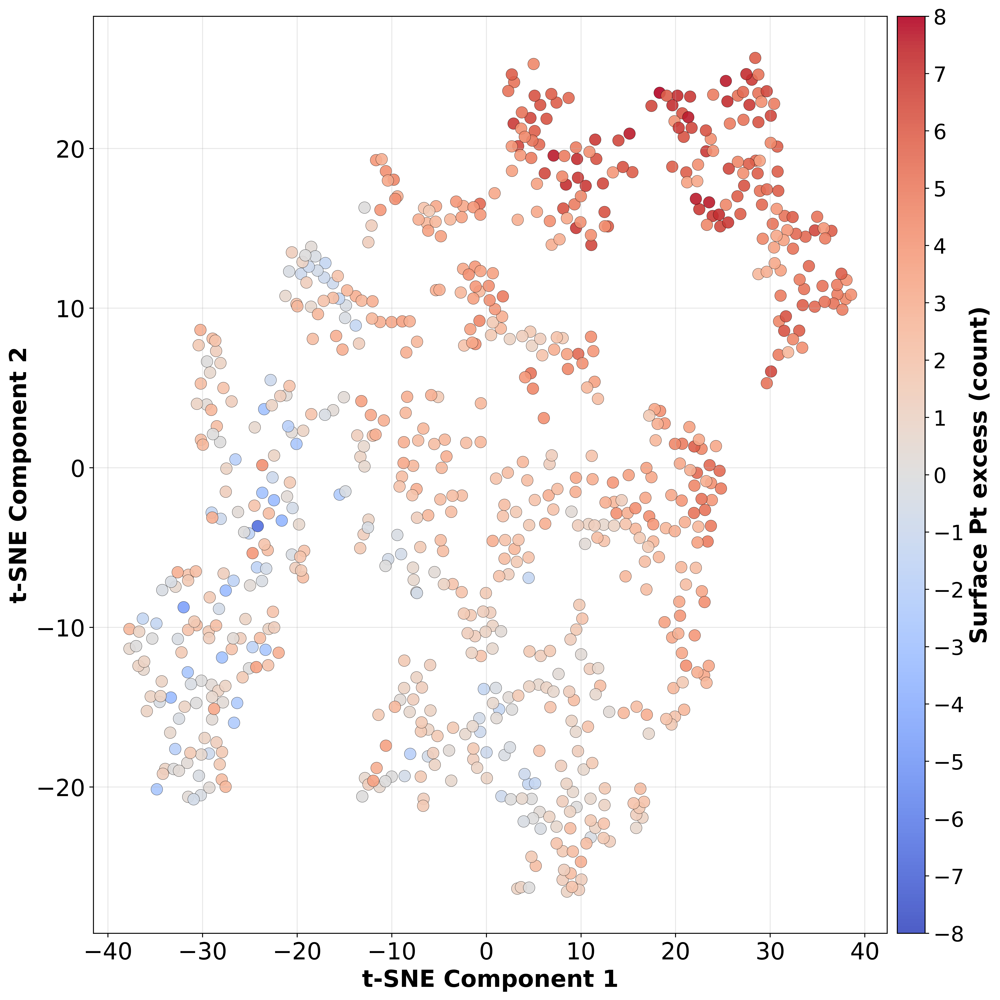

## Abstract

本研究で、我々は、条件付き変分オートエンコーダー(cVAE)とユニバーサルニューラルネットワークポテンシャルを用いて、合金触媒の活性と安定性を同時に最適化する手法を開発した。  
In this study, we have developed a method to 同時に optimize the activity and stability of alloy catalysts using a conditional variational autoencoder (cVAE) and universal neural network potential.

この手法を、酸素還元反応（ORR）のためのPt–Ni 合金触媒の設計に適用した。  
This method was applied to the design of Pt–Ni alloy catalysts for the oxygen reduction reaction (ORR).

cVAE は、計算水素電極（CHE）に基づく過電圧 η と合金形成エネルギー E_form の両方を条件ラベルとして学習し、条件を指定して新規構造を生成した。  
cVAE generated new structures by learning both overpotential (η) based on the computational hydrogen electrode (CHE) and alloy formation energy (E_form) as conditional labels.

5 回のイテレーションで合計 768 件を生成・評価し、データセットの η 分布と E_form 分布がそれぞれ低電位側と安定側へシフトすることを確認した。  
The distribution of η and E_form shifted toward lower potentials and more stable values by total 768 structures generated and evaluated over 5 iterations.

さらに、学習された VAE のエンコーダを用いて各イテレーションで得られたデータを可視化することで、初期データセットに含まれないデータ領域の構造の生成、そして初期データセットとは異なる構造特性のデータの生成が確認された。  
And visualizing data obtained in each iteration using the learned VAE encoder suggested that structures were generated in data spaces not included in the initial dataset, and that data with different structural properties from the initial dataset were generated.

本手法は、合金触媒の効率的な最適化を可能にする。活性と安定性を同時に満たす構造を外挿的に提案することで。限られた初期データからでも。  
This method is able to efficiently optimize alloy catalysts by extrapolatively generating structures that satisfy both activity and stability from limited initial data.

---

本研究では、ユニバーサルニューラルネットワークポテンシャルと条件付き変分オートエンコーダを統合し、Pt–Ni 合金表面における酸素還元反応（ORR）を対象に、活性と安定性を同時に最適化する構造の反復的な生成・評価ワークフローを構築した。cVAE は、計算水素電極（CHE）に基づく過電圧 η と合金形成エネルギー E_form を条件ラベルとして学習し、条件を指定して新規構造を生成する。各構造の評価は NNP により行われ、6 回のイテレーションで各 128 構造、計 768 件を生成・評価した。イテレーションの進行に伴い、それぞれ生成されたデータセットの η 分布は低電位側にシフトし、平均値は 1.126 から 0.520 V へ低下した。同時に E_form の平均値は −0.027 から −0.047 eV/atom へと推移し、安定性が向上を確認した。さらに、学習された VAE のエンコーダを用いて各イテレーションで得られたデータをマッピングすることで、初期データに含まれない潜在空間領域の構造を生成していること、そして初期データセットとは異なる構造特性のデータが生成されていることが確認された。本手法は、限られた初期データからでも、活性と安定性を同時に満たす構造を外挿的に提案できる枠組みであり、合金触媒の開発を大幅に効率化しうることを示す。

## 1. Introduction
固体高分子形燃料電池（PEMFC）は、再生可能エネルギー由来の水素を活用できるクリーンな発電技術として注目されている。  
Proton exchange membrane fuel cells (PEMFCs) are known as a clean power generation technology that can use hydrogen from renewable energy sources.

一方で、カソードにおける酸素還元反応（oxygen reduction reaction, ORR）の速度が実際の応用を制限しており、高活性な電極触媒の開発が課題である。  
However, the rate of the oxygen reduction reaction (ORR) at the cathode limits practical application, and the development of highly active electrode catalysts is a challenge.

現状は商用触媒としては白金（Pt）が中心であるが、希少性とコストの問題から、性能と資源制約のバランスを取るために Pt に安価な元素を合金化することが有効である。  
Currently, platinum (Pt) is the main commercial catalyst, but due to cost and rarity, alloying Pt with inexpensive elements is an effective for balancing performance and resource constraints.

なかでも Pt–Ni は代表的なORR合金触媒の一つであり広く研究されている。  
Especially, Pt–Ni is one of the representative ORR alloy catalysts that has been widely studied.

しかし、活性と安定性の向上に向けた最適な組成・配置については報告間で差があり、いまだ統一した理解に達していない。  
However, there are differences between reports about the optimal composition and arrangement for improving activity and stability, and it is not yet fully understood.

こうした合金触媒の最適化に向けた触媒設計では、第一原理計算（DFT）のような計算手法を用いたスクリーニングが有効である。  
Such catalyst design for the optimization of alloy catalysts is effective using screening with computational methods like a density functional theory (DFT) calculations.

しかし、元素組成比と原子配置の組合せは膨大であり、候補パターンの網羅的探索は計算資源の観点から現実的でない。  
but the combinations of element composition ratios and atomic arrangements are huge, and 網羅的 exploration of 候補 patterns is not realistic from the perspective of computational resources.

また、記述子ベースの機械学習によるスクリーニングは、重要な特徴量の決定と特性予測に有効である。  
Also, descriptor based machine learning screening is effective for determining important features and predicting properties.

しかし、モデルの学習には十分なデータ量が必要であり、そして新構造の探索には学習済みモデルを用いた多数の推論が必要となり未知の化学データ空間からの構造生成は難しい。
But model training requires a sufficient amount of data, and exploring new structures needs a lot of inferences using the trained model, it is difficult to generate structures from unknown chemical data spaces.

そこで、材料特性から構造への逆設計に向けて、生成モデルの利用が提案されており、そして未知の化学データ空間からの構造生成に対して有効なアプローチとして期待されている。
therefore, the use of generative models has been proposed for inverse design from material properties to structures, and is expected to be an effective approach for generating structures from unknown chemical data spaces.

特に、合金触媒設計において生成モデルを活用することで、初期データセットに含まれない外挿的な合金触媒構造候補の提案が可能であることが示されている。  
In particular, using generative models for alloy catalyst design has shown to enable the proposal of extrapolative 候補 of alloy catalyst structure not included in initial data sets.

しかし、生成モデルによる提案構造を都度 DFT で評価するワークフローは、データ数の拡大とともに急速に非効率化する。  
But the workflow of evaluating proposed structures from generative models by DFT calculations each time becomes rapidly inefficient with increasing amount of data.

この課題に対し、第一原理計算データで学習されたユニバーサルニューラルネットワークポテンシャル（NNP）を用いると、DFT に近い精度を維持しながら生成・評価の反復の高速化が可能となる。  
To solve this problem, using a universal neural network potential (NNP) trained by first-principles calculation data can accelerate the iteration of generation and evaluation while maintaining accuracy close to DFT.

これらの触媒設計研究には生成モデルとしてGANが用いられているが、バルク材料の設計においてはGAN同様に一般的な生成モデルである変分オートエンコーダ(VAE)も利用されている。  
These studies have used generative adversarial networks (GANs) as generative models, although variational autoencoders (VAEs), which are also general generative models, have been used for the design of bulk materials.

そして、VAEはGANに比べて、訓練が比較的容易で安定化しやすく、正則化された連続的な潜在空間を活用してサンプリングや補間により未観測データ空間から候補を生成しやすい。  
Furthermore, VAEs are relatively easy to train and stabilize compared to GANs, 

さらに条件付き学習により高精度に指定したラベル(クラス)データ生成できることが報告されている。  
Additionally, it has been reported that conditional learning allows for high-precision generation of specified label (class) data.

そこで本研究は、ORRのためのPt–Ni 合金触媒の最適化に向けて、ユニバーサル NNP による高速評価とVAEによる構造生成を統合したワークフローを提案する。  
Thus, this study proposes a workflow that integrates fast evaluation using a universal NNP and structure generation using VAE for the optimization of Pt–Ni alloy catalysts for ORR.

具体的には、計算水素電極（CHE）に基づくORR過電圧と合金形成エネルギーを同時に条件付けた条件付き変分オートエンコーダ（cVAE）で新規構造を生成する。  
Specifically, new structures are generated using a conditional variational autoencoder (cVAE) conditioned by ORR overpotential based on the computational hydrogen electrode (CHE) and alloy formation energy. 

生成された構造はNNP で評価する。  
The generated structures are evaluated using NNP.

この工程を反復して繰り返すことで、活性と安定性を両立した Pt–Ni 触媒を効率的に探索する。  
By repeating this process, we efficiently explore Pt–Ni catalysts that have high activity and stability.

---

固体高分子形燃料電池（PEMFC）は、再生可能エネルギー由来の水素を活用できるクリーンな発電技術として注目されている。一方で、カソードにおける酸素還元反応（oxygen reduction reaction, ORR）の速度が実用化のボトルネックであり、高活性な電極触媒の開発が課題である。商用触媒としては白金（Pt）が中心であるが、希少性とコストの問題から、Pt に安価な元素を合金化して性能と資源制約のバランスを取る戦略が広く検討されている。なかでも Pt–Ni は代表的な合金触媒であるものの、合金の組成・配置と活性・安定性の関係は、報告により最適比が異なるなど未だ統一的な理解に達していない。

こうした合金触媒の最適化に向けた材料設計では、元素組成比と原子配置の組合せは膨大であり、第一原理計算（DFT）を用いた候補パターンの網羅的探索は計算資源の観点から現実的でない。また、記述子ベースの機械学習によるスクリーニングは、重要な特徴量の決定と特性予測に有効であるが、モデルの学習には十分なデータ量の確保、そして新構造の探索には作成したモデルを用いた多数の推論が必要となり未知の化学データ空間からの構造生成は難しい。そこで、材料特性から構造への逆設計に向けて、生成モデルの利用が提案されており、未知の化学データ空間からの構造生成に対して有効なアプローチとして期待されている。

特に、合金触媒設計において生成モデルを活用することで、既存データに含まれない外挿的な合金触媒構造候補の提案が可能であることが示されている。
しかし、生成モデルによる提案構造を都度 DFT で評価するワークフローは、データ数の拡大とともに急速に非効率化する。この課題に対し、第一原理計算データで事前学習したユニバーサルニューラルネットワークポテンシャル（NNP）を用いると、DFT に近い精度を維持しながら計算を高速化でき、イテレーション型の生成・評価ループの実用性が大きく向上する。

これらの触媒設計には生成モデルとしてGANが用いられているが、バルク材料の設計においてはGAN同様に一般的な生成モデルである変分オートエンコーダ(VAE)も利用されている。そして、VAEはGANに比べて、訓練が比較的容易で安定化しやすく、よく正則化された連続的な潜在空間を活用してサンプリングや補間により未観測候補を生成しやすい。さらに条件付き学習により高精度に所望クラス（ラベル）を直接指定して生成できることが報告されている。

そこで本研究は、Pt–Ni 合金表面の ORR を対象に、ユニバーサル NNP による高速評価と生成モデルによる構造生成を統合したイテレーション型の設計ワークフローを提案する。具体的には、計算水素電極（CHE）に基づく過電圧（η）と合金形成エネルギー（E_form）を同時に条件付けた条件付き変分オートエンコーダ（cVAE）で新規構造を生成し、NNP で迅速に評価する工程をイテレーションとして繰り返すことで、活性（低 η）と安定性（低 E_form）を両立した Pt–Ni 触媒を効率的に探索する。

## 2. Methods

## 2.1 Oxygen Reduction Reaction

本研究では、J. K. Nørskov らの計算水素電極（Computational Hydrogen Electrode, CHE）に基づき、理論限界電位 U_L と過電圧 η により ORR 活性を評価した。  
In this study, we evaluated the ORR activity based on the theoretical limiting potential U_L and overpotential η using the computational hydrogen electrode (CHE) proposed by J. K. Nørskov et al. 

酸性条件下の 4 電子反応機構を仮定し、素過程は次の 4 反応で表す。  
We used a four-electron reaction mechanism under acidic conditions, represented by the following four reactions:

1. O2 + H+ + e− + * → OOH*
2. OOH* + H+ + e− → O* + H2O
3. O* + H+ + e− → OH*
4. OH* + H+ + e− → H2O + *

各 1 電子段階の自由エネルギーは

$$\Delta G_i(U)=\Delta G_i(0)-eU$$

とし、U = 1.23 V（pH = 0, T = 298.15 K）での平衡を基準に

$$U_L=\min_i\left[\frac{\Delta G_i(0)}{e}\right],\quad \eta=1.23-U_L\;\mathrm{[V]}$$

として過電圧を求めた。

ここで ΔG_i(0) は DFT で得られるエネルギーに、文献値に基づくゼロ点振動（ZPE）と振動エントロピー（TS, T = 298.15 K）を加えて構成した。  
Then ΔG_i(0) is calculated by adding zero-point energy (ZPE) and vibrational entropy (TS, T = 298.15 K) based on literature values to DFT calculated energies.

気相 O2 エネルギー計算は、既知の誤差を避けるため、O2 を明示的に参照せず、H2 と H2O のエネルギーおよび水生成の自由エネルギー変化である2.46 eV を用いて計算した。  
And we calculated the gas-phase O2 energy using the energy of H2, H2O and the free energy change for water formation that is 2.46 eV to avoid known errors.

文献に基づき、溶媒効果は定数補正として導入し、O*・OOH*・OH* に対してそれぞれ 0.00、0.28、0.57 eV を加えた。  
Also, we introduced solvent effects as constant corrections based on literature values, adding 0.00, 0.28, and 0.57 eV to O*, OOH*, and OH*.

---

本研究では、J. K. Nørskov らの計算水素電極（Computational Hydrogen Electrode, CHE）に基づき、理論限界電位 U_L と過電圧 η により ORR 活性を評価した。酸性条件下の 4 電子反応機構を仮定し、素過程は次の 4 反応で表す。

1. O2 + H+ + e− + * → OOH*
2. OOH* + H+ + e− → O* + H2O
3. O* + H+ + e− → OH*
4. OH* + H+ + e− → H2O + *

各 1 電子段階の自由エネルギーは

$$\Delta G_i(U)=\Delta G_i(0)-eU$$

とし、U = 1.23 V（pH = 0, T = 298.15 K）での平衡を基準に

$$U_L=\min_i\left[\frac{\Delta G_i(0)}{e}\right],\quad \eta=1.23-U_L\;\mathrm{[V]}$$

として過電圧を求めた。ここで ΔG_i(0) は DFT 全エネルギーに、文献値に基づくゼロ点振動（ZPE）と有限温度の振動エントロピー（TS, T = 298.15 K）を加えて構成した。気相 O2 エネルギーの既知の誤差を避けるため、O2 を明示的に参照せず、H2 と H2O のエネルギーおよび水生成の自由エネルギーを用いて計算した（H2O → 1/2 O2 + H2 を 2.46 eV とした）。文献に基づき、溶媒効果は定数補正として導入し、O*・OOH*・OH* に対してそれぞれ 0.00、0.28、0.57 eV を加えた。

## 2.2 NNP と DFT 計算
データセット生成には、ユニバーサルNNPである UMA（Universal Models for Atoms）の uma‑s‑1p1 モデルを用いて構造最適化およびエネルギー計算を行った。  
We used the uma-s-1p1 model as a universal neural network potential (NNP) for structure optimization and energy calculations.

uma‑s‑1p1 は、約 5 億件の DFT データにより事前学習され、 eSEN（equivariant Smooth Energy Network）に Mixture of Linear Experts（MoLE）を導入した約 1.5 億パラメータの汎用 NNP である。  
uma-s-1p1 is pre-trained by about 500M DFT calculation data and includes Mixture of Linear Experts (MoLE) into the equivariant Smooth Energy Network (eSEN).

uma‑s‑1p1 モデルは、HEA（高エントロピー合金）の形成エネルギーの評価テストでは MAE 24.9 meV/atom、OC20 データセットを用いた吸着エネルギーの評価テストでは MAE 68.8 meV の精度が報告されている。  
And that is reported 

全てのスピン分極DFT計算は Vienna Ab initio Simulation Package（VASP 6.5.1）で、GGA‑RPBE 交換相関汎関数とprojector augmented-wave 法（PAW）を使った。  
All spin-polarized DFT calculations were performed using the Vienna Ab initio Simulation Package (VASP 6.5.1) with the GGA-RPBE exchange-correlation functional and the projector augmented-wave (PAW) method.

価電子は 450 eV の平面波カットオフで展開し、スメアリングには 幅 0.20 eV の Methfessel–Paxton スミアリングを適応した。  
The valence electrons were expanded with a plane-wave cutoff of 450 eV, and a Methfessel–Paxton smearing of width 0.20 eV was applied.

自己無撞着計算の収束判定は 1×10^{-5} eV とし、Brillouin ゾーンのサンプリングはMonkhorst–Pack gridsによるバルク 2×2×2、スラブ 2×2×1、気相分子は Γ 点とした。  
The convergence threshold for self-consistent calculations was set to 1×10^{-5} eV, and the Brillouin zone sampling was performed using Monkhorst–Pack grids with a bulk 2×2×2, slab 2×2×1, and the Γ point for gas-phase molecules.

それぞれスラブは fcc(111) 面からなる 4 層の(4×4)の64原子構造であり、下 2 層を固定、上 2 層と吸着種は全自由度で緩和した。  
Each slab consists of (4×4) 4-layer structures made from fcc(111) and the bottom 2 layers fixed and the top 2 layers and adsorbates relaxed with full degrees of freedom.

z 方向には 15 Å の真空を設け、双極子補正を適用した。  
z-axis is applied with a vacuum of 15 Å and a dipole correction.

気相参照の H2 と H2O は 15 Å 立方セル中で最適化して用いた。   
And the gas-phase references H2 and H2O were optimized in a 15 Å cubic cell.

構造最適化は最大残差力 0.05 eV/Å を閾値として収束させた。  
The convergence threshold for structure optimization was set to 0.05 eV/Å.

吸着系では OOH、O、OH を ontop／bridge／fcc‑hollow／hcp‑hollow に初期配置して最安定サイトを採用した。  
For adsorption systems, OOH, O, and OH were initially placed on ontop/bridge/fcc-hollow/hcp-hollow sites searched for the most stable sites.

また、スラブは真空層を付与する前にセルサイズを最適化した。  
Cell size was optimized before applying the vacuum layer to slab.

なお、本研究の反復ループにおける η と E_form の評価は一貫して NNP（uma‑s‑1p1）で実施し、DFT は NNP の検証および代表構造の解析に用いた。  
Also we consistently used NNP (uma-s-1p1) for the evaluation of η and E_form in the iterative loop, while DFT was used for the validation of NNP and the analysis of represent structures.

---
データセット生成には、ユニバーサルNNPである UMA（Universal Models for Atoms）の uma‑s‑1p1 モデルを用いて構造最適化およびエネルギー計算を行った。uma‑s‑1p1 は、約 5 億件の DFT データにより事前学習され、 eSEN（equivariant Smooth Energy Network）に Mixture of Linear Experts（MoLE）を導入した約 1.5 億パラメータの汎用 NNP である。uma‑s‑1p1 モデルは、HEA（高エントロピー合金）の形成エネルギーの評価テストでは MAE 24.9 meV/atom、OC20 データセットを用いた吸着エネルギーの評価テストでは MAE 68.8 meV の精度が報告されている。

第一原理計算（DFT）は Vienna Ab initio Simulation Package（VASP）を用いたスピン分極計算で実施し、projector augmented-wave 法（PAW）と GGA‑RPBE 交換相関汎関数を採用した。波動関数は 450 eV の平面波カットオフで展開し、金属占有には 幅 0.20 eV の Methfessel–Paxton スミアリングを用いた。自己無撞着計算の収束判定は 1×10^{-5} eV とし、Brillouin ゾーンのサンプリングはMonkhorst–Pack gridsによるバルク 2×2×2、(111) スラブ 2×2×1、気相分子（H2, H2O）は Γ 点とした。

スラブモデルは fcc(111) 面からなる 4 層の(4×4)の64原子構造であり、下 2 層を固定、上 2 層と吸着種は全自由度で緩和した。z 方向には 15 Å の真空を設け、表面法線方向の双極子補正を適用した。構造最適化は最大残差力 0.05 eV/Å を閾値として収束させ、気相参照の H2 と H2O は 15 Å 立方セル中で最適化して用いた。吸着系では OOH、O、OH を ontop／bridge／fcc‑hollow／hcp‑hollow に初期配置して最安定サイトを採用した。また、セルサイズは真空層を付与する前に最適化した。

なお、本研究の反復ループにおける η と E_form の評価は一貫して NNP（uma‑s‑1p1）で実施し、DFT は NNP の検証および代表構造の解析に用いた。

## 2.3 Variational Auto-Encoder

### 2.3.1 Structure Representation
触媒構造は，fcc(111) の各4層をグリッドへ写像した(4, 8, 8)のテンソルで表現した。  
Catalyst structures were represented as a (4, 8, 8) tensor mapping each of the four layers of the fcc(111) surface to a grid.

各層は二次元の行列で，要素ごとに空白・Ni・Pt の占有を離散的に符号化する。
Each layer was converted into a two-dimensional matrix encoded the occupancy of blank, Ni, and Pt for each element.

これにより，層間スタッキングと平面内の合金配置を同時に取り扱えるようにした。  
Thus we can treat layer stacking and in-plane alloy arrangements.

### 2.3.2 VAE Architecture
条件付き畳み込み VAE を用い，入力の(4, 8, 8)の構造テンソルに加えて，2値に変換された過電圧と合金形成エネルギーを条件ラベルとして与えた。  
We used conditional convolutional VAE, providing the (4, 8, 8) structure tensor with binary labels of overpotential and alloy formation energy.

条件ラベルは、イテレーションごとに、全データの過電圧と合金形成エネルギーの上位30%に「1」を設定し残りのデータに「0」を設定した。  
The conditional label was set 

つまり、データセットには、(1, 1), (1, 0), (0, 1), (0, 0) の4つの条件ラベルを持つデータが含まれる。    
Then datasets have four conditional labels, (1, 1), (1, 0), (0, 1), and (0, 0).

VAEのエンコーダとデコーダはいずれも畳み込みブロックを主体し，潜在空間の次元は 32 とした。  
The VAE encoder and decoder were based on convolutional blocks, and has 32-dimension latent space.

条件ラベルは全結合層からなるエンベディングの後にエンコーダとデコーダへ注入した。  
The conditional label were combined to the encoder and decoder after the embedding from fully connected layers.

デコーダの出力形状は 4 層×3 クラスに対応する (12, 8, 8) である。  
The shape of decoder output is to (12, 8, 8) for 4 layers and 3 classes. 

構造生成時には softmax 関数により (4, 8, 8) のクラスラベルへ復元する。  
During structure generation, it is reshaped to (4, 8, 8) class labels using the softmax function.

### 2.3.3 Training Process
学習には実施したイテレーションまでの統合されたデータを用い，訓練:評価=9:1 に分割した。  
The VAE training is conducted using the integrated data until the iteration performed, and was divided into training and evaluation sets in a 9:1 ratio.

最適化は AdamW optimizer（学習率 2×10^{-4}，weight decay 1×10^{-4}）を用いた。  
The training optimizer was AdamW with a learning rate of 2×10^{-4} and a weight decay of 1×10^{-4}.

バッチサイズは16、学習は 200 エポック行った。 
And batch size was 16, and training was performed for 200 epochs.

損失関数は，4 層それぞれの画素に対する 3 クラス（空白・Ni・Pt）の重み付き多クラス交差エントロピーと潜在分布の KL ダイバージェンスを組み合わせた。  
The loss function combined the weighted multi-class cross-entropy for the 3 classes (blank, Ni, Pt) for each pixel in the 4 layers with the KL divergence of the latent distribution.

読みやすさのため，出力ロジットの softmax により得られるクラス確率を

$$p_{bz h w, c} \,=\, \mathrm{softmax}(\hat x_{bzchw})_c$$

と定義すると，再構成誤差は「正解クラスの対数確率のみを取り出す」形に書ける：

$$\begin{align}
\mathcal{L}_{\rm recon}
&= -\sum_{b=1}^{B}\sum_{z=1}^{4}\sum_{h=1}^{H}\sum_{w=1}^{W}
\, w_{x_{bzhw}} \, \log p_{bz h w,\, x_{bzhw}},\\
\mathcal{L}_{\rm KL}
&= -\tfrac12\sum_{b=1}^{B}\sum_{j=1}^{D}\Bigl(1+\log\sigma_{bj}^2-\mu_{bj}^2-\sigma_{bj}^2\Bigr),\\
\mathcal{L}_{\text{total}}
&= \mathcal{L}_{\rm recon} + \beta\,\mathcal{L}_{\rm KL} \qquad (\beta=2.0).
\end{align}$$

ここで、B はバッチサイズ、z は層（4）、H=W=8 は各層の画素サイズ。D は潜在次元（32）。$\hat x_{bzchw}$ は出力ロジット，$p_{bz h w, c}$ はクラス $c\in\{0,1,2\}$ の予測確率，$x_{bzhw}$ は正解クラス ID。$w=(w_0,w_1,w_2)=(0.1,1.0,1.0)$ はクラス重み（空白(0)の学習を抑制させるため低重み）。

### 2.3.4 Structure Generation
学習後は条件 [1,1]（低過電圧・低形成エネルギー）を指定し、学習済みVAEのデコーダーからテンソルを出力した。  
After VAE training, we selected the condition [1,1] (low overpotential and low formation energy) and output the tensor from the trained VAE decoder.

テンソルは前述の変換の逆変換によって、新規の構造とした。  
The new catalyst structure was generated by applying the inverse structure representation.

この時、既存構造と一致する重複は除外した。  
This time, we removed same structure compare with existing structures.

## 2.4 Iterative Loop
本研究では、iter0〜iter5 の 合計 6 イテレーションを実施し，1 iter あたり 128 構造（合計 768 構造）を生成・評価した。  
In this study, we conducted a total 6 iterations, generating and evaluating 128 structures each iteration.

iter0 ではランダムな原子配置の合金構造を生成し，NNP により ORR 過電圧 η と合金形成エネルギー E_form を評価した。  
The structure of iter 0 was generated with a random atomic arrangement, and the ORR overpotential η and alloy formation energy E_form were evaluated using NNP.

得られたデータセット（構造，η，E_form）を用いて条件付き VAE を学習した。
Obtained dataset (structure, η, E_form) was used to train the conditional VAE.  

学習後のVAEデコーダーに「低過電圧・低形成エネルギー」に対応する条件を指定して新規構造を生成した。  
After training, the VAE decoder was set to the condition of "low overpotential and low formation energy" to generate new structures.

生成構造に対して再び NNP により（η，E_form）を評価し，データ集合に追加したうえで条件ラベルを設定し直し、学習を更新する「生成→評価→追加→再学習」のループを iter1 から5で繰り返した。  
For the generated structures, we again evaluated (η, E_form) using NNP, added them to the dataset, defined the conditional labels, and repeated the "generation → evaluation → addition → training" loop from iter1 to 5.

VAEの学習にはPython ライブラリ Pytorch を用いた。  
For VAE training, we used the Python library Pytorch.

構造の生成と管理には Python ライブラリ ASE を用いた。  
And for structure generation and management, we used the Python library ASE.

## 3. Results and Discussion

## 3.1 Accuracy of NNP

ユニバーサル NNP（uma‑s‑1p1）のPt-Ni合金系への利用の妥当性を、DFT 計算との比較で検証した。  
We checked using universal NNP (uma‑s‑1p1) for the Pt-Ni alloy system by comparing it with DFT calculations.

Figure 1 は、Pt–Ni 合金構造に対して求めた（i）ORR 過電圧 η（V）と（ii）合金形成エネルギー E_form（eV/atom）について、DFT（横軸）と NNP（縦軸）のプロットを示す。  
Figure 1 shows plots of (i) ORR overpotential η (V) and (ii) alloy formation energy E_form (eV/atom) for the Pt-Ni alloy structure, with DFT on the x-axis and NNP on the y-axis.

いずれも高いスピアマンの順位相関係数を示し、過電圧で ρ ≈ 0.985、形成エネルギーで ρ ≈ 0.982であった。データ間の大小関係が維持されていることが確認できる。  
Each plot shows a high Spearman rank correlation coefficient with ρ ≈ 0.985 for overpotential and ρ ≈ 0.982 for formation energy. That confirms the maintain of the order relation between the data.

また、絶対誤差はそれぞれ MAE ≈ 0.060 V、MAE ≈ 0.007 eV/atom であった。   
And the absolute errors were MAE ≈ 0.060 V and MAE ≈ 0.007 eV/atom.

プロットはおおむね対角線上に分布し、特に η では広い値域（約 0.5–1.8 V）で一致が保たれている。  
The η plots are almost match in the wide range (about 0.5–1.8 V).

E_form については、−0.03 eV/atom 未満の領域で NNP が不安定側へ過小評価する傾向が見られるものの、系統誤差は 0.01 eV/atom 程度であり、スクリーニング用途としては許容範囲である。  
E_form has a tendency to underestimate on the unstable side in the region of less than -0.03 eV/atom, but the error is about 0.01 eV/atom which is able to use for screening purposes.

したがって、本研究の workflowにおいては、NNP による特性評価が妥当であると判断した。  
Therefore, we judged that the property evaluation by NNP is valid in this study's workflow.

---

本研究で用いたユニバーサル NNP（uma‑s‑1p1）のPt-Ni合金系への適応の妥当性を、DFT 計算との直接比較で検証した。Figure 1 は、Pt–Ni 合金構造に対して求めた（i）ORR 過電圧 η（V）と（ii）合金形成エネルギー E_form（eV/atom）について、DFT（横軸）と NNP（縦軸）のプロットを示す。いずれもスピアマンの順位相関係数が高く、過電圧で ρ ≈ 0.985、形成エネルギーで ρ ≈ 0.982であり、データ間の大小関係が維持されていることが確認できる。また、絶対誤差はそれぞれ MAE ≈ 0.060 V、MAE ≈ 0.007 eV/atom であった。

プロットはおおむね対角線上に分布し、特に η では広い値域（約 0.5–1.8 V）で一致が保たれている。E_form については、−0.03 eV/atom 未満の領域で NNP が不安定側へ過小評価する傾向が見られるものの、系統誤差は 0.01 eV/atom 程度であり、スクリーニング用途としては許容範囲である。したがって、本研究のイテレーション型生成ワークフローでは、NNP による特性評価が妥当であると判断した。

ここで、合金形成エネルギーは以下で定義する。

$$
E_{\mathrm{form}} = E_{\mathrm{bulk}}^{\mathrm{alloy}} - \sum_i N_i \; \frac{E_{\mathrm{bulk}}(i)}{N_{\mathrm{bulk}}(i)}.
$$

E_form は原子数で割り（eV/atom）に正規化して算出した。純元素（Pt, Ni）のバルク参照エネルギーは、それぞれの 4×4×4 fcc 構造を同一ワークフローで構造最適化及びエネルギー計算を行なった。

Figure 1. Parity plots of overpotential (V) and alloy formation energy (eV/atom) between DFT (x) and NNP (y). 注記にはスピアマン ρ と MAE を併記した。

## 3.2 Iterative Improvement and Data Distributions

合計5回の反復による生成・評価過程により、過電圧および合金形成エネルギーの分布は高性能側へに推移することが確認できた。  
We confirmed that the distributions of overpotential and alloy formation energy shifted toward the high-performance side with a total of 5 iterations of the generation and evaluation process.

Figure 2 のバイオリンプロットから、iter の進行とともに過電圧分布が高活性側に、形成エネルギー分布がより安定な方へ移動する傾向が確認できる。  
Violin plots in Figure 2 show that the overpotential distribution shifts toward the high-activity side, and the formation energy distribution moves toward a more stable side with iteration progresses, 

定量的には、iter0→iter5 で過電圧の平均は 1.126 V から 0.520 V へ、合金形成エネルギーの平均は −0.027 eV/atom から −0.047 eV/atom へとそれぞれ低下した。  

分布の変化をプロットで確認すると（Figure 3）、過電圧の低下とともに合金形成エネルギーもより安定な領域へ移動した。
And Figure 3 shows the change in distribution, and the alloy formation energy also moves to a more stable region as the overpotential decreases.

つまり、活性と安定性の両立に向けて均一なデータが生成されていく様子が確認できる。  
Then we can confirm that data is generated toward the coexistence of activity and stability.

--- 

イテレーションによる生成・評価過程により、過電圧および合金形成エネルギーの分布は高性能側へ系統的に推移した。Figure 2 のバイオリンプロットから、iter の進行とともに過電圧分布が高活性側に、形成エネルギー分布がより安定な方へ移動する傾向が確認できる。定量的には、iter0→iter5 で過電圧の平均は 1.126 V から 0.520 V へ、合金形成エネルギーの平均は −0.027 eV/atom から −0.047 eV/atom へとそれぞれ低下した。

分布の同時変化を二次元上で俯瞰すると（Figure 3）、過電圧の低下とともに合金形成エネルギーもより負の領域へ移動し、活性と安定性の両立に向けて均一なデータが生成されていく様子が確認できる。

Figure 2. Combined distributions of alloy formation energy and overpotential (iter0–5).

Figure 3. Overpotential vs. alloy formation energy (iter0–5).

## 3.3 Evolution of Catalytic Properties

各イテレーションで得られた触媒構造の特性が、触媒活性の先行研究トレンドと矛盾せず、イテレーションにより系統的に改善されていくことを確認する。

Figure 5 は ORR の CHE と線形スケーリング則に基づくボルケーノプロットに、各イテレーションの構造を重ね合わせたものである。    
Figure 5 shows volcano plots based on the CHE and linear scaling relations for the ORR, with the structures generated from each iteration. 

Figure 6 は組成比と合金形成エネルギーでプロットされた相図である。  
Figure 6 shows a phase diagram drawn by the composition ratio and the alloy formation energy.

---

各イテレーションで得られた触媒構造の特性が、触媒活性の先行研究トレンドと矛盾せず、イテレーションにより系統的に改善されていくことを確認する。Figure 5 は ORR の CHE と線形スケーリング則に基づくボルケーノプロットに、各イテレーションの構造を重ね合わせたものであり、Figure 6 は組成比と合金形成エネルギーを対応付けた相図である。

Figure 5 では、x 軸に ΔG_OH、y 軸に理論限界電位 U_L を取り、CHE およびスケーリング関係から得られる 2 本の境界直線（強結合側: U_L = ΔG_OH、弱結合側: U_L = 1.72 − ΔG_OH）と理想水平線（U_L = 1.23 V）を示した。2 直線の交点は ΔG_OH ≈ 0.86 eV であり、ここがボルケーノプロットの頂点（U_L 最大）に対応する。反復の進行とともに、データ点は頂点近傍へと集約する傾向を示し、活性が理論最適領域へ近づく様子が確認できる。すなわち、3.2 節の η 分布の低下に対応して、ボルケーノプロット上でも U_L が高い領域である ΔG_OH ≈ 0.86 eV への移動が観測される。

Figure 5. Volcano plot: ΔG_OH vs limiting potential (iter0–5).

次に Figure 6 は、Ni 含有率（x_Ni）と合金形成エネルギー E_form（eV/atom、負ほど安定）の相図を示す。iter の進行に伴い、分布はより負の E_form 側へ推移しつつ、x_Ni ≈ 0.4–0.6 の等量近傍にサンプルが集中する傾向が見られる。これは、活性が高い領域（Figure 5 の頂点近傍）と、熱力学的に安定な領域（より負の E_form）が、探索の反復によって同時に改善されていることを示唆する。

Figure 6. Phase diagram: Ni fraction vs formation energy colored by iter.

  

 
## 3.4 DFT Validation

最終的にイテレーション 5 で得られた構造のうち、η < 0.60 V かつ E_form < −0.05 eV/atom を満たす 16 構造を抽出し、DFT による再評価を行った。  
We check the 16 structures obtained in iteration 5 that satisfy η < 0.60 V and E_form < −0.05 eV/atom by DFT evaluation.

全体傾向として、過電圧は NNP と DFT で良好に一致し、平均絶対誤差は MAE ≈ 0.018 V であった。  
The trend of overpotential was well matched between NNP and DFT, with a mean absolute error of MAE ≈ 0.018 V.

一方、合金形成エネルギーは 3.1 節で述べた通り、NNP が DFT に比べて0.01 eV/atom 程度の過小評価する傾向が引き続き確認された。  
While the alloy formation energy is underestimated by NNP compared to DFT by about 0.01 eV/atom.

また、Figure 7 は、イテレーション 5 で得られた高活性・高安定構造のうちの1つである Pt35Ni29 について、OH*／O*／OOH* の3つの吸着種に対する NNP と DFT の最安定配置および吸着反応エネルギーを可視化・比較したものである。  
Also we checked Pt35Ni29 which is one of the high-activity and high-stability structures obtained in iteration 5 and visualized and compared the most stable site and adsorption reaction energies for the 3 adsorbates OH*, O*, and OOH* using NNP and DFT.

３つの吸着種すべてで最安定サイトは一致していることが確認できる。  
The 3 adsorbates all have the same most stable site.

さらに Figure 8 の NNP と DFT による ORR 自由エネルギーダイアグラムを比較すると、限界電位 U_Lの値は0.731Vと0.756Vで誤差は0.025Vであり、また律速段階が両者で一致していることが確認できる。  
Furthermore, comparing the ORR free energy diagrams from NNP and DFT in Figure 8, the limiting potential U_L values are 0.731 V and 0.756 V, an error of 0.025 V, and the rate determining steps are  consistent.

---

最終的にイテレーション 5 で得られた構造のうち、η < 0.60 V かつ E_form < −0.05 eV/atom を満たす 16 構造を抽出し、DFT による再評価を行った。
全体傾向として、過電圧は NNP と DFT で良好に一致し、平均絶対誤差は MAE ≈ 0.018 V であった。一方、合金形成エネルギーは 3.1 節で述べた通り、NNP が DFT に比べて0.01 eV/atom 程度の過小評価する傾向が引き続き確認された。  
しかし、全体としてDFTで検証された16点のデータは、NNPによって評価された高活性かつ高安定性の傾向を維持しており、本ワークフローによって最終的に得られた構造の有用性が確認された。

  

また、Figure 7 は、イテレーション 5 で得られた高活性・高安定構造のうちの1つである Pt35Ni29 について、OH*／O*／OOH* の3つの吸着種に対する NNP と DFT の最安定配置および吸着反応エネルギーを可視化・比較したものである。３つの吸着種すべてで最安定サイトは一致していることが確認できる。さらに Figure 8 の NNP と DFT による ORR 自由エネルギーダイアグラムを比較すると、限界電位 U_Lの値は0.731Vと0.756Vで誤差は0.025Vであり、また律速段階が両者で一致していることが確認できる。

Figure 7. Adsorption structures and energies (ΔE): NNP (top) vs DFT (bottom).

Figure 8. ORR free‑energy diagrams: NNP (left) and DFT (right).

 

ここで、OH, O, OOH の吸着反応エネルギーは以下で定義する。

$$
E_{\mathrm{ads}}(\mathrm{OH}^{\ast}) = E(\mathrm{OH}^{\ast}) - \left[ E(\ast) + E(\mathrm{H_2O}) - \tfrac{1}{2}E(\mathrm{H_2}) \right]
$$

$$
E_{\mathrm{ads}}(\mathrm{O}^{\ast}) = E(\mathrm{O}^{\ast}) - \left[ E(\ast) + E(\mathrm{H_2O}) - E(\mathrm{H_2}) \right]
$$

$$
E_{\mathrm{ads}}(\mathrm{OOH}^{\ast}) = E(\mathrm{OOH}^{\ast}) - \left[ E(\ast) + E(\mathrm{H_2O}) + \tfrac{1}{2}E(\mathrm{H_2}) \right]
$$

## 3.5 Latent-Space Visualization and Property-Colored Distributions

データ分布の特性を解析するために、イテレーション 5 で学習した cVAE のエンコーダを用い、各構造（iter0–5）を32 次元の潜在変数 z の事後平均（μ）に次元削減したのちに、t‑SNE で 2 次元に可視化した。  
We visualized all data points to 2D space using t-SNE to analyze the data distribution characteristics, after reducing the dimensionality to the 32-dimensional post mean (μ) of latent space (z) learned cVAE iteration 5.

Figure 4（上）はイテレーションごとに色分けした結果である。  
Figure 4 shows the results colored by iteration.

初期データ（iter0）は図の左側の領域に主に分布するのに対し、iter1 以降は分布が中央〜右側へと大きく広がっている。  
The initial data (iter0) is mainly distributed in the left area of the figure, while iter1 and later iterations show that the distribution spreads widely to the center and right side.

これは、イテレーションの過程で iter0 には存在しなかったデータ空間の領域にまで、構造探索・生成が拡張したことを示している。
This indicates that the structural exploration and generation have expanded into areas of the data space that did not exist in iter0.

さらに、合金触媒の構造が潜在座標にどう反映されるかを確かめるため、各点を「最表面層の Pt 原子数が下層と比べてどれだけ多いか」を表す指標で色付けした。  
In addition, we colored each point by a parameter showing how many Pt atoms exist in the top layer compared to the lower layers, in order to investigate the influence of the surface structure on catalytic activity.

結果として、iter0 では 0 近傍の点がほとんどで、最表面と下層の Pt 数が概ね同程度である。  
As a result, most points are close to 0 in iter0, so the number of Pt atoms in the top layer is almost equal to that in the lower layers.

一方、iter1 以降では正の値（赤）をとる点が顕著に増え、最表面の Pt が下層（2〜4 層の平均）より優位に多い。  
While, in iter1 and later iterations, the number of points with positive values (red) increases significantly, and the top layer has significantly more Pt atoms than the lower layers (average of layers 2-4).

いわゆるPtスキンに近いの構造が選択的に生成されていることが分かる。  
that suggests that structures close to the so-called Pt-skin are selectively generated.

これは 3.2 節で示した過電圧分布の改善（低 η 側へのシフト）とも整合的である。
And this is consist with the improvement of the overpotential distribution shown in Section 3.2 (shift to the low η side).

以上より、反復的な構造生成と評価により、初期データには存在しなかったデータ空間まで拡張されること。
Therefore, iterative structure generation and evaluation can extend the data space that did not exist in the initial dataset.

そして、Ptスキン構造の顕在化という触媒構造として意味のある特徴の発生がデータのマッピングと対応していることが確認された。
And it was confirmed that the feature as a catalytic structure is appearing in the mapping of the data.

---

データの分布特性を解析するために、イテレーション 5 で学習した cVAE のエンコーダを用い、各構造（iter0–5）を32 次元の潜在変数 z の事後平均（μ）に圧縮したのちに、t‑SNE で 2 次元に可視化した。Figure 4（上）はイテレーションごとに色分けした結果である。初期データ（iter0）は図の左側の領域に主に分布するのに対し、iter1 以降は点群が中央〜右側へと大きく広がっている。これは、イテレーションの過程で iter0 には存在しなかったデータ空間の領域にまで、構造探索・生成が拡張したことを示している。

さらに、合金触媒の構造が潜在座標にどう反映されるかを確かめるため、各点を「最表面層の Pt 原子数が下層と比べてどれだけ多いか」を表す指標で色付けした。指標は次式で定義した：

$$
\mathrm{Surface\ Pt\ excess}
\;=\;
\frac{1}{3}\sum_{k=2}^{4}\bigl[\,N_{\mathrm{Pt}}^{(\mathrm{top})}-N_{\mathrm{Pt}}^{(k)}\,\bigr],
$$

ここで $N_{\mathrm{Pt}}^{(\ell)}$ は層 $\ell$ に含まれる Pt 原子数である。結果として、iter0 では 0 近傍の点がほとんどで、表面と下層の Pt 数が概ね同程度である。一方、iter1 以降では正の値（赤）をとる点が顕著に増え、最表面の Pt が下層（2〜4 層の平均）より優位に多い、いわゆるPtスキンに近いの構造が選択的に生成されていることが分かる。これは 3.2 節で示した過電圧分布の改善（低 η 側へのシフト）とも整合的である。

以上より、反復的な構造生成と評価により、初期データには存在しなかった潜在空間の領域までデータが拡張されること、同時に、Ptスキン構造の顕在化という物理化学的に意味のある特徴の発生が潜在空間のマッピングと対応していることが確認された。

Figure 4. 上: t‑SNE colored by iteration (VAE latent mean μ; iter0–5). 下: t‑SNE colored by Surface Pt excess (count).

## 4. Conclusions

我々は、汎用ニューラルネットワークポテンシャル（NNP）と条件付き変分オートエンコーダ（cVAE）を統合し、触媒活性と安定性を同時に最適化するための構造生成、評価の手法を開発した。  
We developed a method for structure generation and evaluation that integrates a universal neural network potential (NNP) and a conditional variational autoencoder (cVAE) to 同時に optimize catalytic activity and stability.

Pt–Ni 合金表面の酸素還元反応（ORR）を対象に、cVAE は計算水素電極（CHE）に基づく過電圧と合金形成エネルギーを条件ラベルとして学習し、NNP により生成された構造の評価を高速化した。  
For the oxygen reduction reaction (ORR) on the Pt–Ni alloy surface, the cVAE was trained with conditional labels based on the computational hydrogen electrode (CHE) overpotential and alloy formation energy, and the NNP accelerated the evaluation of the generated structures.

NNPによって得られた過電圧と合金形成エネルギーの値は、DFT計算による検証により、データの大小関係を高い精度で保持していることが確認された。  
The values of overpotential and alloy formation energy obtained by NNP were confirmed by DFT calculations to maintain the order of size relationships with high accuracy.

合計5回の反復を通じて、η と E_form の分布がそれぞれ低電位側およびより負の値へ統計的に移動することを示した。  
The distribution of η and E_form shifted toward lower potentials and more stable values by total 768 structures generated and evaluated over 5 iterations.

各イテレーションで得られたデータは、データ点が既報のボルケーノプロットの頂点近傍および相図の安定域へ集約する傾向が確認され、物理化学的特性に即した妥当性が確認された。  
The data obtained in each iteration showed 

また、学習済みの cVAE のエンコーダを用いて、各構造を２次元にマッピングした結果、イテレーションの進行に伴い、初期データには存在しなかったデータ空間へデータが拡張されることが確認された。  
Also, using the encoder of the trained cVAE, each structure was mapped to two dimensions, and it was confirmed that the data expanded into a data space that did not exist in the initial data by iterations progressed.

そして、最表面にPtが多く存在する構造という触媒構造として意味のある特徴が確認された。  
And the structure with a high concentration of Pt at the surface was confirmed as a meaningful feature of the catalyst structure.

以上より、本ワークフローは、限られた初期データからでも、活性と安定性を同時に満たす合金表面構造を外挿的に提案しうる汎用的な計算スクリーニング手法であることを示した。
This workflow demonstrates a general computational screening method that can extrapolate alloy surface structures satisfying both activity and stability from limited initial data.

---
本研究では、汎用ニューラルネットワークポテンシャル（NNP）と条件付き変分オートエンコーダ（cVAE）を統合し、Pt–Ni 合金表面の酸素還元反応（ORR）を対象に触媒活性と安定性を最適化しながら「生成→評価→再学習」を反復するワークフローを構築した。cVAE は計算水素電極（CHE）に基づく過電圧 η と合金形成エネルギー E_form を条件として学習し、NNP により各候補のエネルギー評価を高速化することで、iter0〜5（各128構造、計768件）の反復を通じて、η と E_form の分布がそれぞれ低電位側およびより負の側へ系統的に移動することを示した。さらに、ボルケーノプロットと相図の確認から、データ点がボルケーノ頂点近傍および安定域へ集約する傾向が確認され、既報の線形スケーリングに基づく活性トレンドと矛盾しない物理化学的一貫性が担保された。加えて、iter5 で得られた Pt33Ni31 に対する自由エネルギーダイアグラムの個別検証では、NNP と DFT の U_L・η・律速段階がよく一致し、提案手法の定量的信頼性を支持した。以上より、本ワークフローは、限られた初期データからでも、活性（低 η）と安定性（低 E_form）を同時に満たす合金表面構造を外挿的に提案しうる実用的・汎用的な計算スクリーニング基盤であることを示した。

## Data and Code Availability

- github

## References 

### イントロで使う文献

#### 燃料電池導入／ORRのボトルネック・Pt依存

- Debe, M. K. Electrocatalyst approaches and challenges for automotive fuel cells. Nature (2012) 486(7401), 43–51. DOI: 10.1038/nature11115
  ［用途メモ：PEMFCの現状/課題、ORRが律速、Pt依存の背景に］

- Centi, G. Smart catalytic materials for energy transition. SmartMat (2020) 1(1), 1005. DOI: 10.1002/smm2.1005
  ［用途メモ：エネルギー転換と触媒材料の俯瞰（導入の補助）］

- R. Rosli; A. Sulong; W. Daud; M. Zulkifley; T. Husaini; M. Rosli; E. Majlan; M. Haque. A Review of High-Temperature Proton Exchange Membrane Fuel Cell (HT-PEMFC) System. International Journal of Hydrogen Energy (2017) 42, 9293–9314. DOI: 未記載
  ［用途メモ：PEMFC技術の俯瞰（高温系のレビュー）］

- Gittleman, C. S.; Kongkanand, A.; Masten, D.; Gu, W. Materials research and development focus areas for low cost automotive proton-exchange membrane fuel cells. Current Opinion in Electrochemistry (2019) 18, 81–89. DOI: 10.1016/j.coelec.2019.10.009
  ［用途メモ：コスト低減の研究課題（政策的・産業的背景）］

- Moving forward with fuel cells. Nature Energy (2021) 6, 451. DOI: 10.1038/s41560-021-00846-1
  ［用途メモ：燃料電池の最新動向（短評・社説系）］

#### Pt系一般（利点・課題）

- Zhang, X.; Li, H.; Yang, J.; Lei, Y.; Wang, C.; Wang, J.; Tang, Y.; Mao, Z. Recent advances in Pt-based electrocatalysts for PEMFCs. RSC Advances (2021)（Review）. DOI: 10.1039/D0RA05468B
  ［用途メモ：Pt系触媒の総説］

- Wang, Y.; Wang, D.; Li, Y. A fundamental comprehension and recent progress in advanced Pt-based ORR nanocatalysts. SmartMat (2021) 2(1), 56–75. DOI: 10.1002/smm2.1023
  ［用途メモ：Pt系のデメリット・課題整理（活性/耐久/コスト）］

- Gasteiger, H. A.; Kocha, S. S.; Sompalli, B.; Wagner, F. T. Activity benchmarks and requirements for Pt, Pt-alloy, and non-Pt oxygen reduction catalysts for PEMFCs. Applied Catalysis B: Environmental (2005) 56(1–2), 9–35. DOI: 10.1016/j.apcatb.2004.06.021
  ［用途メモ：ORR活性の基準・要求水準（ベンチマーク）］

#### Pt合金一般／Pt–Ni

- Greeley, J.; Stephens, I.; Bondarenko, A.; et al. Alloys of platinum and early transition metals as oxygen reduction electrocatalysts. Nature Chemistry (2009) 1, 552–556. DOI: 10.1038/nchem.367
  ［用途メモ：Pt合金一般の有望性（理論＋実験の早期総括）］

- Tian, X.; Zhao, X.; Su, Y.-Q.; et al. Engineering bunched Pt–Ni alloy nanocages for efficient oxygen reduction in practical fuel cells. Science (2019) 366(6467), 850–856. DOI: 10.1126/science.aaw7493
  ［用途メモ：Pt–Niナノ構造での高活性実証（応用側の強い例）］

- Zhuang, Y.; Iguchi, Y.; Li, T.; Kato, M.; Hutapea, Y. A.; Hayashi, A.; Watanabe, T.; Yagi, I. Platinum–Nickel Alloy Nanowire Electrocatalysts Transform into Pt-Skin Beads-on-Nanowires Keeping Oxygen Reduction Reaction Activity During Potential Cycling. ACS Catalysis (2024) 14(3), 1750–1758. DOI: 10.1021/acscatal.3c04709
  ［用途メモ：Pt-skin 形成と活性維持（耐久・構造進化）］

#### Pt–Ni の組成・合成・活性例

- Carpenter, M. K.; Moylan, T. E.; Kukreja, R. S.; Atwan, M. H.; Tessema, M. M. Solvothermal Synthesis of Platinum Alloy Nanoparticles for Oxygen Reduction Electrocatalysis. Journal of the American Chemical Society (2012) 134(20), 8535–8542. DOI: 未記載
  ［用途メモ：Pt合金NPの合成とORR活性］

- Yang, H.; Coutanceau, C.; Léger, J.-M.; Alonso-Vante, N.; Lamy, C. Methanol tolerant oxygen reduction on carbon-supported Pt–Ni alloy nanoparticles. Journal of Electroanalytical Chemistry (2005) 576(2), 305–313. DOI: 10.1016/j.jelechem.2004.10.026
  ［用途メモ：Pt–Niの耐メタノール性・組成依存例］

#### DFTの計算コスト
- Shambhawi, S.; Mohan, O.; Choksi, T. S.; Lapkin, A. A. The design and optimization of heterogeneous catalysts using computational methods. Catalysis Science & Technology, Issue 3 (2024). DOI: https://doi.org/10.1039/D3CY01160G  
  ［用途メモ：DFTの計算コストについて言及。網羅的な探索には計算負荷が高く実用的ではない］

#### 記述子ベースのMLの先行研究

#### 合金触媒の組成比最適化／高エントロピー

- Batchelor, T. A. A.; Pedersen, J. K.; Winther, S. H.; Castelli, I. E.; Jacobsen, K. W.; Rossmeisl, J. High-Entropy Alloys as a Discovery Platform for Electrocatalysis. Joule (2019) 3(3), 834–845. DOI: 10.1016/j.joule.2018.12.015
  ［用途メモ：多元合金（HEA）プラットフォームの概念］

- Shamekhi, M.; Toghraei, A.; Guay, D.; Peslherbe, G. H. High-throughput screening and DFT characterization of bimetallic alloy catalysts for the nitrogen reduction reaction. Physical Chemistry Chemical Physics (2025) DOI: 10.1039/D5CP01094B
  ［用途メモ：ハイスループットDFTと二元合金スクリーニング（NRR例；スクリーニング手法の参照に）］

#### 生成AIレビュー

- Park, H.; Li, Z.; Walsh, A. Has generative artificial intelligence solved inverse materials design? Matter (2024) 7(7), 2355–2367. DOI: 10.1016/j.matt.2024.05.017
  ［用途メモ：MLスクリーニングと生成AIの比較（レビュー的観点）］

- Hellman, A. A brief overview of deep generative models and how they can be used to discover new electrode materials. Current Opinion in Electrochemistry (2025) 49, 101629. DOI: 10.1016/j.coelec.2024.101629
  ［用途メモ：生成AIによる材料の逆設計事例・手法の概観］

#### 生成AIの利用（触媒探索）

- Ishikawa, A. Heterogeneous catalyst design by generative adversarial network and first-principles based microkinetics. Scientific Reports (2022) 12, 11657. DOI: 10.1038/s41598-022-15586-9
  ［用途メモ：GANで外挿生成→DFT/マイクロキネ連携の枠組み］

- Hisama, K.; Ishikawa, A.; Aspera, S. M.; Koyama, M. Theoretical Catalyst Screening of Multielement Alloy Catalysts for Ammonia Synthesis Using Machine Learning Potential and Generative Artificial Intelligence. The Journal of Physical Chemistry C (2024) 128(44), 18750–18758. DOI: 10.1021/acs.jpcc.4c04018
  ［用途メモ：GAN＋NNPで反復的スクリーニング（NNP活用の具体例）］

#### NNPのレビュー・評価

- Friederich, P.; Häse, F.; Proppe, J.; et al. Machine-learned potentials for next-generation matter simulations. Nature Materials (2021) 20, 750–761. DOI: 10.1038/s41563-020-0777-6
  ［用途メモ：MLポテンシャルの俯瞰レビュー］

- Unke, O. T.; Chmiela, S.; Sauceda, H. E.; et al. Machine Learning Force Fields. Chemical Reviews (2021) 121(16), 10142–10186. DOI: 10.1021/acs.chemrev.0c01111
  ［用途メモ：MLFFの大規模レビュー］

- Focassio, B.; Freitas, L. P. M.; Schleder, G. R. Performance Assessment of Universal Machine Learning Interatomic Potentials: Challenges and Directions for Materials’ Surfaces. ACS Applied Materials & Interfaces (2024/2025) 17(9), 13111–13121. DOI: 10.1021/acsami.4c03815
  ［用途メモ：ユニバーサルNNPの表面系評価（課題と指針）］

- UMA: A Family of Universal Models for Atoms. arXiv (2025). DOI: 10.48550/arXiv.2506.23971
  ［用途メモ：ユニバーサルNNP（UMA）概要。本文では軽い紹介に］

- Chanussot, L.; Das, A.; Goyal, S.; et al. Open Catalyst 2020 (OC20) Dataset and Community Challenges. ACS Catalysis (2021). DOI: 10.1021/acscatal.0c04525
  ［用途メモ：触媒NNPの大規模データ基盤］

- Barroso-Luque, L.; Shuaibi, M.; Fu, X.; et al. Open Materials 2024 (OMat24) Inorganic Materials Dataset and Models. arXiv (2024). DOI: 未記載
  ［用途メモ：材料一般の大規模データ（参考）］

#### VAEの利用のメリット
- Bajpai, R.; Shukla, A.; Kumar, J.; Tewari, A. A scalable crystal representation for reverse engineering of novel inorganic materials using deep generative models. Computational Materials Science (2023) 230, 112525. DOI: 10.1016/j.commatsci.2023.112525
  ［用途メモ：バルク材料の逆設計へのVAEの利用］

- Türk, H.; Landini, E.; Kunkel, C.; Margraf, J. T.; Reuter, K. Assessing Deep Generative Models in Chemical Composition Space. Chemistry of Materials (2022) 34(21), 9455–9467. DOI: 10.1021/acs.chemmater.2c01860
  ［用途メモ：GANとVAEの簡単な比較＆バルクの逆設計］

### メソッドで使う文献

#### ORR／CHE／溶媒補正

- Nørskov, J. K.; Rossmeisl, J.; Logadottir, A.; et al. Origin of the Overpotential for Oxygen Reduction at a Fuel-Cell Cathode. The Journal of Physical Chemistry B (2004) 108(46), 17886–17892. DOI: 10.1021/jp047349j
  ［用途メモ：CHEの基礎（ηやULの定義、自由エネルギー評価）］

- He, Z.-D.; Hanselman, S.; Chen, Y.-X.; Koper, M. T. M.; Calle-Vallejo, F. Importance of Solvation for the Accurate Prediction of Oxygen Reduction Activities of Pt-Based Electrocatalysts. The Journal of Physical Chemistry Letters (2017) 8(10), 2243–2246. DOI: 10.1021/acs.jpclett.7b01018
  ［用途メモ：定数溶媒補正の根拠（OOH/OHの補正など）］

- Zhang, Q.; Asthagiri, A. Solvation effects on DFT predictions of ORR activity on metal surfaces. Catalysis Today (2019) 323, 35–43. DOI: 10.1016/j.cattod.2018.07.036
  ［用途メモ：溶媒が活性予測に与える影響（概要）］

#### DFT実装・PAW・VASP

- Kresse, G.; Furthmüller, J. Efficient iterative schemes for ab initio total-energy calculations using a plane-wave basis set. Physical Review B (1996) 54(16), 11169–11186. DOI: 未記載
  ［用途メモ：VASP（実装基礎）］

- Kresse, G.; Joubert, D. From ultrasoft pseudopotentials to the projector augmented-wave method. Physical Review B (1999) 59(3), 1758–1775. DOI: 未記載
  ［用途メモ：PAW法の原典］

#### VAE／実装基盤

- Kingma, D. P.; Welling, M. Auto-Encoding Variational Bayes. arXiv (2013/ICLR 2014). DOI: 10.48550/arXiv.1312.6114
  ［用途メモ：VAEの基本枠組み］

- Rezende, D. J.; Mohamed, S.; Wierstra, D. Stochastic Backpropagation and Approximate Inference in Deep Generative Models. arXiv (2014/ICML 2014). DOI: 10.48550/arXiv.1401.4082
  ［用途メモ：畳み込みVAE］

- Larsen, A. H.; Mortensen, J. J.; Blomqvist, J.; et al. The atomic simulation environment—a Python library for working with atoms. Journal of Physics: Condensed Matter (2017) 29(27), 273002. DOI: 10.1088/1361-648X/aa680e
  ［用途メモ：ASE（計算実装の基盤）］

### 結果の考察で使う文献

#### 構造生成（Pt-skinモチーフの設計・再現）

- Shin, D. Y.; Shin, Y.-J.; Kim, M.-S.; Kwon, J. A.; Lim, D.-H. Density functional theory–based design of a Pt-skinned PtNi catalyst for the oxygen reduction reaction in fuel cells. Applied Surface Science (2021) 565, 150518. DOI: 10.1016/j.apsusc.2021.150518
  ［用途メモ：Pt-skin設計のDFT指針（本研究の生成構造モチーフの妥当性確認に）］

#### ボルケーノ／スケーリング関係

- Kulkarni, A.; Siahrostami, S.; Patel, A.; Nørskov, J. K. Understanding Catalytic Activity Trends in the Oxygen Reduction Reaction. Chemical Reviews (2018) 118(5), 2302–2312. DOI: 10.1021/acs.chemrev.7b00488
  ［用途メモ：ΔG_*OH 指標・スケーリング・ボルケーノの総説（図示の根拠に）］

#### 相図（Ni–Pt 系）

Popov, A. A.; Varygin, A. D.; Plyusnin, P. E.; Sharafutdinov, M. R.; Korenev, S. V.; Serkova, A. N.; Shubin, Y. V. X-ray diffraction reinvestigation of the Ni–Pt phase diagram. Journal of Alloys and Compounds (2022) 891, 161974. DOI: 10.1016/j.jallcom.2021.161974
［用途メモ：Ni–Pt バルク相図の最新XRD再検討。合金安定相・秩序相領域の根拠に。］

Sanati, M.; Wang, L. G.; Zunger, A. Adaptive Crystal Structures: CuAu and NiPt. Physical Review Letters (2003) 90, 045502. DOI: 10.1103/PhysRevLett.90.045502
［用途メモ：NiPt（CuAu型を含む）における適応的結晶構造／秩序化の理論的知見。相安定性・秩序相の議論に。］

Shang, S. L.; Wang, Y.; Kim, D. E.; Zacherl, C. L.; Du, Y.; Liu, Z. K. Structural, vibrational, and thermodynamic properties of ordered and disordered Ni1−xPt x alloys from first-principles calculations. Physical Review B (2011) 83, 144204. DOI: 10.1103/PhysRevB.83.144204
［用途メモ：Ni1−xPt x 合金の秩序／無秩序相に対する構造・振動・熱力学（第一原理）。混合自由エネルギーや相安定性の補強に。］

- 

## Supplementary Information

- Distributions（補足）: iter別の単独分布を参照（本文は複合図）。
  
  - Overpotential histogram (iter0–5)
  
  

  - Alloy-formation histogram (iter0–5)
  
  

- Volcano variants（補助）: iter以外の色付け表現。
  
  - Volcano（Ni heatmap）
  
  

  - Volcano（Pt heatmap）
  
  
