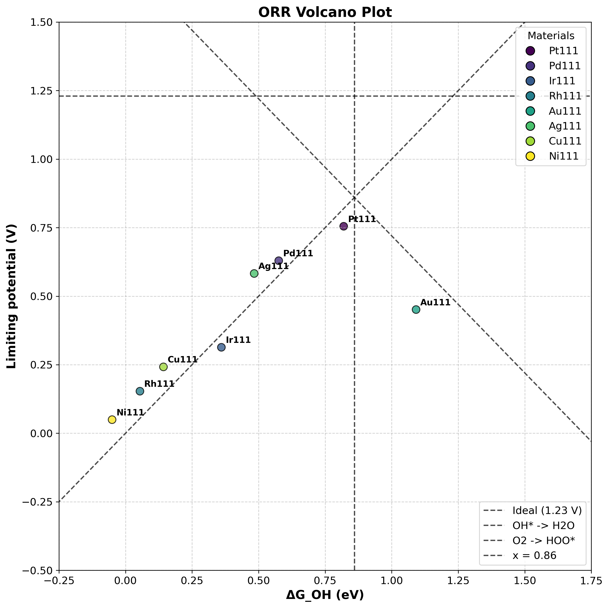
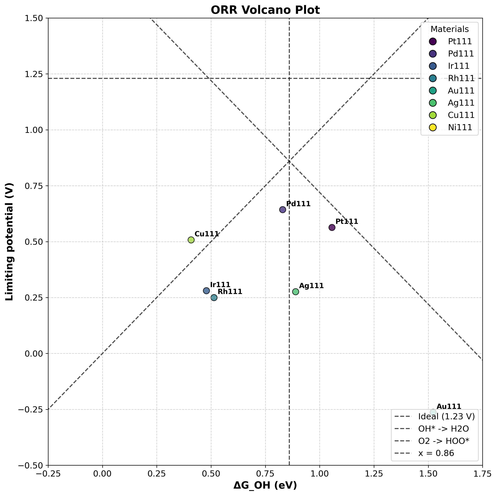
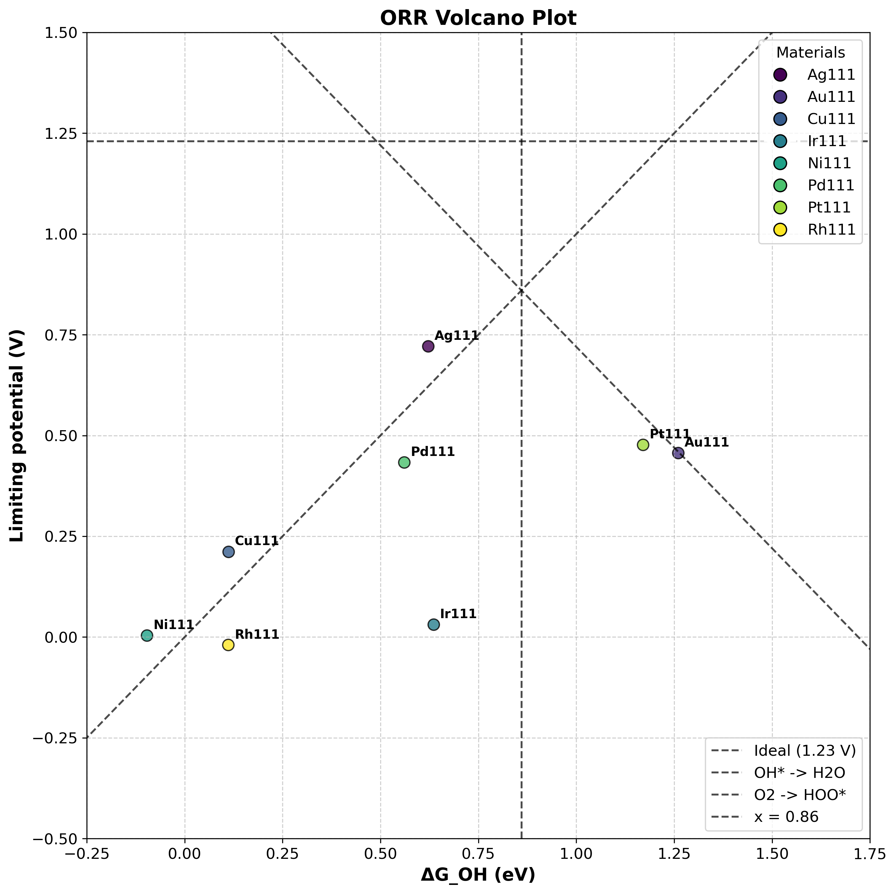
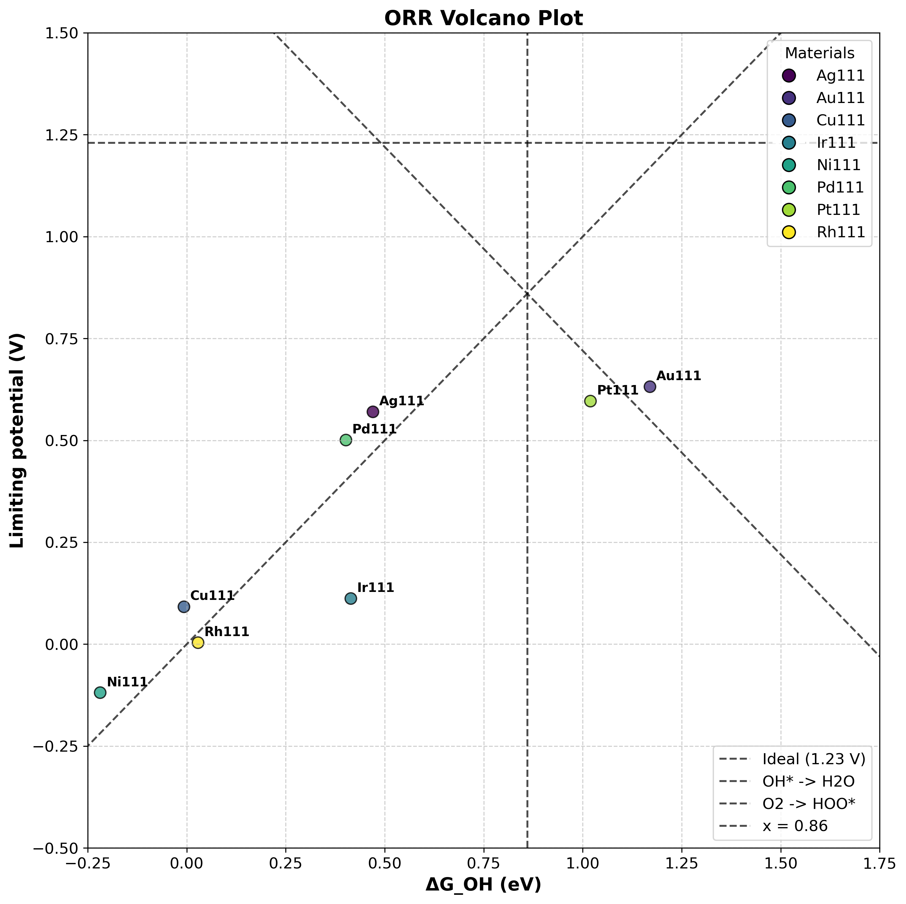
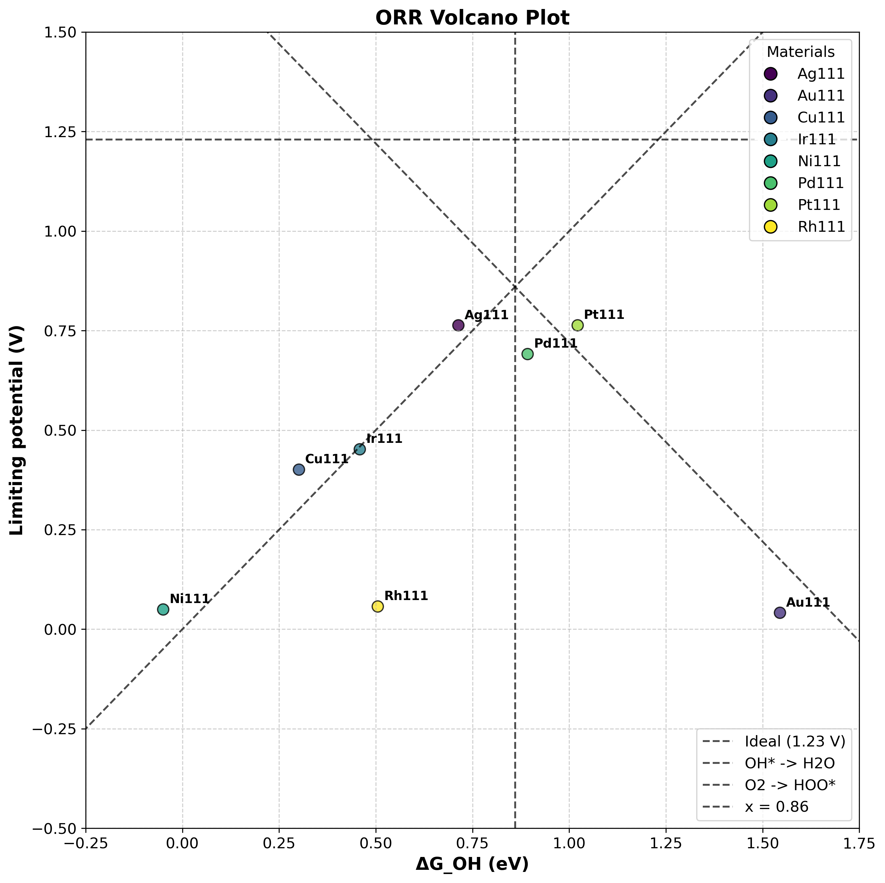
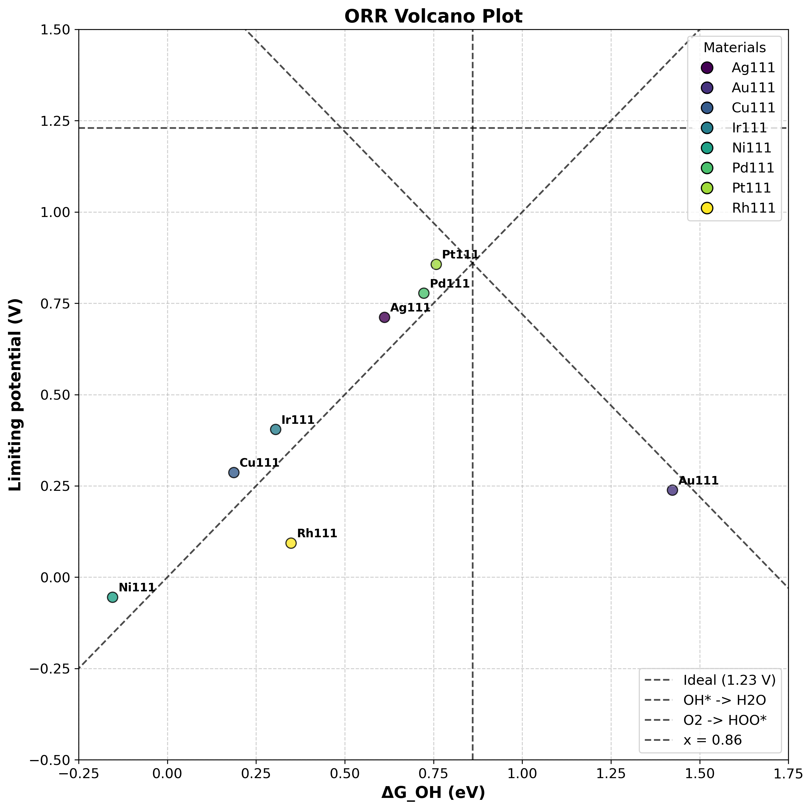

# ORR過電圧計算に向けたNNPの検証

## 概要
VAEやGANを用いたORR用触媒探索に向けて、データセット作成には大量の計算が必要となる。

ここでは、VASPを用いたDFTによる計算を行う前に、NNPを用いてORRの過電圧計算を行い、NNPの精度と材料間の線形関係を確認し、NNPを用いたデータセット作成の可能性を検討する。

## 検証方法
NNPの精度を確認するために、以下の計算を行う：

1. DFT (RPBE D3-PAW) を用いてORRの過電圧を計算
2. NNP (Mattersim) を用いてORRの過電圧を計算 <- fine-tuning後の結果も追加
3. NNP (MACE MatPES PBE) を用いてORRの過電圧を計算
4. NNP (MACE MatPES PBE D3) を用いてORRの過電圧を計算
5. DFTとNNPの結果を比較し、ORRの過電圧の線形関係を確認
6. 各計算結果をVolcano Plotにまとめ、ORRの過電圧の傾向を可視化

## 検証結果

| 計算手法 | Volcano Plot |
|----------|--------------|
| DFT: RPBE D3-PAW |  |
| NNP: Mattersim |  |
 NNP: Mattersim MatPES PBE |  |
| NNP: Mattersim MatPES PBE D3 |  |
| NNP: MACE MatPES PBE |  |
| NNP: MACE MatPES PBE D3 |  |

## 結果の考察
- DFTとNNPの結果を比較すると、MACE MatPES PBE D3が最もDFTに近い結果を示した
- MattersimもMatPESデータセットでfine-tuningすると、DFTに近い結果を示すようになったが、MACE MatPES PBE D3の方がよりは精度が低い。もしかすると、Mattersimは他のNNPと比較すると、パラメータ数が少ないので表現力不足なのかもしれない。
- MACE MatPES PBE D3を用いたデータセット作成と、VAEやGANによる触媒性能最適化のデモンストレーションは可能であると判断
- 以降は一旦MACE MatPES PBE D3を用いてORR過電圧の計算とデータセットの作成を行い、触媒性能最適化のデモンストレーションを実施する