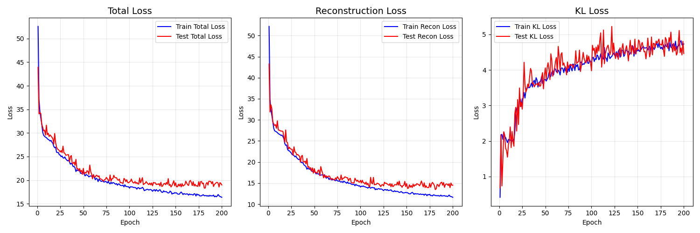
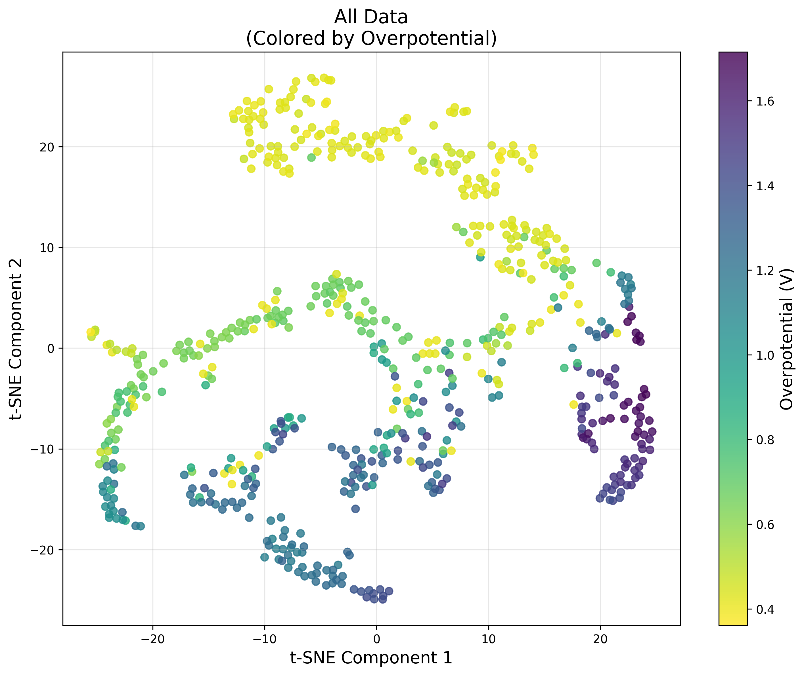
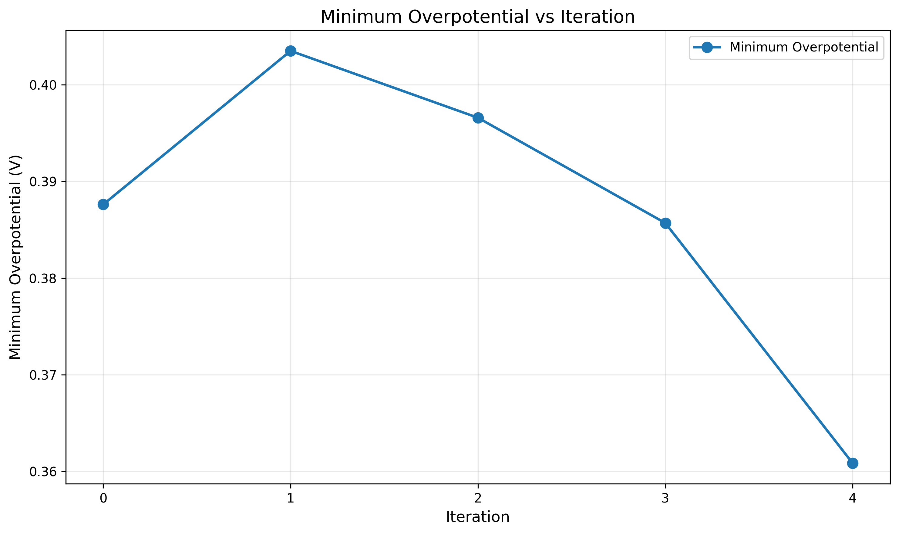
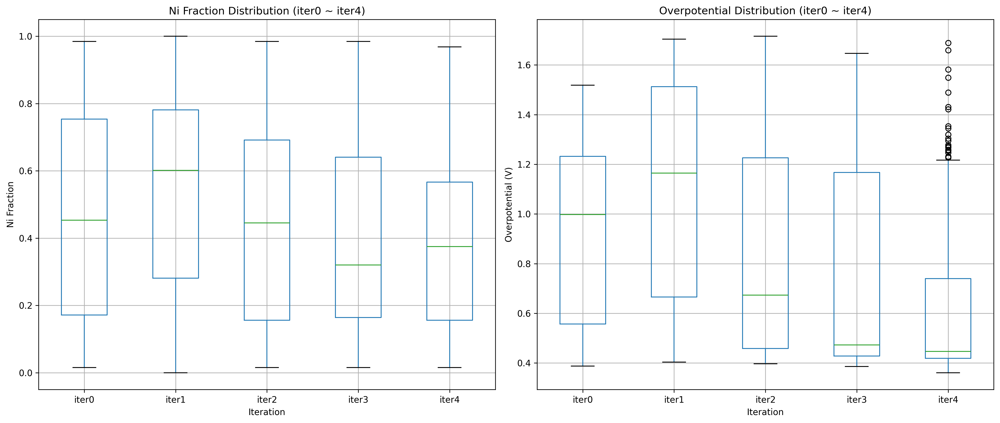
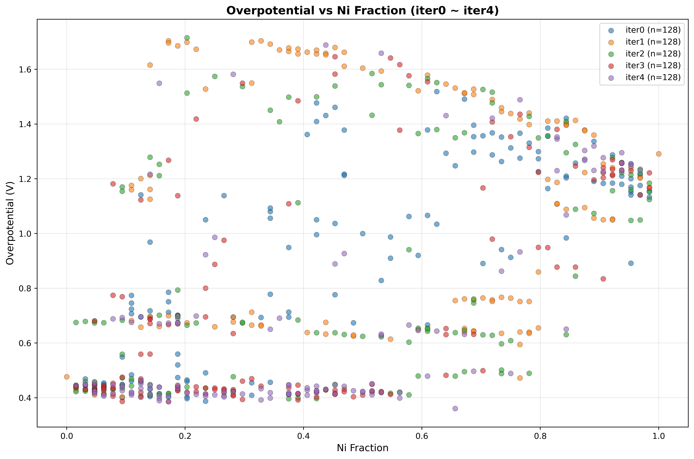
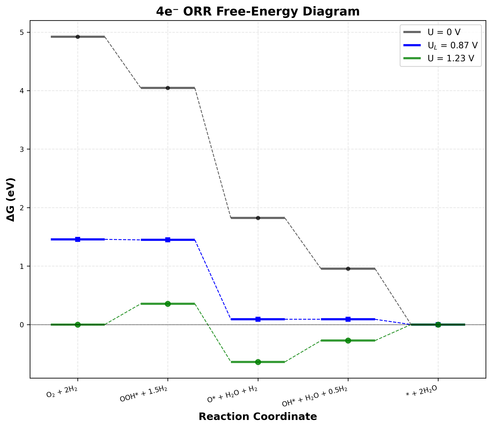

# Conditional VAE of ORR Catalyst Generator for Pd-Ni Alloy

## Overview (概要)

ORR（酸素還元反応）触媒に向けた条件付きVAEを用いたPd-Ni合金触媒の探索を行う。

## Data Representation (データ表現)

### Structure Data (構造データ)
- **入力**: 4×4×4構造（64原子）
- **テンソル変換**: 4チャンネル×8×8（各層を1チャンネルとして表現）
- **元素マッピング**: 0（空サイト）, 1（Ni）, 2（Pd）

### Condition Labels (条件ラベル)
- **ORR過電圧ラベル**: データセットの内、過電圧が低いもの64個を1、残りを0とする

## Conditional VAE Architecture (条件付きVAEアーキテクチャ)

### Encoder (エンコーダ)
- **入力**: 4チャンネル×8×8テンソル + 1次元条件ラベル
- **条件埋め込み**: 線形層（1→16→16→8次元）で条件を変換
- **結合**: 条件を空間的に拡張して入力テンソルと結合（12チャンネル）
- **出力**: 潜在変数の平均μと分散logvar（各n次元）
- **構造**: 畳み込み層（256→512→1024） → 全結合層

### Decoder (デコーダ)
- **入力**: n次元潜在変数 + 1次元条件ラベル
- **条件埋め込み**: 線形層（1→16→16→8次元）で条件を変換
- **結合**: 潜在変数と条件埋め込みを結合（136次元）
- **出力**: 12チャンネル×8×8テンソル（各層3クラス分類用logits）
- **構造**: 全結合層 → 転置畳み込み層（64→n→64→32→12）

### Loss Function (損失関数)
- **再構成損失**: 各層でクラス重み付きクロスエントロピー
- **KL発散**: 潜在変数の正規化項
- **総損失**: 再構成損失 + β × KL発散

## 探索ワークフロー

### VAEによる触媒生成・散策の反復的ワークフロー

本研究では、条件付きVAEを用いた高性能ORR触媒の探索を反復的に実行する。各イテレーションにおいて以下の5つのステップを順次実行する：

#### ステップ1: 初期構造生成（Iteration 0）
```bash
python3 01_generate_random_structures.py --num 128
```
- Pd(111)面上にNiとPdをランダム配置した初期構造を128個生成
- 4×4×4のスーパーセル構造（64原子）を使用

#### ステップ2: DFT計算による物性評価
```bash
python3 02_run_all_calculations.py --iter [n]
```
- 第一原理DFT計算（VASP）による酸素還元反応過電圧の計算
- ORR反応中間体（O*, OH*, OOH*）の吸着エネルギー評価
- 過電圧に基づく条件ラベル生成（低過電圧: 1, 高過電圧: 0）

#### ステップ3: 条件付きVAE学習
```bash
python3 03_conditional_vae.py --iter [n] --max_epoch 200 --beta [β] --latent_size [n_dim]
```
- 構造データ（4×8×8テンソル）と過電圧条件ラベルを用いたVAE訓練
- 損失関数: 再構成損失 + β × KL発散
- ハイパーパラメータ: β値（KL項の重み）、潜在変数次元数

#### ステップ4: 新規構造生成
```bash
python3 04_generate_new_structures.py --iter [n] --num 64 --target_condition 1 --latent_size [n_dim]
python3 04_generate_new_structures.py --iter [n] --num 64 --target_condition 0 --latent_size [n_dim]
```
- 訓練済みVAEデコーダによる新規触媒構造生成
- **高性能条件（target_condition=1）および低性能条件（target_condition=0）で各64構造**
- 潜在空間からのサンプリングと条件付き生成

#### ステップ5: 潜在空間可視化
```bash
python3 05_visualize_latent_space.py --iter [n] --latent_size [n_dim]
```
- t-SNEによる潜在空間の2次元可視化
- 高性能・低性能サンプルの潜在空間における分布確認

### 反復プロセス
上記ステップ2-5を複数イテレーション（通常5回）繰り返し、段階的に高性能触媒を探索する。各イテレーションで新たに生成された構造を既存データセットに追加し、VAEの学習データを拡張することで、より精度の高い構造生成を実現する。

### ハイパーパラメータ設定
- **β値**: 1.0
- **潜在変数次元数**: 32

##　探索結果

### 損失関数


### 潜在空間可視化


### 過電圧推移
#### 最小過電圧推移


#### 箱ひげ図


#### 過電圧 vs Ni含有量


### Best結果: Ni42Pd22
#### DFT: 計算中

#### MACE


## 考察
- Pt-Ni系と比べると、より広い空間を探索できる可能性がある。特に、最も高い活性を示した素性がNi42Pd22であり、このNi含有量はPt-Ni系では見られない組成である。

- 追記予定
