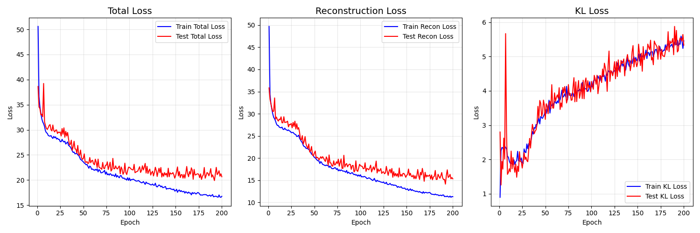
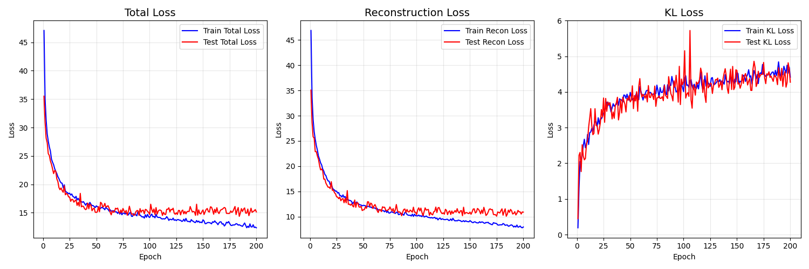
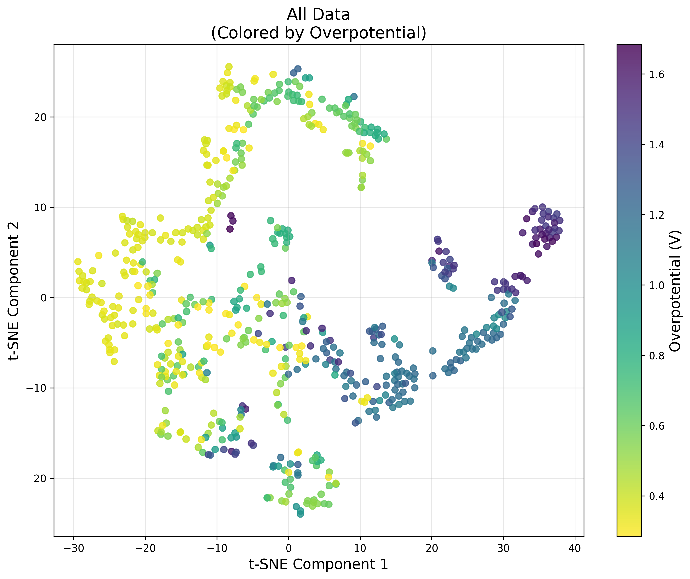
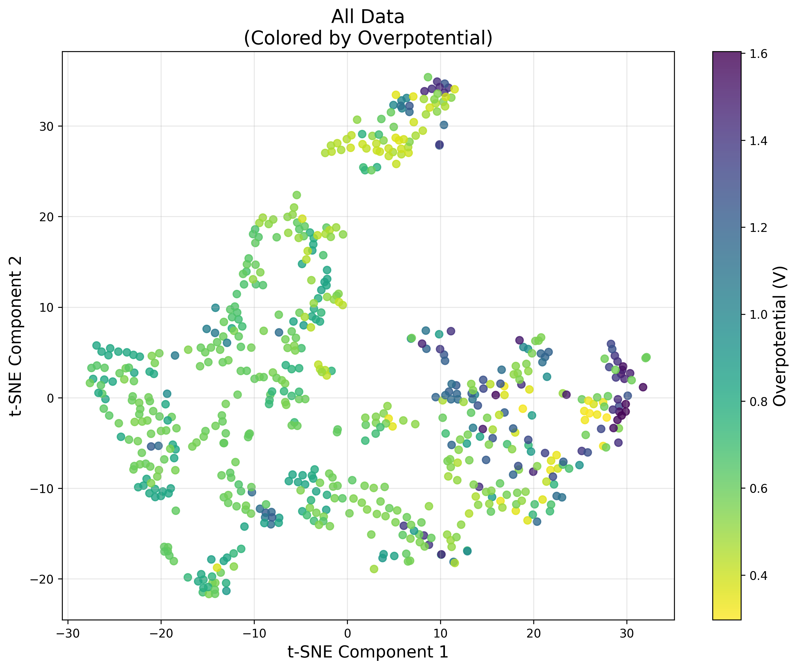
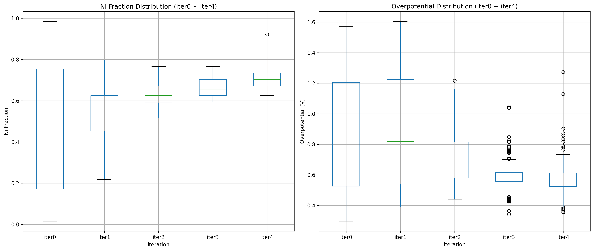
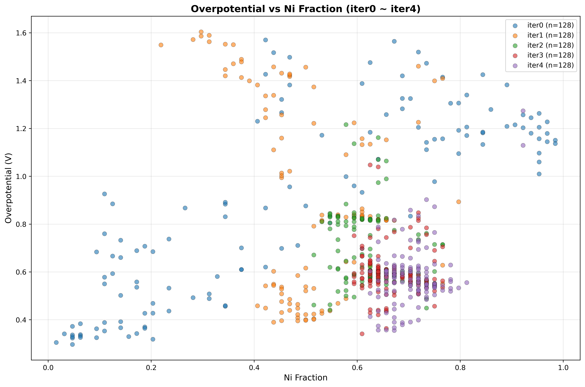
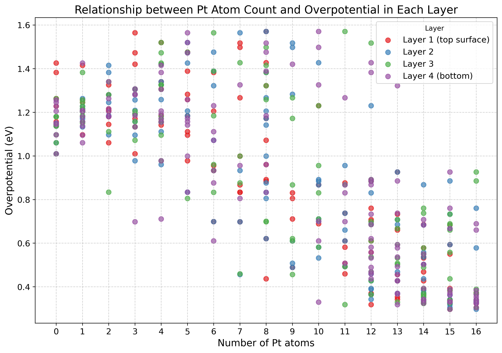
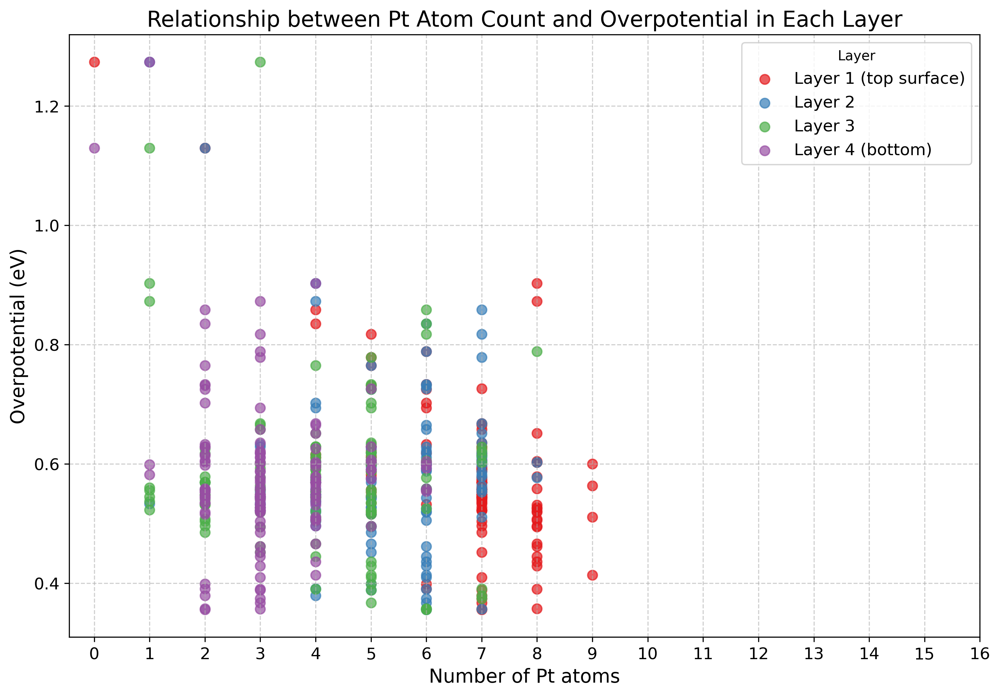

# Mulch-label Conditional VAE of ORR Catalyst Generator 

## Overview (概要)

ORR（酸素還元反応）触媒に向けた条件付きVAEを用いたPt-Ni合金触媒の探索を行う。

ここでは、VAEの学習に過電圧だけを条件ラベルとして設定したものと、過電圧とPt含有量を条件ラベルとして設定したものの2つのモデルを比較する。

## Data Representation (データ表現)

### Structure Data (構造データ)
- **入力**: 4×4×4構造（64原子）
- **テンソル変換**: 4チャンネル×8×8（各層を1チャンネルとして表現）
- **元素マッピング**: 0（空サイト）, 1（Ni）, 2（Pd）

### Condition Labels (条件ラベル)
- **ORR過電圧ラベル**: データセットの内、過電圧が低いもの半分を1、残りを0とする
- **Pt含有量ラベル**: データセットの内、Pt含有量が低いもの半分を1、残りを0とする

## Conditional VAE Architecture (条件付きVAEアーキテクチャ)

### Encoder (エンコーダ)
- **入力**: 4チャンネル×8×8テンソル + 1or2次元条件ラベル
- **条件埋め込み**: 線形層（1→32→32→16次元）で条件を変換
- **結合**: 条件を空間的に拡張して入力テンソルと結合（12チャンネル）
- **出力**: 潜在変数の平均μと分散logvar（各n次元）
- **構造**: 畳み込み層（256→512→1024） → 全結合層

### Decoder (デコーダ)
- **入力**: n次元潜在変数 + 1or2次元条件ラベル
- **条件埋め込み**: 線形層（1→32→32→16次元）で条件を変換
- **結合**: 潜在変数と条件埋め込みを結合（136次元）
- **出力**: 12チャンネル×8×8テンソル（各層3クラス分類用logits）
- **構造**: 全結合層 → 転置畳み込み層（64→n→64→32→12）

### Loss Function (損失関数)
- **再構成損失**: 各層でクラス重み付きクロスエントロピー
- **KL発散**: 潜在変数の正規化項
- **総損失**: 再構成損失 + β × KL発散

## 探索ワークフロー

### VAEによる触媒生成・散策の反復的ワークフロー

本研究では、条件付きVAEを用いた高性能ORR触媒の探索を反復的に実行する。各イテレーションにおいて以下の5つのステップを順次実行する：

#### ステップ1: 初期構造生成（Iteration 0）

- Pd(111)面上にNiとNiをランダム配置した初期構造を128個生成
- 4×4×4のスーパーセル構造（64原子）を使用

#### ステップ2: DFT計算による物性評価

- ORR過電圧の計算
- 過電圧に基づく条件ラベル生成（低過電圧: 1, 高過電圧: 0）& (Pt含有量ラベル生成（低Pt含有量: 1, 高Pt含有量: 0）)

#### ステップ3: 条件付きVAE学習

- 構造データ（4×8×8テンソル）と過電圧条件ラベルを用いたVAE訓練
- 損失関数: 再構成損失 + β × KL発散
- ハイパーパラメータ: β値（KL項の重み）、潜在変数次元数

#### ステップ4: 新規構造生成

- 訓練済みVAEデコーダによる新規触媒構造生成
- **高性能条件（過電圧ラベル1 + Pt含有ラベル1）で各128構造**
- 潜在空間からのサンプリングと条件付き生成

#### ステップ5: 潜在空間可視化

- t-SNEによる潜在空間の2次元可視化
- 高性能・低性能サンプルの潜在空間における分布確認

### 反復プロセス
上記ステップを複数イテレーション（通常5回）繰り返し、段階的に高性能触媒を探索する。各イテレーションで新たに生成された構造を既存データセットに追加し、VAEの学習データを拡張することで、より精度の高い構造生成を実現する。

### ハイパーパラメータ設定
- **β値**: 1.0
- **潜在変数次元数**: 32

##　探索結果

## 探索結果

### モデル比較

| 評価項目 | ラベル1（過電圧のみ）| ラベル2（過電圧+Pt含有量） |
|---------|-------------------|------------------------|
| **損失関数** |  |  |
| **潜在空間可視化** |  |  |
| **過電圧分布（箱ひげ図）** |  |  |
| **過電圧 vs Ni含有量** |  |  |

### レイヤー毎Pt含有量:ラベル2（過電圧+Pt含有量条件）

#### Iter0

#### Iter4 

### 考察

- ラベル1（過電圧のみ条件）とラベル2（過電圧+Pt含有量条件）を比較すると、条件ラベルを2つ設定したものの方が優位に高活性かつ低Pt含有量の触媒を生成できる傾向が見られた。

- また、ラベル2（過電圧+Pt含有量条件）のiter4で出力された構造のレイヤー毎のPt含有量を確認すると、最表面がPt含有量が高く、下層に行くほどPt含有量が低くなる傾向が見られた。VAEが３次元的な構造もなんとなく考慮している可能性がある。
